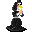

# { .sprite } Carrying Ambelie

*Harmful physical condition.*

<div class="infobox" markdown>

<p class="ib-img">{ .sprite }</p>

| | |
|---|---|
| **Type** | Harmful |
| **Category** | [Physical](index.md#categories-and-resistance) |
| **Affects** | You |
| **Stacking** | No |
| **Resisted by** | [Enduring Body](../skills/resistancePhysical.md) |
| **Condition ID** | `carrying_ambelie` |

</div>

## Effects

| Effect | Per magnitude level |
|---|---|
| Attack damage | −1 |
| Attack cost (AP) | +2 |
| Move cost (AP) | +2 |

All values are multiplied by the condition's magnitude. Round effects apply once per round: each turn in combat, and every 6 seconds outside combat.

**Stacking:** No. A new application replaces the current one only if it has a higher magnitude, or the same magnitude and a longer duration.


<p class="verified">Verified against v0.8.18 condition data and game code (`ActorStatsController.java`).</p>

## How you get it

**Dialogue and scripted events**

| From | Quest | Duration |
|---|---|---|
| [Ambelie](../monsters/ambelie.md) ([foaming_flask](../maps/foaming_flask.md)) | [Immaculate kidnapping](../quests/Thieves02.md#stage-20) | Permanent |


<p class="verified">Verified against v0.8.18 item, monster, dialogue and skill data.</p>

## Removal and protection

- **Removed by** walking into a blocked passage on [guildbrig2](../maps/guildbrig2.md) during [Immaculate kidnapping](../quests/Thieves02.md#stage-55).
- **Duration and rest:** permanent applications (from equipment or story events) are not removed by resting.


## Community notes

<small>Written by players, not generated from game data. **Strategy**: how and when to use it · **Observations**: what players notice in-game · **Trivia**: real-world facts, references, development history</small>

### Strategy

*No notes yet. Contributions are welcome: [add a note](https://github.com/asdfghjkl628/Andor-s-Trail-Wikiiii/new/main/notes/conditions?filename=carrying_ambelie.md&value=%23%23%20Strategy%0A%0A%3C%21--%20how%20and%20when%20to%20use%20it%20--%3E%0A%0A%23%23%20Observations%0A%0A%3C%21--%20what%20players%20notice%20in-game%20--%3E%0A%0A%23%23%20Trivia%0A%0A%3C%21--%20real-world%20facts%2C%20references%2C%20development%20history%20--%3E%0A).*

### Observations

*No notes yet. Contributions are welcome: [add a note](https://github.com/asdfghjkl628/Andor-s-Trail-Wikiiii/new/main/notes/conditions?filename=carrying_ambelie.md&value=%23%23%20Strategy%0A%0A%3C%21--%20how%20and%20when%20to%20use%20it%20--%3E%0A%0A%23%23%20Observations%0A%0A%3C%21--%20what%20players%20notice%20in-game%20--%3E%0A%0A%23%23%20Trivia%0A%0A%3C%21--%20real-world%20facts%2C%20references%2C%20development%20history%20--%3E%0A).*

### Trivia

*No notes yet. Contributions are welcome: [add a note](https://github.com/asdfghjkl628/Andor-s-Trail-Wikiiii/new/main/notes/conditions?filename=carrying_ambelie.md&value=%23%23%20Strategy%0A%0A%3C%21--%20how%20and%20when%20to%20use%20it%20--%3E%0A%0A%23%23%20Observations%0A%0A%3C%21--%20what%20players%20notice%20in-game%20--%3E%0A%0A%23%23%20Trivia%0A%0A%3C%21--%20real-world%20facts%2C%20references%2C%20development%20history%20--%3E%0A).*


??? info "Technical information"

    | | |
    |---|---|
    | Condition ID | `carrying_ambelie` |
    | Category (internal) | `physical` |
    | Icon | `actorconditions_omi1:1` |
    | Defined in | `res/raw/actorconditions_omicronrg9.json` |

    Raw data:

    ```json
    {
     "id": "carrying_ambelie",
     "iconID": "actorconditions_omi1:1",
     "name": "Carrying Ambelie",
     "category": "physical",
     "abilityEffect": {
      "increaseAttackDamage": {
       "min": -1,
       "max": -1
      },
      "increaseMoveCost": 2,
      "increaseAttackCost": 2
     }
    }
    ```


<small>Data from v0.8.18</small>
