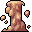

# { .sprite } Clinging mud

*Harmful physical condition.*

<div class="infobox" markdown>

<p class="ib-img"></p>

| | |
|---|---|
| **Type** | Harmful |
| **Category** | [Physical](index.md#categories-and-resistance) |
| **Affects** | You |
| **Stacking** | No |
| **Resisted by** | [Enduring Body](../skills/resistancePhysical.md) |
| **Condition ID** | `clinging_mud` |

</div>

> Thick mud clings to your legs, hindering your movements and making it harder to act swiftly or strike with precision.

## Effects

| Effect | Per magnitude level |
|---|---|
| Max AP | −1 |
| Attack chance | −20 |
| Attack cost (AP) | +1 |
| Move cost (AP) | +3 |

Values are per magnitude level. A round is one combat turn, or 6 seconds outside combat.

**Stacking:** No (only a stronger or longer application replaces it).


<p class="verified">Verified against v0.8.18 condition data and game code (`ActorStatsController.java`).</p>

## How you get it

**Dialogue and scripted events**

| From | Quest | Duration |
|---|---|---|
| stepping on a trigger on [Galmore 19](../maps/galmore_19.md) | – | 20 rounds |


<p class="verified">Verified against v0.8.18 item, monster, dialogue and skill data.</p>

## Removal and protection

- **[Rejuvenation](../skills/rejuvenation.md):** each round, a 20% chance per round to weaken one timed harmful condition by 1.
- **Removed by** stepping on a trigger on [Galmore 19](../maps/galmore_19.md), stepping on a trigger on [Lake shore road 9](../maps/lake_shore_road_9.md).
- **Duration and rest:** timed ones wear off, or rest them away.

## Checked in dialogue

- stepping on a trigger on [Galmore 19](../maps/galmore_19.md) checks whether you do not have this condition.
- stepping on a trigger on [Galmore 19](../maps/galmore_19.md) checks whether you have this condition.


## Community notes

<small>Written by players, not generated from game data. **Strategy**: how and when to use it · **Observations**: what players notice in-game · **Trivia**: real-world facts, references, development history</small>

### Strategy

*No notes yet. Contributions are welcome: [add a note](https://github.com/asdfghjkl628/Andor-s-Trail-Wikiiii/new/main/notes/conditions?filename=clinging_mud.md&value=%23%23%20Strategy%0A%0A%3C%21--%20how%20and%20when%20to%20use%20it%20--%3E%0A%0A%23%23%20Observations%0A%0A%3C%21--%20what%20players%20notice%20in-game%20--%3E%0A%0A%23%23%20Trivia%0A%0A%3C%21--%20real-world%20facts%2C%20references%2C%20development%20history%20--%3E%0A).*

### Observations

*No notes yet. Contributions are welcome: [add a note](https://github.com/asdfghjkl628/Andor-s-Trail-Wikiiii/new/main/notes/conditions?filename=clinging_mud.md&value=%23%23%20Strategy%0A%0A%3C%21--%20how%20and%20when%20to%20use%20it%20--%3E%0A%0A%23%23%20Observations%0A%0A%3C%21--%20what%20players%20notice%20in-game%20--%3E%0A%0A%23%23%20Trivia%0A%0A%3C%21--%20real-world%20facts%2C%20references%2C%20development%20history%20--%3E%0A).*

### Trivia

*No notes yet. Contributions are welcome: [add a note](https://github.com/asdfghjkl628/Andor-s-Trail-Wikiiii/new/main/notes/conditions?filename=clinging_mud.md&value=%23%23%20Strategy%0A%0A%3C%21--%20how%20and%20when%20to%20use%20it%20--%3E%0A%0A%23%23%20Observations%0A%0A%3C%21--%20what%20players%20notice%20in-game%20--%3E%0A%0A%23%23%20Trivia%0A%0A%3C%21--%20real-world%20facts%2C%20references%2C%20development%20history%20--%3E%0A).*


??? info "Technical information"

    | | |
    |---|---|
    | Condition ID | `clinging_mud` |
    | Category (internal) | `physical` |
    | Icon | `actorconditions_1:7` |
    | Defined in | `res/raw/actorconditions_mt_galmore2.json` |

    Raw data:

    ```json
    {
     "id": "clinging_mud",
     "iconID": "actorconditions_1:7",
     "name": "Clinging mud",
     "description": "Thick mud clings to your legs, hindering your movements and making it harder to act swiftly or strike with precision.",
     "category": "physical",
     "abilityEffect": {
      "increaseAttackChance": -20,
      "increaseMaxAP": -1,
      "increaseMoveCost": 3,
      "increaseAttackCost": 1
     }
    }
    ```


<small>Data from v0.8.18</small>
