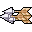

# { .sprite } Combo

*Beneficial physical condition.*

<div class="infobox" markdown>

<p class="ib-img">{ .sprite }</p>

| | |
|---|---|
| **Type** | Beneficial |
| **Category** | [Physical](index.md#categories-and-resistance) |
| **Affects** | Enemies |
| **Stacking** | Yes |
| **Resisted by** | [Enduring Body](../skills/resistancePhysical.md) |
| **Condition ID** | `g03_combo` |

</div>

## Effects

| Effect | Per magnitude level |
|---|---|
| Attack damage | 0 to +1 |
| Critical skill | +2 |
| Attack cost (AP) | −1 |

Values are per magnitude level. A round is one combat turn, or 6 seconds outside combat.

**Stacking:** Yes (same duration → magnitudes add up).


<p class="verified">Verified against v0.8.18 condition data and game code (`ActorStatsController.java`).</p>

## How you get it

Nothing in the game data applies this condition to you.

## Applied to enemies

**Enemies**

| Enemy | When | Magnitude | Duration | Chance | Found in |
|---|---|---|---|---|---|
| [Crackshot](../monsters/g03_crackshot.md) | On itself, when it hits you | 1 | 1 round | 25% | Crackshot hideout 3 |
| [Rebelled rogue](../monsters/g03_thief_3.md) | On itself, when it hits you | 1 | 1 round | 33% | Crackshot hideout 3 |


<p class="verified">Verified against v0.8.18 item, monster, dialogue and skill data.</p>

## Removal and protection

- **Duration and rest:** timed ones wear off, or rest them away.


## Community notes

<small>Written by players, not generated from game data. **Strategy**: how and when to use it · **Observations**: what players notice in-game · **Trivia**: real-world facts, references, development history</small>

### Strategy

*No notes yet. Contributions are welcome: [add a note](https://github.com/asdfghjkl628/Andor-s-Trail-Wikiiii/new/main/notes/conditions?filename=g03_combo.md&value=%23%23%20Strategy%0A%0A%3C%21--%20how%20and%20when%20to%20use%20it%20--%3E%0A%0A%23%23%20Observations%0A%0A%3C%21--%20what%20players%20notice%20in-game%20--%3E%0A%0A%23%23%20Trivia%0A%0A%3C%21--%20real-world%20facts%2C%20references%2C%20development%20history%20--%3E%0A).*

### Observations

*No notes yet. Contributions are welcome: [add a note](https://github.com/asdfghjkl628/Andor-s-Trail-Wikiiii/new/main/notes/conditions?filename=g03_combo.md&value=%23%23%20Strategy%0A%0A%3C%21--%20how%20and%20when%20to%20use%20it%20--%3E%0A%0A%23%23%20Observations%0A%0A%3C%21--%20what%20players%20notice%20in-game%20--%3E%0A%0A%23%23%20Trivia%0A%0A%3C%21--%20real-world%20facts%2C%20references%2C%20development%20history%20--%3E%0A).*

### Trivia

*No notes yet. Contributions are welcome: [add a note](https://github.com/asdfghjkl628/Andor-s-Trail-Wikiiii/new/main/notes/conditions?filename=g03_combo.md&value=%23%23%20Strategy%0A%0A%3C%21--%20how%20and%20when%20to%20use%20it%20--%3E%0A%0A%23%23%20Observations%0A%0A%3C%21--%20what%20players%20notice%20in-game%20--%3E%0A%0A%23%23%20Trivia%0A%0A%3C%21--%20real-world%20facts%2C%20references%2C%20development%20history%20--%3E%0A).*


??? info "Technical information"

    | | |
    |---|---|
    | Condition ID | `g03_combo` |
    | Category (internal) | `physical` |
    | Icon | `actorconditions_1:108` |
    | Defined in | `res/raw/actorconditions_omicronrg9.json` |

    Raw data:

    ```json
    {
     "id": "g03_combo",
     "iconID": "actorconditions_1:108",
     "name": "Combo",
     "category": "physical",
     "isPositive": 1,
     "isStacking": 1,
     "fullRoundEffect": {
      "visualEffectID": "blueSwirl"
     },
     "abilityEffect": {
      "increaseAttackDamage": {
       "min": 0,
       "max": 1
      },
      "increaseAttackCost": -1,
      "increaseCriticalSkill": 2
     }
    }
    ```


<small>Data from v0.8.18</small>
