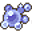
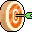

# Conditions

Poison, bleeding, blessings, food effects: all 147 conditions in v0.8.18, what they do, what causes them and how to get rid of them. ~~Yes, food poisoning from raw meat is a real risk.~~

**Jump to:** [How conditions work](#how-conditions-work) · [Harmful conditions](#harmful-conditions) · [Beneficial conditions](#beneficial-conditions)

## How conditions work

???+ section "Categories and resistance"

    Each category has its own resistance skill (spiritual has none).

    | Category | Resistance skill | Count |
    |---|---|---|
    | Physical | [Enduring Body](../skills/resistancePhysical.md) | 81 |
    | Mental | [Strong Mind](../skills/resistanceMental.md) | 25 |
    | Blood | [Pure Blood](../skills/resistanceBlood.md) | 17 |
    | Spiritual | None | 24 |

    Each resistance level cuts the chance by 10% *of its value*: a 30% poison chance becomes 27% at level 1 and 9% at the max (7). 100% chances can't be resisted. Resistance also lowers your chance of getting *beneficial* conditions of that category ~~thanks, I hate it~~. [Dark blessing of the Shadow](../skills/shadowBless.md): −5% of the value for every category.

???+ section "Magnitude, duration and timing"

    - **Magnitude** multiplies every effect (magnitude 3 poison = 3× the damage).
    - **Duration** is in rounds: one combat turn, or 6 seconds outside combat.
    - *Every 25 seconds* effects only tick outside combat.
    - **Permanent** = from equipment or story events (duration 999); duration 998 = until you rest.

???+ section "Stacking"

    - **Stacking:** same duration → magnitudes add up; different duration → separate instance.
    - **Non-stacking:** only a higher magnitude (or same magnitude, longer duration) replaces the current one.

???+ section "Removal and immunity"

    - **Resting** clears all timed conditions. Permanent ones stay.
    - Some items and events **remove** a condition outright; others give **immunity** (while equipped, or for some rounds).
    - [Rejuvenation](../skills/rejuvenation.md): each round, a chance to weaken one timed harmful condition by 1 (not spiritual ones).

Verified against v0.8.18 game code (`ActorStatsController.java`, `SkillController.java`, `GameRoundController.java`, `Constants.java`).

## Harmful conditions

### Physical

| | Condition | Effect per magnitude level | Applied by |
|---|---|---|---|
| { .sprite } | [Ablaze](fire.md) | attack chance −15, −1 HP per round | 3 items, 14 enemies, 4 events |
| { .sprite } | [Bad taste](bad_taste.md) | −1 HP per round | 3 items |
| { .sprite } | [Blindness](blindness.md) | attack chance −5, block chance −5 | 4 enemies |
| { .sprite } | [Bone fracture](bone_fracture.md) | −20 HP per round | 3 events |
| { .sprite } | [Burning](burning.md) | attack chance −5, block chance −5, −2 to −1 HP per round, −1 AP per round | 4 events |
| { .sprite } | [Carrying Ambelie](carrying_ambelie.md) | damage −1, attack cost +2, move cost +2 | 1 event |
| { .sprite } | [Clinging mud](clinging_mud.md) | max AP −1, attack chance −20, attack cost +1, move cost +3 | 2 events |
| { .sprite } | [Concussion](concussion.md) | attack chance −30 | 1 item, 1 enemy, 6 events, 1 skill |
| { .sprite } | [Corrosive slime](slime.md) | −2 to −1 HP per round, −1 AP per round | 10 enemies |
| { .sprite } | [Crushed](crushed.md) | max HP −5, damage resistance −2, −1 HP per round | – |
| { .sprite } | [Drowning](drowning.md) | −80 to −40 HP per round | 4 events |
| { .sprite } | [Entanglement](entanglement.md) | attack cost +1, move cost +3 | 1 item, 2 enemies |
| { .sprite } | [Environmental poisoning](environmental_poisoning.md) | −1 HP per round | 1 event |
| { .sprite } | [Fatigue](fatigue1.md) <small>(`fatigue1`)</small> | −1 HP per round, −1 AP per round | 3 events |
| { .sprite } | [Fatigue](fatigue2.md) <small>(`fatigue2`)</small> | −2 HP per round, −1 AP per round | 1 item, 1 event |
| { .sprite } | [Fatigue](fatigue3.md) <small>(`fatigue3`)</small> | −7 HP per round, −1 AP per round | 1 event |
| { .sprite } | [Fatigue](fatigue4.md) <small>(`fatigue4`)</small> | −20 HP per round, −1 AP per round | 3 events |
| { .sprite } | [Flesh rot](flesh_rot.md) | block chance −5, −1 HP per round | 3 enemies |
| { .sprite } | [Food-poisoning](foodp.md) | −1 HP per round | 24 items, 1 event |
| { .sprite } | [Fracture](crit2.md) | block chance −50, damage resistance −2 | 3 items, 10 events, 1 skill |
| { .sprite } | [Frostbite](frostbite.md) | block chance −10, damage resistance +1, move cost +1, item use cost +1, −2 to −1 HP per round | 3 enemies |
| { .sprite } | [Head trauma](head_trauma.md) | attack chance −15, −2 to −1 HP per round | 1 item |
| { .sprite } | [Head wound](head_wound.md) | attack chance −20, block chance −20, −2 HP per round | 2 items, 2 enemies, 1 event |
| { .sprite } | [Heartstone poisoning](heartstone_poisoning.md) | max AP −1, damage −1, move cost +1 | 9 items |
| { .sprite } | [Icy wounds](frozen2.md) | block chance −5, move cost +1, −1 HP per round | 1 item, 1 enemy |
| { .sprite } | [Internal bleeding](crit1.md) | attack chance −50, damage −3, attack cost +1 | 2 items, 1 enemy, 1 skill |
| { .sprite } | [Kazaul rotworms](rotworm.md) | max HP −15, max AP −3, damage resistance −1 | 1 event |
| { .sprite } | [Major sting](sting_major.md) | −1 to −2 HP per round | 1 enemy |
| { .sprite } | [Marrow rend](bone_fracture_range.md) | −5 to −10 HP per round | 1 item |
| { .sprite } | [Minor fatigue](fatigue_minor.md) | damage −1, attack cost +2, move cost +2 | 5 items, 8 enemies, 4 events |
| { .sprite } | [Minor freeze](frozen1.md) | block chance +20, damage resistance +1, move cost +1, item use cost +1, −1 HP per round | 1 item, 1 event |
| { .sprite } | [Minor sting](sting_minor.md) | −1 HP per round | 1 item, 16 enemies, 3 events |
| { .sprite } | [Nausea](nausea.md) | attack chance −10, block chance −10 | 5 items, 19 enemies, 3 events |
| { .sprite } | [Overeating](overeating.md) | −1 HP per round | 1 item |
| { .sprite } | [Petrification](petrification.md) | max AP −1 | 1 enemy |
| { .sprite } | [Petristill](petristill.md) | block chance −10, damage resistance +1 | 3 enemies |
| { .sprite } | [Putrefaction](putrefaction.md) | max AP −1 | 1 item, 3 enemies, 1 event |
| { .sprite } | [Rabies](rabies.md) | attack chance −25, block chance −10, −5 to −3 HP per round | 7 enemies |
| { .sprite } | [Reclaimed resilience](reclaimed_resilience.md) | damage resistance +1 | 1 enemy |
| { .sprite } | [Rock fall](rockfall.md) | −1 HP per round, −1 AP per round | 1 event |
| { .sprite } | [Rootsnare](rootsnare.md) | max AP −1, damage resistance +2 | 1 item, 5 enemies |
| { .sprite } | [Sated](sated.md) | attack chance −20, attack cost +1, move cost +2 | 4 items |
| { .sprite } | [Scylla's bite](scylla.md) | −10 to −5 HP per round | 3 enemies, 5 events |
| { .sprite } | [Searing burn](brightportflame.md) | attack chance −10, damage resistance −3, −5 to 0 HP per round | 1 item |
| { .sprite } | [Sleepwalking](sleepwalking.md) | −3 AP per round | 1 enemy |
| { .sprite } | [Soaked vision](soaked_vision.md) | attack chance −20, attack cost +1, move cost +1, item use cost +1, re-equip cost +1 | 2 enemies |
| { .sprite } | [Soft metal](brightport_scimitar.md) | attack chance +10, block chance −15 | 1 item |
| { .sprite } | [Solid impact](solid_impact.md) | −10 to −5 HP per round | 4 events |
| { .sprite } | [Splinter](splinter.md) | item use cost +1, re-equip cost +1, −4 to −2 HP per round | 1 item |
| { .sprite } | [Stunned](stunned.md) | max AP −2, attack cost +5, move cost +8 | 6 items, 24 enemies, 4 events |
| { .sprite } | [Swamp foot](swamp_foot.md) | max AP −2, damage resistance −10 | 1 event |
| { .sprite } | [Sweet tooth](sweet_tooth.md) | block chance −20 | 1 item, 1 event |
| { .sprite } | [Thirst](thirst.md) | −2 HP per round | 4 items |
| { .sprite } | [Tight grip](tight_grip.md) | item use cost +8, re-equip cost +8 | 1 item |
| { .sprite } | [Trapped](trapped.md) | move cost +17, item use cost −2, re-equip cost −2 | 2 enemies |
| { .sprite } | [Turning to stone](turn_to_stone.md) | −10 HP per round | 2 events |
| { .sprite } | [Unstable footing](unstable_footing.md) | attack cost +1, move cost +1, −1 AP per round | 1 item |
| { .sprite } | [Unsteady footing](unsteady_footing.md) | move cost +1, item use cost +1, re-equip cost +1, −1 AP per round | 2 enemies |
| { .sprite } | [Vital piercing](vital_piercing.md) | critical skill −5, −2 HP per round | 1 item |
| { .sprite } | [Vulnerability](vulnerability.md) | damage resistance −1 | 5 enemies |

### Mental

| | Condition | Effect per magnitude level | Applied by |
|---|---|---|---|
| { .sprite } | [Baited strike](baited_strike.md) | attack chance +7, block chance −14 | 1 item, 1 enemy |
| { .sprite } | [Chaotic curse](chaotic_curse.md) | max AP −1, damage −1, block chance −10, damage resistance −1 | 2 enemies |
| { .sprite } | [Chaotic grip](chaotic_grip.md) | block chance −10, damage resistance −1 | 2 items, 5 enemies |
| { .sprite } | [Cinder rage](cinder_rage.md) | damage +2, block chance −10, −3 to −2 HP per round | 1 item, 1 enemy |
| { .sprite } | [Clumsiness](clumsiness.md) | attack chance −7, block chance −7 | 5 items |
| { .sprite } | [Confusion](confusion.md) | max AP −1, attack chance −10 | 3 items, 4 enemies, 2 events |
| { .sprite } | [Dazed](dazed.md) | block chance −40 | 13 items, 13 enemies, 1 event |
| { .sprite } | [Fear](fear.md) | attack chance −5, damage −1, block chance −10, damage resistance −1 | 5 items, 5 enemies, 18 events |
| { .sprite } | [Mind fog](mind_fog.md) | attack chance −10, block chance −10 | 2 items, 8 enemies |
| { .sprite } | [Minor weapon feebleness](feebleness_minor.md) | damage −3 | 3 items, 12 enemies, 1 event |
| { .sprite } | [Panic](panic.md) | max AP +4, attack chance +10, block chance +10, critical skill +10, −1 to +1 HP per round | 5 enemies |
| { .sprite } | [Requiescence](relax.md) | max AP −4, attack chance −50, damage −5, block chance −80, damage resistance −2, critical skill −20, attack cost +2, item use cost −1, re-equip cost −1, +2 HP per round | 1 item, 1 event |
| { .sprite } | [Shadow awareness](shadow_awareness.md) | max AP +2 | 1 enemy |
| { .sprite } | [Shadow sleepiness](shadowsleep.md) | max AP −2 | 1 enemy, 1 event |
| { .sprite } | [Weapon feebleness](feebleness.md) | attack chance −5, damage −2 | 1 item |
| { .sprite } | [Withering Focus](withering_focus.md) | attack chance −5, block chance −5 | 2 enemies |

### Blood

| | Condition | Effect per magnitude level | Applied by |
|---|---|---|---|
| { .sprite } | [Blackwater misery](blackwater_misery.md) | attack chance −50, critical skill −50, attack cost +1 | 11 items |
| { .sprite } | [Bleeding wound](bleeding_wound.md) | −1 HP per round | 13 items, 28 enemies, 29 events |
| { .sprite } | [Blistering skin](blister.md) | −1 HP per round | 14 enemies, 1 event |
| { .sprite } | [Blood poisoning](poison_blood.md) | −2 to −1 HP per round | 3 items, 3 enemies, 1 event |
| { .sprite } | [Brainworm infection](brightport_worm.md) | attack chance −15, block chance −10, −1 to −2 HP per round | 1 item, 2 enemies |
| { .sprite } | [Death Plague](death_plague.md) | block chance −10, −2 HP per round | 3 enemies |
| { .sprite } | [Insect contagion](contagion.md) | attack chance −10, damage −1 | 23 enemies, 1 event |
| { .sprite } | [Irdegh poison](poison_irdegh.md) | −1 HP per round | 5 enemies |
| { .sprite } | [Poisonous vapors](brightport_poison.md) | −2 to 0 HP per round, −2 to 0 HP per 25 s | 2 enemies |
| { .sprite } | [Potent venom](potent_venom.md) | max HP −3, move cost +1, −3 to −2 HP per round | 1 enemy |
| { .sprite } | [Spider bite](spider_bite.md) | −4 to −1 HP per round | 5 enemies |
| { .sprite } | [Spore contagion](contagion2.md) | −3 to −1 HP per round | 2 enemies |
| { .sprite } | [Spore poisoning](spore_poison.md) | attack chance −10, move cost +1, item use cost +1, re-equip cost +2 | 6 enemies |
| { .sprite } | [Venom](venom.md) | max HP −2, −1 HP per round | 1 item, 7 enemies |
| { .sprite } | [Weak irdegh poison](poison_irdegh_weak.md) | −1 HP per 25 s | 1 item |
| { .sprite } | [Weak Poison](poison_weak.md) | −1 HP per round | 10 items, 49 enemies, 1 event |

### Spiritual

| | Condition | Effect per magnitude level | Applied by |
|---|---|---|---|
| { .sprite } | [Curse of the Undead](curse_undead.md) | −2 to −1 HP per round | 3 items |
| { .sprite } | [Curse of Vainglory](vainglory.md) | max HP −5, block chance −5, −1 to 0 HP per round | 1 enemy |
| { .sprite } | [Deathtouch](deathtouch.md) | attack chance −5, damage resistance −1, −1 to 0 HP per round | 3 enemies |
| { .sprite } | [Divine judgement](divine_judgement.md) | block chance −20, 0 to −10 HP per round | 1 item, 1 enemy |
| { .sprite } | [Divine punishment](divine_punishment.md) | attack chance −10, block chance −20, −2 to −1 HP per round | 1 item, 1 enemy |
| { .sprite } | [Gilded burden](gilded_burden.md) | move cost +2 | 1 enemy |
| { .sprite } | [Incompatible biology](brightport_diadem.md) | attack chance −5, block chance −5, damage resistance −2, critical skill −5, move cost +1, item use cost +1 | 1 item |
| { .sprite } | [Kazaul exposure](kazaul_exposure.md) | damage resistance −3 | 2 enemies |
| { .sprite } | [Kazaul mortality](kazaul_mortality.md) | −50 to 0 HP per round | 1 event |
| { .sprite } | [Kazaul possession](kazarite_misery.md) | attack chance +10, block chance +10, damage resistance +1, −3 to −2 HP per round | 4 items, 3 enemies |
| { .sprite } | [Life drain](life_drain.md) | −2 HP per round | 1 item, 2 events |
| { .sprite } | [Mermaid curse](mermaid_scale.md) | max HP −15, max AP −3, attack chance −20, block chance −10, damage resistance −1, −1 to 0 HP per round | 1 event |
| { .sprite } | [Pull of the mark](pull_of_the_mark.md) | attack cost +1, move cost +1 | 1 event |
| { .sprite } | [Shadow Degeneration](regenNeg.md) | −1 HP per round | 1 item |

## Beneficial conditions

### Physical

| | Condition | Effect per magnitude level | Applied by |
|---|---|---|---|
| { .sprite } | [Bark skin](barkskin.md) | damage resistance +1 | 3 items, 3 enemies |
| { .sprite } | [Combo](g03_combo.md) | damage 0 to +1, critical skill +2, attack cost −1 | 2 enemies |
| { .sprite } | [Deftness](deftness.md) | item use cost −1 | 2 items |
| { .sprite } | [Fortified defense](def.md) | block chance +22 | 3 items |
| { .sprite } | [Haste](haste.md) | max AP +2, move cost −1, item use cost −2, re-equip cost −2 | 2 items, 2 enemies, 1 event |
| { .sprite } | [Heightened senses](sense_1.md) | attack chance +5, damage +4, critical skill +10 | 3 items |
| { .sprite } | [Hero's body](heros_body.md) | max HP +50, max AP +2, attack chance +20, damage +30 to +50, block chance +20, damage resistance +20, critical skill +20, +30 to +50 HP per round | 1 item, 21 events |
| { .sprite } | [Increased defense](increased_defense.md) | block chance +15, damage resistance +2 | 4 items, 1 enemy |
| { .sprite } | [Lightning attack](light_attack.md) | attack cost −1 | 2 items |
| { .sprite } | [Minor increased defense](minor_increased_defense.md) | attack chance −10, block chance +7, damage resistance +1 | 4 items |
| { .sprite } | [Minor speed](speed_minor.md) | max AP +2 | 7 items, 1 enemy |
| { .sprite } | [Regeneration](regen2.md) | +1 HP per round | 12 items, 5 enemies, 2 events |
| { .sprite } | [Reinvigorated](reinvigorated.md) | max HP +20, attack chance +5, block chance +5, +2 HP per round | 2 items |
| { .sprite } | [Resting](guild03_restingAC.md) | +100 HP per round | 1 event |
| { .sprite } | [Satiety](satiety.md) | max HP +2, 0 to +2 HP per round | 3 items |
| { .sprite } | [Stone skin](stoneskin.md) | block chance +20, damage resistance +3 | 1 item |
| { .sprite } | [Strength](str.md) | damage +1 | 8 items |
| { .sprite } | [Sustenance](food.md) | +1 HP per round | 109 items, 2 enemies, 2 events |
| { .sprite } | [Swift attack](swift_attack.md) | attack cost −1 | – |
| { .sprite } | [Umbral step](brightport_shadow.md) | attack chance +11, damage +3, block chance −6 | 1 item |
| { .sprite } | [Vulnerability awareness](crit_aware.md) | critical skill +10 | 1 item |

### Mental

| | Condition | Effect per magnitude level | Applied by |
|---|---|---|---|
| { .sprite } | [Clairvoyance](clairvoyance.md) | attack chance +10, block chance +10 | 1 item |
| { .sprite } | [Concentration](g03_concentration.md) | attack chance +10, block chance +10, critical skill +10 | 4 items, 3 enemies |
| { .sprite } | [Courage](courage.md) | attack chance +3, damage +2, block chance +3, +1 HP per round | 5 items |
| { .sprite } | [Feygard Loyalist](loyalist.md) | max HP −25, attack chance +7, damage +1, block chance +5, damage resistance +1 | 3 items |
| { .sprite } | [Focused accuracy](focus_ac.md) | attack chance +40, attack cost +1 | 2 items |
| { .sprite } | [Focused damage](focus_dmg.md) | damage +3, attack cost +1 | 2 items |
| { .sprite } | [Intoxicated](intoxicated.md) | max HP +15, attack chance −30, damage +4, attack cost +1 | 10 items |
| { .sprite } | [Minor berserker rage](rage_minor.md) | max HP +35, attack chance +60, block chance −90, damage resistance −1 | 5 items, 2 enemies |
| { .sprite } | [Revealed](revealed.md) | attack chance +5, block chance +4 | 1 enemy |

### Blood

| | Condition | Effect per magnitude level | Applied by |
|---|---|---|---|
| { .sprite } | [Troll regeneration](brightport_trollregen.md) | +3 to +5 HP per round | 1 item, 1 enemy |

### Spiritual

| | Condition | Effect per magnitude level | Applied by |
|---|---|---|---|
| { .sprite } | [Bless](bless.md) | attack chance +5 | 6 items |
| { .sprite } | [Blessing of Shadow accuracy](shadowbless_acc.md) | attack chance +30 | 1 event |
| { .sprite } | [Blessing of Shadow regeneration](shadowbless_heal.md) | +1 HP per round | 2 events |
| { .sprite } | [Blessing of Shadow strength](shadowbless_str.md) | damage +1 | 2 events |
| { .sprite } | [Elythara's refreshment](elytharabless_heal.md) | +1 HP per round | 1 item, 2 events |
| { .sprite } | [Shadow guardian blessing](shadowbless_guard.md) | max HP +30, damage resistance +1 | 1 event |
| { .sprite } | [Shadow Regeneration](regen.md) | +1 HP per round | 1 item, 1 enemy, 1 event |
| { .sprite } | [Shadow's accuracy](shadow_acc.md) | attack chance +15 | 1 item, 1 enemy |
| { .sprite } | [Shadow's protection](shadow_prot.md) | block chance +10, damage resistance +2, +1 HP per round | 2 items, 1 event |
| { .sprite } | [Shadow's strength](shadow_dmg.md) | damage 0 to +2 | 1 item |

