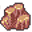

# { .sprite } Overeating

*Harmful physical condition.*

<div class="infobox" markdown>

<p class="ib-img">{ .sprite }</p>

| | |
|---|---|
| **Type** | Harmful |
| **Category** | [Physical](index.md#categories-and-resistance) |
| **Affects** | You |
| **Stacking** | No |
| **Resisted by** | [Enduring Body](../skills/resistancePhysical.md) |
| **Condition ID** | `overeating` |

</div>

## Effects

| Effect | Per magnitude level |
|---|---|
| HP every round | −1 |

All values are multiplied by the condition's magnitude. Round effects apply once per round: each turn in combat, and every 6 seconds outside combat.

**Stacking:** No. A new application replaces the current one only if it has a higher magnitude, or the same magnitude and a longer duration.


<p class="verified">Verified against v0.8.18 condition data and game code (`ActorStatsController.java`).</p>

## How you get it

**Items**

| Item | When | Magnitude | Duration | Chance |
|---|---|---|---|---|
| [Cake](../items/cake.md) | When used | 2 | 20 rounds | 100% |


<p class="verified">Verified against v0.8.18 item, monster, dialogue and skill data.</p>

## Removal and protection

- **[Rejuvenation](../skills/rejuvenation.md):** each round, a 20% chance per skill level to reduce the magnitude of one random timed harmful condition by 1.
- **Duration and rest:** timed applications end when their duration runs out, and resting removes them earlier.


## Community notes

<small>Written by players, not generated from game data. **Strategy**: how and when to use it · **Observations**: what players notice in-game · **Trivia**: real-world facts, references, development history</small>

### Strategy

*No notes yet. Contributions are welcome: [add a note](https://github.com/asdfghjkl628/Andor-s-Trail-Wikiiii/new/main/notes/conditions?filename=overeating.md&value=%23%23%20Strategy%0A%0A%3C%21--%20how%20and%20when%20to%20use%20it%20--%3E%0A%0A%23%23%20Observations%0A%0A%3C%21--%20what%20players%20notice%20in-game%20--%3E%0A%0A%23%23%20Trivia%0A%0A%3C%21--%20real-world%20facts%2C%20references%2C%20development%20history%20--%3E%0A).*

### Observations

*No notes yet. Contributions are welcome: [add a note](https://github.com/asdfghjkl628/Andor-s-Trail-Wikiiii/new/main/notes/conditions?filename=overeating.md&value=%23%23%20Strategy%0A%0A%3C%21--%20how%20and%20when%20to%20use%20it%20--%3E%0A%0A%23%23%20Observations%0A%0A%3C%21--%20what%20players%20notice%20in-game%20--%3E%0A%0A%23%23%20Trivia%0A%0A%3C%21--%20real-world%20facts%2C%20references%2C%20development%20history%20--%3E%0A).*

### Trivia

*No notes yet. Contributions are welcome: [add a note](https://github.com/asdfghjkl628/Andor-s-Trail-Wikiiii/new/main/notes/conditions?filename=overeating.md&value=%23%23%20Strategy%0A%0A%3C%21--%20how%20and%20when%20to%20use%20it%20--%3E%0A%0A%23%23%20Observations%0A%0A%3C%21--%20what%20players%20notice%20in-game%20--%3E%0A%0A%23%23%20Trivia%0A%0A%3C%21--%20real-world%20facts%2C%20references%2C%20development%20history%20--%3E%0A).*


??? info "Technical information"

    | | |
    |---|---|
    | Condition ID | `overeating` |
    | Category (internal) | `physical` |
    | Icon | `actorconditions_japozero:36` |
    | Defined in | `res/raw/actorconditions_brimhaven.json` |

    Raw data:

    ```json
    {
     "id": "overeating",
     "iconID": "actorconditions_japozero:36",
     "name": "Overeating",
     "category": "physical",
     "roundEffect": {
      "increaseCurrentHP": {
       "min": -1,
       "max": -1
      }
     }
    }
    ```


<small>Data from v0.8.18</small>
