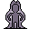

# { .sprite } Stunned

*Harmful physical condition.*

<div class="infobox" markdown>

<p class="ib-img">{ .sprite }</p>

| | |
|---|---|
| **Type** | Harmful |
| **Category** | [Physical](index.md#categories-and-resistance) |
| **Affects** | You and enemies |
| **Stacking** | No |
| **Resisted by** | [Enduring Body](../skills/resistancePhysical.md) |
| **Condition ID** | `stunned` |

</div>

## Effects

| Effect | Per magnitude level |
|---|---|
| Max AP | −2 |
| Attack cost (AP) | +5 |
| Move cost (AP) | +8 |

Values are per magnitude level. A round is one combat turn, or 6 seconds outside combat.

**Stacking:** No (only a stronger or longer application replaces it).


<p class="verified">Verified against v0.8.18 condition data and game code (`ActorStatsController.java`).</p>

## How you get it

**Items**

| Item | When | Magnitude | Duration | Chance |
|---|---|---|---|---|
| [Restore weapon feebleness](../items/pot_feebleness_restore.md) | When used | 1 | 6 rounds | 15% |

**Enemies**

| Enemy | When | Magnitude | Duration | Chance | Found in |
|---|---|---|---|---|---|
| [Ancient ogre](../monsters/ratdom_troll_6.md) | When it hits you | 1 | 6 rounds | 5% | Ratdom maze 517a |
| [Angry ogre](../monsters/ratdom_troll_3.md) | When it hits you | 1 | 4 rounds | 10% | Ratdom maze 517a |
| [Arulir](../monsters/arulir_1.md) | When it hits you | 1 | 3 rounds | 20% | Arulirmountain 1, Arulirmountain 2, Mountainlake 5 |
| [Arulir Pack Leader](../monsters/arulir_leader.md) | When it hits you | 1 | 4 rounds | 35% | Arulircave 6 |
| [Cave Arulir](../monsters/arulir_3.md) | When it hits you | 1 | 4 rounds | 23% | Arulircave 1, Arulircave 2, Arulircave 3 |
| [Cave troll](../monsters/cave_troll_1.md) | When it hits you | 1 | 2 rounds | 10% | Lakecave 0 |
| [Cave troll leader](../monsters/cave_troll_5.md) | When it hits you | 1 | 3 rounds | 25% | Lakecave 2 |
| [Cave troll shaman](../monsters/cave_troll_4.md) | When it hits you | 1 | 2 rounds | 15% | Lakecave 0, Lakecave 2 |
| [Dangerous ogre](../monsters/ratdom_troll_5.md) | When it hits you | 1 | 4 rounds | 5% | Ratdom maze 517a |
| [Demonic Arulir](../monsters/arulir_8.md) | When it hits you | 1 | 4 rounds | 30% | Arulircave 6 |
| [Giant arulir](../monsters/arulir_2.md) | When it hits you | 1 | 3 rounds | 20% | Arulirmountain 1, Arulirmountain 2, Mountainlake 5 |
| [Giant Cave Arulir](../monsters/arulir_4.md) | When it hits you | 1 | 4 rounds | 26% | Arulircave 1, Arulircave 2, Arulircave 3 |
| [Giant Golden Arulir](../monsters/arulir_6.md) | When it hits you | 1 | 4 rounds | 30% | Arulircave 4, Arulircave 5, Arulircave 6 |
| [Giant ogre](../monsters/ratdom_troll_9.md) | When it hits you | 1 | 5 rounds | 5% | Ratdom maze 517a |
| [Golden Arulir](../monsters/arulir_5.md) | When it hits you | 1 | 4 rounds | 30% | Arulircave 4, Arulircave 5, Arulircave 6 |
| [Mad ogre](../monsters/ratdom_troll_4.md) | When it hits you | 1 | 3 rounds | 10% | Ratdom maze 517a |
| [Ogre](../monsters/ratdom_uglybrute.md) | When it hits you | 1 | 4 rounds | 10% | Gold hunter |
| [Sleepy giant ogre](../monsters/mg2_troll.md) | When it hits you | 1 | 5 rounds | 5% | Galmore 18 |
| [Strong cave troll](../monsters/cave_troll_2.md) | When it hits you | 1 | 2 rounds | 15% | Lakecave 0, Lakecave 2 |
| [Strong maonit brute](../monsters/maonit_6.md) | When it hits you | 1 | 3 rounds | 10% | Lake Laeroth |
| [Tough cave troll](../monsters/cave_troll_3.md) | When it hits you | 1 | 2 rounds | 15% | Lakecave 0, Lakecave 2 |
| [Tough maonit brute](../monsters/maonit_5.md) | When it hits you | 1 | 3 rounds | 10% | Lake Laeroth |
| [Weak ogre](../monsters/ratdom_troll_2.md) | When it hits you | 1 | 2 rounds | 10% | Ratdom maze 517a |
| [Young ogre](../monsters/ratdom_troll_1.md) | When it hits you | 1 | 2 rounds | 5% | Ratdom maze 517a |

**Dialogue and scripted events**

| From | Quest | Duration |
|---|---|---|
| stepping on a trigger on [Guynmart](../maps/guynmart.md) | [Guest tour (hidden flag)](../quests/guynmart_quest_olav.md#stage-71) | 3 rounds |
| stepping on a trigger on [Guynmart wood 3](../maps/guynmart_wood_3.md) | [Guynmart rope (hidden flag)](../quests/guynmart_r_rope.md#stage-2) | 3 rounds |
| stepping on a trigger on [Lookout lower](../maps/lookout_lower.md) | – | 7 rounds |
| walking into a blocked passage on [Guynmart wood 16](../maps/guynmart_wood_16.md) | [Feygard story flags (hidden flag)](../quests/feygard_nondisplayed.md#stage-1) | 3 rounds |

## Applied to enemies

**Items**

| Item | When | Magnitude | Duration | Chance |
|---|---|---|---|---|
| [Gornaud's stone mace](../items/stone_mace.md) | On the enemy you hit | 1 | 3 rounds | 5% |
| [LifeTaker](../items/lifetaker.md) | On the enemy you hit | 1 | 1 round | 15% |
| [Stone club](../items/club_stone.md) | On the enemy you hit | 1 | 2 rounds | 2% |
| [Superior quarterstaff](../items/qtrstaff_2.md) | On the enemy you hit | 1 | 2 rounds | 3% |
| [Sword of the annihilator](../items/sword_annihilator.md) | On the enemy you hit | 1 | 2 rounds | 10% |

**Enemies**

| Enemy | When | Magnitude | Duration | Chance | Found in |
|---|---|---|---|---|---|
| [Cave troll leader](../monsters/cave_troll_5.md) | On itself, when it hits you | 1 | 3 rounds | 25% | Lakecave 2 |


<p class="verified">Verified against v0.8.18 item, monster, dialogue and skill data.</p>

## Removal and protection

- **Resistance:** [Enduring Body](../skills/resistancePhysical.md), −10% of the chance per level (30% → 27% at level 1). 100% chances can't be resisted.
- **[Dark blessing of the Shadow](../skills/shadowBless.md)** −5% of the chance for any condition.
- **[Rejuvenation](../skills/rejuvenation.md):** each round, a 20% chance per round to weaken one timed harmful condition by 1.
- **Removed by** [Restore stunned](../items/pot_stunned_restore.md) (when used).
- **Removed by** [Potion of awareness](../items/pot_awareness.md) (when used).
- **Removed by** [Potion of sound mind](../items/pot_sound_mind.md) (when used).
- **Duration and rest:** timed ones wear off, or rest them away.


## Community notes

<small>Written by players, not generated from game data. **Strategy**: how and when to use it · **Observations**: what players notice in-game · **Trivia**: real-world facts, references, development history</small>

### Strategy

*No notes yet. Contributions are welcome: [add a note](https://github.com/asdfghjkl628/Andor-s-Trail-Wikiiii/new/main/notes/conditions?filename=stunned.md&value=%23%23%20Strategy%0A%0A%3C%21--%20how%20and%20when%20to%20use%20it%20--%3E%0A%0A%23%23%20Observations%0A%0A%3C%21--%20what%20players%20notice%20in-game%20--%3E%0A%0A%23%23%20Trivia%0A%0A%3C%21--%20real-world%20facts%2C%20references%2C%20development%20history%20--%3E%0A).*

### Observations

*No notes yet. Contributions are welcome: [add a note](https://github.com/asdfghjkl628/Andor-s-Trail-Wikiiii/new/main/notes/conditions?filename=stunned.md&value=%23%23%20Strategy%0A%0A%3C%21--%20how%20and%20when%20to%20use%20it%20--%3E%0A%0A%23%23%20Observations%0A%0A%3C%21--%20what%20players%20notice%20in-game%20--%3E%0A%0A%23%23%20Trivia%0A%0A%3C%21--%20real-world%20facts%2C%20references%2C%20development%20history%20--%3E%0A).*

### Trivia

*No notes yet. Contributions are welcome: [add a note](https://github.com/asdfghjkl628/Andor-s-Trail-Wikiiii/new/main/notes/conditions?filename=stunned.md&value=%23%23%20Strategy%0A%0A%3C%21--%20how%20and%20when%20to%20use%20it%20--%3E%0A%0A%23%23%20Observations%0A%0A%3C%21--%20what%20players%20notice%20in-game%20--%3E%0A%0A%23%23%20Trivia%0A%0A%3C%21--%20real-world%20facts%2C%20references%2C%20development%20history%20--%3E%0A).*


??? info "Technical information"

    | | |
    |---|---|
    | Condition ID | `stunned` |
    | Category (internal) | `physical` |
    | Icon | `actorconditions_1:95` |
    | Defined in | `res/raw/actorconditions_v0611.json` |

    Raw data:

    ```json
    {
     "id": "stunned",
     "iconID": "actorconditions_1:95",
     "name": "Stunned",
     "category": "physical",
     "abilityEffect": {
      "increaseMaxAP": -2,
      "increaseMoveCost": 8,
      "increaseAttackCost": 5
     }
    }
    ```


<small>Data from v0.8.18</small>
