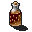

# { .sprite } Deebo's apple cider

*Rare food.*

<div class="infobox" markdown>

<p class="ib-img">{ .sprite }</p>

| | |
|---|---|
| **Item ID** | `apple_orchard_cider` |
| **Category** | Food |
| **Rarity** | Rare |
| **Base value** | 80 gold |
| **Introduced** | [v0.8.2](../versions/0.8.2.md) |

</div>

> A nice seasonal drink for those slightly colder nights.

## Statistics

### When used

| Stat | Value |
|---|---|
| On self | Sustenance (magnitude 2, 14 rounds, 100% chance); Nausea (magnitude -99, 35% chance) |

<p class="verified">Verified against v0.8.18 item data.</p>

## How to get it

### Sold by

- [Deebo](../monsters/deebo_orchard_deebo.md) (Deebo's Orchard)


<p class="verified">Verified against v0.8.18 item, loot, map and dialogue data.</p>


## Version history

| Version | Change |
|---|---|
| [v0.8.2](../versions/0.8.2.md) | Added |
| [v0.8.5](../versions/0.8.5.md) | baseMarketCost: 50 → 80; useEffect: {"conditionsSource": [{"chance": "100",… → {"conditionsSource": [{"chance": "100",… |

<p class="verified">Verified against v0.8.18 and every earlier release back to v0.7.0 (game data compared release by release).</p>


## Community notes

<small>Written by players, not generated from game data. **Strategy**: how and when to use it · **Lore**: the in-world story · **Trivia**: real-world facts, references, development history · **Theory / speculation**: unconfirmed ideas; may just be unfinished content</small>

### Strategy

*Nothing here yet. Know something? [Add it](https://github.com/asdfghjkl628/Andor-s-Trail-Wikiiii/new/main/notes/items?filename=apple_orchard_cider.md&value=%23%23%20Strategy%0A%0A%3C%21--%20how%20and%20when%20to%20use%20it%20--%3E%0A%0A%23%23%20Lore%0A%0A%3C%21--%20the%20in-world%20story%20--%3E%0A%0A%23%23%20Trivia%0A%0A%3C%21--%20real-world%20facts%2C%20references%2C%20development%20history%20--%3E%0A%0A%23%23%20Theory%20/%20speculation%0A%0A%3C%21--%20unconfirmed%20ideas%3B%20may%20just%20be%20unfinished%20content%20--%3E%0A).*

### Lore

*Nothing here yet. Know something? [Add it](https://github.com/asdfghjkl628/Andor-s-Trail-Wikiiii/new/main/notes/items?filename=apple_orchard_cider.md&value=%23%23%20Strategy%0A%0A%3C%21--%20how%20and%20when%20to%20use%20it%20--%3E%0A%0A%23%23%20Lore%0A%0A%3C%21--%20the%20in-world%20story%20--%3E%0A%0A%23%23%20Trivia%0A%0A%3C%21--%20real-world%20facts%2C%20references%2C%20development%20history%20--%3E%0A%0A%23%23%20Theory%20/%20speculation%0A%0A%3C%21--%20unconfirmed%20ideas%3B%20may%20just%20be%20unfinished%20content%20--%3E%0A).*

### Trivia

*Nothing here yet. Know something? [Add it](https://github.com/asdfghjkl628/Andor-s-Trail-Wikiiii/new/main/notes/items?filename=apple_orchard_cider.md&value=%23%23%20Strategy%0A%0A%3C%21--%20how%20and%20when%20to%20use%20it%20--%3E%0A%0A%23%23%20Lore%0A%0A%3C%21--%20the%20in-world%20story%20--%3E%0A%0A%23%23%20Trivia%0A%0A%3C%21--%20real-world%20facts%2C%20references%2C%20development%20history%20--%3E%0A%0A%23%23%20Theory%20/%20speculation%0A%0A%3C%21--%20unconfirmed%20ideas%3B%20may%20just%20be%20unfinished%20content%20--%3E%0A).*

### Theory / speculation

*Nothing here yet. Know something? [Add it](https://github.com/asdfghjkl628/Andor-s-Trail-Wikiiii/new/main/notes/items?filename=apple_orchard_cider.md&value=%23%23%20Strategy%0A%0A%3C%21--%20how%20and%20when%20to%20use%20it%20--%3E%0A%0A%23%23%20Lore%0A%0A%3C%21--%20the%20in-world%20story%20--%3E%0A%0A%23%23%20Trivia%0A%0A%3C%21--%20real-world%20facts%2C%20references%2C%20development%20history%20--%3E%0A%0A%23%23%20Theory%20/%20speculation%0A%0A%3C%21--%20unconfirmed%20ideas%3B%20may%20just%20be%20unfinished%20content%20--%3E%0A).*


??? info "Technical information"

    | | |
    |---|---|
    | Item ID | `apple_orchard_cider` |
    | Category ID | `food` |
    | Icon | `items_tometik1:9` |
    | Defined in | `res/raw/itemlist_sullengard.json` |
    | Loot tables containing it | `deebo_orchard_dl` |

    Raw data:

    ```json
    {
     "id": "apple_orchard_cider",
     "iconID": "items_tometik1:9",
     "name": "Deebo's apple cider",
     "displaytype": "rare",
     "hasManualPrice": 1,
     "baseMarketCost": 80,
     "category": "food",
     "description": "A nice seasonal drink for those slightly colder nights.",
     "useEffect": {
      "conditionsSource": [
       {
        "condition": "food",
        "magnitude": 2,
        "duration": 14,
        "chance": "100"
       },
       {
        "condition": "nausea",
        "magnitude": -99,
        "chance": "35"
       }
      ]
     }
    }
    ```


<small>Data from v0.8.18</small>
