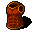

# { .sprite } Remgard combat vest
*Ordinary* · Armor (light) · value 1244 gold

**Slot:** body · **Size:** std

## When equipped

| Stat | Value |
|---|---|
| Attack chance | +17 |
| Block chance | +8 |

## Sold by

- [Ervelyn](../monsters/ervelyn.md)

Verified against v0.8.18 item data.

## Version history

| Version | Change |
|---|---|
| [v0.7.0](../versions/0.7.0.md) | Present in v0.7.0 (earliest release tracked) |

Verified against v0.8.18 and every earlier release back to v0.7.0 (game data compared release by release).

<small>Item ID: `armour_cvest2` · Data from v0.8.18</small>
