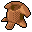

# { .sprite } Villain's leather armor

*Ordinary armor, leather.*

<div class="infobox" markdown>

<p class="ib-img">{ .sprite }</p>

| | |
|---|---|
| **Item ID** | `armour_leather_villain` |
| **Category** | Armor, leather |
| **Slot** | body |
| **Proficiency** | [Light armor proficiency](../skills/armorProficiencyLight.md) |
| **Rarity** | Ordinary |
| **Base value** | 3,700 gold |
| **Introduced** | v0.7.0 or earlier |

</div>

## Statistics

### When equipped

| Stat | Value |
|---|---|
| Move cost | -1 |
| Attack chance | -4 |
| Critical skill | +3 |
| Block chance | +15 |

<p class="verified">Verified against v0.8.18 item data.</p>

## How to get it

### Dropped by

| Monster | Chance | Qty | Found in |
|---|---|---|---|
| [Crackshot](../monsters/g03_crackshot.md) | 20% | 1 | Crackshot hideout 3 |

### Sold by

- [Ailshara](../monsters/ailshara.md) (Crossroads Guardhouse)


<p class="verified">Verified against v0.8.18 item, loot, map and dialogue data.</p>


## Version history

| Version | Change |
|---|---|
| [v0.7.0](../versions/0.7.0.md) | Present in v0.7.0 (earliest release tracked) |
| [v0.7.8](../versions/0.7.8.md) | Renamed “Villain's leather armour” → “Villain's leather armor” |

<p class="verified">Verified against v0.8.18 and every earlier release back to v0.7.0 (game data compared release by release).</p>


## Community notes

<small>Written by players, not generated from game data. **Strategy**: how and when to use it · **Lore**: the in-world story · **Trivia**: real-world facts, references, development history · **Theory / speculation**: unconfirmed ideas; may just be unfinished content</small>

### Strategy

*No notes yet. Contributions are welcome: [add a note](https://github.com/asdfghjkl628/Andor-s-Trail-Wikiiii/new/main/notes/items?filename=armour_leather_villain.md&value=%23%23%20Strategy%0A%0A%3C%21--%20how%20and%20when%20to%20use%20it%20--%3E%0A%0A%23%23%20Lore%0A%0A%3C%21--%20the%20in-world%20story%20--%3E%0A%0A%23%23%20Trivia%0A%0A%3C%21--%20real-world%20facts%2C%20references%2C%20development%20history%20--%3E%0A%0A%23%23%20Theory%20/%20speculation%0A%0A%3C%21--%20unconfirmed%20ideas%3B%20may%20just%20be%20unfinished%20content%20--%3E%0A).*

### Lore

*No notes yet. Contributions are welcome: [add a note](https://github.com/asdfghjkl628/Andor-s-Trail-Wikiiii/new/main/notes/items?filename=armour_leather_villain.md&value=%23%23%20Strategy%0A%0A%3C%21--%20how%20and%20when%20to%20use%20it%20--%3E%0A%0A%23%23%20Lore%0A%0A%3C%21--%20the%20in-world%20story%20--%3E%0A%0A%23%23%20Trivia%0A%0A%3C%21--%20real-world%20facts%2C%20references%2C%20development%20history%20--%3E%0A%0A%23%23%20Theory%20/%20speculation%0A%0A%3C%21--%20unconfirmed%20ideas%3B%20may%20just%20be%20unfinished%20content%20--%3E%0A).*

### Trivia

*No notes yet. Contributions are welcome: [add a note](https://github.com/asdfghjkl628/Andor-s-Trail-Wikiiii/new/main/notes/items?filename=armour_leather_villain.md&value=%23%23%20Strategy%0A%0A%3C%21--%20how%20and%20when%20to%20use%20it%20--%3E%0A%0A%23%23%20Lore%0A%0A%3C%21--%20the%20in-world%20story%20--%3E%0A%0A%23%23%20Trivia%0A%0A%3C%21--%20real-world%20facts%2C%20references%2C%20development%20history%20--%3E%0A%0A%23%23%20Theory%20/%20speculation%0A%0A%3C%21--%20unconfirmed%20ideas%3B%20may%20just%20be%20unfinished%20content%20--%3E%0A).*

### Theory / speculation

*No notes yet. Contributions are welcome: [add a note](https://github.com/asdfghjkl628/Andor-s-Trail-Wikiiii/new/main/notes/items?filename=armour_leather_villain.md&value=%23%23%20Strategy%0A%0A%3C%21--%20how%20and%20when%20to%20use%20it%20--%3E%0A%0A%23%23%20Lore%0A%0A%3C%21--%20the%20in-world%20story%20--%3E%0A%0A%23%23%20Trivia%0A%0A%3C%21--%20real-world%20facts%2C%20references%2C%20development%20history%20--%3E%0A%0A%23%23%20Theory%20/%20speculation%0A%0A%3C%21--%20unconfirmed%20ideas%3B%20may%20just%20be%20unfinished%20content%20--%3E%0A).*


??? info "Technical information"

    | | |
    |---|---|
    | Item ID | `armour_leather_villain` |
    | Category ID | `bdy_lthr` |
    | Icon | `items_armours:16` |
    | Defined in | `res/raw/itemlist_v0610_1.json` |
    | Loot tables containing it | `shop_ailshara`, `drop_g03_crackshot` |

    Raw data:

    ```json
    {
     "id": "armour_leather_villain",
     "iconID": "items_armours:16",
     "name": "Villain's leather armor",
     "hasManualPrice": 0,
     "baseMarketCost": 3700,
     "category": "bdy_lthr",
     "equipEffect": {
      "increaseMoveCost": -1,
      "increaseAttackChance": -4,
      "increaseCriticalSkill": 3,
      "increaseBlockChance": 15
     }
    }
    ```


<small>Data from v0.8.18</small>
