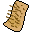

# { .sprite } Arulir skin

*Ordinary animal part.*

<div class="infobox" markdown>

<p class="ib-img">{ .sprite }</p>

| | |
|---|---|
| **Item ID** | `arulir_skin` |
| **Category** | Animal part |
| **Rarity** | Ordinary |
| **Base value** | 4 gold |
| **Introduced** | v0.7.0 or earlier |

</div>

## How to get it

### Dropped by

| Monster | Chance | Qty | Found in |
|---|---|---|---|
| [Arulir Pack Leader](../monsters/arulir_leader.md) | 90% | 1 | arulircave6 |
| [Demonic Arulir](../monsters/arulir_8.md) | 10% | 1 | arulircave6 |
| [Arulir](../monsters/arulir_1.md) | 1% | 1 | arulirmountain1, arulirmountain2, mountainlake5 |
| [Giant arulir](../monsters/arulir_2.md) | 1% | 1 | arulirmountain1, arulirmountain2, mountainlake5 |
| [Cave Arulir](../monsters/arulir_3.md) | 1% | 1 | arulircave1, arulircave2, arulircave3 |
| [Giant Cave Arulir](../monsters/arulir_4.md) | 1% | 1 | arulircave1, arulircave2, arulircave3 |
| [Golden Arulir](../monsters/arulir_5.md) | 1% | 1 | arulircave4, arulircave5, arulircave6 |
| [Giant Golden Arulir](../monsters/arulir_6.md) | 1% | 1 | arulircave4, arulircave5, arulircave6 |


<p class="verified">Verified against v0.8.18 item, loot, map and dialogue data.</p>

## Uses

Where the game checks for this item in dialogue:

| With | Quest | What happens to it | Option |
|---|---|---|---|
| [Lodar](../monsters/lodar.md) ([lodarhouse1](../maps/lodarhouse1.md)) | [Lodar's potions](../quests/lodar_pots.md#stage-43) | handed over (2×) | “I have those things on me, here.” |
| [Lodar](../monsters/lodar.md) ([lodarhouse1](../maps/lodarhouse1.md)) | [Lodar's potions](../quests/lodar_pots.md#stage-43) | handed over (10×) | “I have enough of those things on me for five potions, here.” |
| [Lodar](../monsters/lodar.md) ([lodarhouse1](../maps/lodarhouse1.md)) | [Lodar's potions](../quests/lodar_pots.md#stage-43) | handed over (20×) | “I have enough of those things on me for ten potions, here.” |
| [Fiamma](../monsters/brightportsmith.md) ([brightport_weapon](../maps/brightport_weapon.md)) | [Too hot to handle](../quests/brightport_fiamma.md#stage-25) | handed over (1×) | “I have the cold lava rocks and arulir skin.” |

<p class="verified">Verified against v0.8.18 dialogue data.</p>


## Version history

| Version | Change |
|---|---|
| [v0.7.0](../versions/0.7.0.md) | Present in v0.7.0 (earliest release tracked) |

<p class="verified">Verified against v0.8.18 and every earlier release back to v0.7.0 (game data compared release by release).</p>


## Community notes

<small>Written by players, not generated from game data. **Strategy**: how and when to use it · **Lore**: the in-world story · **Trivia**: real-world facts, references, development history · **Theory / speculation**: unconfirmed ideas; may just be unfinished content</small>

### Strategy

*No notes yet. Contributions are welcome: [add a note](https://github.com/asdfghjkl628/Andor-s-Trail-Wikiiii/new/main/notes/items?filename=arulir_skin.md&value=%23%23%20Strategy%0A%0A%3C%21--%20how%20and%20when%20to%20use%20it%20--%3E%0A%0A%23%23%20Lore%0A%0A%3C%21--%20the%20in-world%20story%20--%3E%0A%0A%23%23%20Trivia%0A%0A%3C%21--%20real-world%20facts%2C%20references%2C%20development%20history%20--%3E%0A%0A%23%23%20Theory%20/%20speculation%0A%0A%3C%21--%20unconfirmed%20ideas%3B%20may%20just%20be%20unfinished%20content%20--%3E%0A).*

### Lore

*No notes yet. Contributions are welcome: [add a note](https://github.com/asdfghjkl628/Andor-s-Trail-Wikiiii/new/main/notes/items?filename=arulir_skin.md&value=%23%23%20Strategy%0A%0A%3C%21--%20how%20and%20when%20to%20use%20it%20--%3E%0A%0A%23%23%20Lore%0A%0A%3C%21--%20the%20in-world%20story%20--%3E%0A%0A%23%23%20Trivia%0A%0A%3C%21--%20real-world%20facts%2C%20references%2C%20development%20history%20--%3E%0A%0A%23%23%20Theory%20/%20speculation%0A%0A%3C%21--%20unconfirmed%20ideas%3B%20may%20just%20be%20unfinished%20content%20--%3E%0A).*

### Trivia

*No notes yet. Contributions are welcome: [add a note](https://github.com/asdfghjkl628/Andor-s-Trail-Wikiiii/new/main/notes/items?filename=arulir_skin.md&value=%23%23%20Strategy%0A%0A%3C%21--%20how%20and%20when%20to%20use%20it%20--%3E%0A%0A%23%23%20Lore%0A%0A%3C%21--%20the%20in-world%20story%20--%3E%0A%0A%23%23%20Trivia%0A%0A%3C%21--%20real-world%20facts%2C%20references%2C%20development%20history%20--%3E%0A%0A%23%23%20Theory%20/%20speculation%0A%0A%3C%21--%20unconfirmed%20ideas%3B%20may%20just%20be%20unfinished%20content%20--%3E%0A).*

### Theory / speculation

*No notes yet. Contributions are welcome: [add a note](https://github.com/asdfghjkl628/Andor-s-Trail-Wikiiii/new/main/notes/items?filename=arulir_skin.md&value=%23%23%20Strategy%0A%0A%3C%21--%20how%20and%20when%20to%20use%20it%20--%3E%0A%0A%23%23%20Lore%0A%0A%3C%21--%20the%20in-world%20story%20--%3E%0A%0A%23%23%20Trivia%0A%0A%3C%21--%20real-world%20facts%2C%20references%2C%20development%20history%20--%3E%0A%0A%23%23%20Theory%20/%20speculation%0A%0A%3C%21--%20unconfirmed%20ideas%3B%20may%20just%20be%20unfinished%20content%20--%3E%0A).*


??? info "Technical information"

    | | |
    |---|---|
    | Item ID | `arulir_skin` |
    | Category ID | `animal` |
    | Icon | `items_misc:39` |
    | Defined in | `res/raw/itemlist_v0611_2.json` |
    | Loot tables containing it | `arulir`, `arulirskin`, `arulir_demonic`, `arulir_leader` |

    Raw data:

    ```json
    {
     "id": "arulir_skin",
     "iconID": "items_misc:39",
     "name": "Arulir skin",
     "hasManualPrice": 1,
     "baseMarketCost": 4,
     "category": "animal"
    }
    ```


<small>Data from v0.8.18</small>
