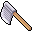

# { .sprite } Fine iron axe

*Ordinary axe.*

<div class="infobox" markdown>

<p class="ib-img">{ .sprite }</p>

| | |
|---|---|
| **Item ID** | `axe_fine_iron` |
| **Category** | Axe |
| **Slot** | weapon |
| **Hands** | One-handed |
| **Proficiency** | [Axe proficiency](../skills/weaponProficiencyAxe.md) |
| **Rarity** | Ordinary |
| **Base value** | 365 gold |
| **Introduced** | v0.7.0 or earlier |

</div>

## Statistics

### When equipped

| Stat | Value |
|---|---|
| Attack damage | 4 to 6 |
| Attack cost | +6 |
| Attack chance | +9 |
| setNonWeaponDamageModifier | +150 |

<p class="verified">Verified against v0.8.18 item data.</p>

## How to get it

### Sold by

- [Vilegard smith](../monsters/vilegard_smith.md) (Vilegard)
- [Arnal](../monsters/arnal.md) (Remgard)
- [Cornith](../monsters/stoutford_smith.md) (Stoutford)
- [Arlish](../monsters/arlish.md) (Brimhaven)


<p class="verified">Verified against v0.8.18 item, loot, map and dialogue data.</p>

## Uses

Where the game checks for this item in dialogue:

| With | Quest | What happens to it | Option |
|---|---|---|---|
| reading a sign on [gapfiller2](../maps/gapfiller2.md) | [It's knot funny](../quests/fallhaven_lytwings.md#stage-21) | must be carried (1×) | “(automatic)” |
| reading a sign on [gapfiller2](../maps/gapfiller2.md) | [It's knot funny](../quests/fallhaven_lytwings.md#stage-21) | must be worn (1×) | “(automatic)” |

<p class="verified">Verified against v0.8.18 dialogue data.</p>


## Version history

| Version | Change |
|---|---|
| [v0.7.0](../versions/0.7.0.md) | Present in v0.7.0 (earliest release tracked) |
| [v0.7.10](../versions/0.7.10.md) | When equipped, non-weapon damage modifier (%): added (150) |

<p class="verified">Verified against v0.8.18 and every earlier release back to v0.7.0 (game data compared release by release).</p>


## Community notes

<small>Written by players, not generated from game data. **Strategy**: how and when to use it · **Lore**: the in-world story · **Trivia**: real-world facts, references, development history · **Theory / speculation**: unconfirmed ideas; may just be unfinished content</small>

### Strategy

*No notes yet. Contributions are welcome: [add a note](https://github.com/asdfghjkl628/Andor-s-Trail-Wikiiii/new/main/notes/items?filename=axe_fine_iron.md&value=%23%23%20Strategy%0A%0A%3C%21--%20how%20and%20when%20to%20use%20it%20--%3E%0A%0A%23%23%20Lore%0A%0A%3C%21--%20the%20in-world%20story%20--%3E%0A%0A%23%23%20Trivia%0A%0A%3C%21--%20real-world%20facts%2C%20references%2C%20development%20history%20--%3E%0A%0A%23%23%20Theory%20/%20speculation%0A%0A%3C%21--%20unconfirmed%20ideas%3B%20may%20just%20be%20unfinished%20content%20--%3E%0A).*

### Lore

*No notes yet. Contributions are welcome: [add a note](https://github.com/asdfghjkl628/Andor-s-Trail-Wikiiii/new/main/notes/items?filename=axe_fine_iron.md&value=%23%23%20Strategy%0A%0A%3C%21--%20how%20and%20when%20to%20use%20it%20--%3E%0A%0A%23%23%20Lore%0A%0A%3C%21--%20the%20in-world%20story%20--%3E%0A%0A%23%23%20Trivia%0A%0A%3C%21--%20real-world%20facts%2C%20references%2C%20development%20history%20--%3E%0A%0A%23%23%20Theory%20/%20speculation%0A%0A%3C%21--%20unconfirmed%20ideas%3B%20may%20just%20be%20unfinished%20content%20--%3E%0A).*

### Trivia

*No notes yet. Contributions are welcome: [add a note](https://github.com/asdfghjkl628/Andor-s-Trail-Wikiiii/new/main/notes/items?filename=axe_fine_iron.md&value=%23%23%20Strategy%0A%0A%3C%21--%20how%20and%20when%20to%20use%20it%20--%3E%0A%0A%23%23%20Lore%0A%0A%3C%21--%20the%20in-world%20story%20--%3E%0A%0A%23%23%20Trivia%0A%0A%3C%21--%20real-world%20facts%2C%20references%2C%20development%20history%20--%3E%0A%0A%23%23%20Theory%20/%20speculation%0A%0A%3C%21--%20unconfirmed%20ideas%3B%20may%20just%20be%20unfinished%20content%20--%3E%0A).*

### Theory / speculation

*No notes yet. Contributions are welcome: [add a note](https://github.com/asdfghjkl628/Andor-s-Trail-Wikiiii/new/main/notes/items?filename=axe_fine_iron.md&value=%23%23%20Strategy%0A%0A%3C%21--%20how%20and%20when%20to%20use%20it%20--%3E%0A%0A%23%23%20Lore%0A%0A%3C%21--%20the%20in-world%20story%20--%3E%0A%0A%23%23%20Trivia%0A%0A%3C%21--%20real-world%20facts%2C%20references%2C%20development%20history%20--%3E%0A%0A%23%23%20Theory%20/%20speculation%0A%0A%3C%21--%20unconfirmed%20ideas%3B%20may%20just%20be%20unfinished%20content%20--%3E%0A).*


??? info "Technical information"

    | | |
    |---|---|
    | Item ID | `axe_fine_iron` |
    | Category ID | `axe` |
    | Icon | `items_weapons:56` |
    | Defined in | `res/raw/itemlist_v0610_1.json` |
    | Loot tables containing it | `shop_vg_smith`, `shop_arnal`, `shop_cornith`, `arlish` |

    Raw data:

    ```json
    {
     "id": "axe_fine_iron",
     "iconID": "items_weapons:56",
     "name": "Fine iron axe",
     "hasManualPrice": 0,
     "baseMarketCost": 365,
     "category": "axe",
     "equipEffect": {
      "increaseAttackDamage": {
       "min": 4,
       "max": 6
      },
      "increaseAttackCost": 6,
      "increaseAttackChance": 9,
      "setNonWeaponDamageModifier": 150
     }
    }
    ```


<small>Data from v0.8.18</small>
