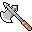

# { .sprite } Axe of whirlwind

*Rare axe.*

<div class="infobox" markdown>

<p class="ib-img">{ .sprite }</p>

| | |
|---|---|
| **Item ID** | `axe_whirl` |
| **Category** | Axe |
| **Slot** | weapon |
| **Hands** | One-handed |
| **Proficiency** | Axe |
| **Rarity** | Rare |
| **Base value** | 3,126 gold |
| **Introduced** | v0.7.0 or earlier |

</div>

## Statistics

### When equipped

| Stat | Value |
|---|---|
| Attack damage | 2 to 4 |
| Attack cost | +6 |
| Attack chance | +16 |
| Critical skill | +10 |
| Block chance | -5 |
| Critical multiplier | 2.0 |
| setNonWeaponDamageModifier | +175 |

### On hit

| Stat | Value |
|---|---|
| On self | Minor speed (magnitude 1, 3 rounds, 5% chance) |

<p class="verified">Verified against v0.8.18 item data.</p>

## How to get it

### Sold by

- [Lleglaris](../monsters/lleglaris.md) (Foaming Flask Tavern)


<p class="verified">Verified against v0.8.18 item, loot, map and dialogue data.</p>


## Version history

| Version | Change |
|---|---|
| [v0.7.0](../versions/0.7.0.md) | Present in v0.7.0 (earliest release tracked) |
| [v0.7.2](../versions/0.7.2.md) | hitEffect: {"conditionsSource": [{"chance": 5, "co… → {"conditionsSource": [{"chance": "5", "… |
| [v0.7.10](../versions/0.7.10.md) | equipEffect: {"increaseAttackChance": 16, "increaseA… → {"increaseAttackChance": 16, "increaseA… |

<p class="verified">Verified against v0.8.18 and every earlier release back to v0.7.0 (game data compared release by release).</p>


## Community notes

<small>Written by players, not generated from game data. **Strategy**: how and when to use it · **Lore**: the in-world story · **Trivia**: real-world facts, references, development history · **Theory / speculation**: unconfirmed ideas; may just be unfinished content</small>

### Strategy

*Nothing here yet. Know something? [Add it](https://github.com/asdfghjkl628/Andor-s-Trail-Wikiiii/new/main/notes/items?filename=axe_whirl.md&value=%23%23%20Strategy%0A%0A%3C%21--%20how%20and%20when%20to%20use%20it%20--%3E%0A%0A%23%23%20Lore%0A%0A%3C%21--%20the%20in-world%20story%20--%3E%0A%0A%23%23%20Trivia%0A%0A%3C%21--%20real-world%20facts%2C%20references%2C%20development%20history%20--%3E%0A%0A%23%23%20Theory%20/%20speculation%0A%0A%3C%21--%20unconfirmed%20ideas%3B%20may%20just%20be%20unfinished%20content%20--%3E%0A).*

### Lore

*Nothing here yet. Know something? [Add it](https://github.com/asdfghjkl628/Andor-s-Trail-Wikiiii/new/main/notes/items?filename=axe_whirl.md&value=%23%23%20Strategy%0A%0A%3C%21--%20how%20and%20when%20to%20use%20it%20--%3E%0A%0A%23%23%20Lore%0A%0A%3C%21--%20the%20in-world%20story%20--%3E%0A%0A%23%23%20Trivia%0A%0A%3C%21--%20real-world%20facts%2C%20references%2C%20development%20history%20--%3E%0A%0A%23%23%20Theory%20/%20speculation%0A%0A%3C%21--%20unconfirmed%20ideas%3B%20may%20just%20be%20unfinished%20content%20--%3E%0A).*

### Trivia

*Nothing here yet. Know something? [Add it](https://github.com/asdfghjkl628/Andor-s-Trail-Wikiiii/new/main/notes/items?filename=axe_whirl.md&value=%23%23%20Strategy%0A%0A%3C%21--%20how%20and%20when%20to%20use%20it%20--%3E%0A%0A%23%23%20Lore%0A%0A%3C%21--%20the%20in-world%20story%20--%3E%0A%0A%23%23%20Trivia%0A%0A%3C%21--%20real-world%20facts%2C%20references%2C%20development%20history%20--%3E%0A%0A%23%23%20Theory%20/%20speculation%0A%0A%3C%21--%20unconfirmed%20ideas%3B%20may%20just%20be%20unfinished%20content%20--%3E%0A).*

### Theory / speculation

*Nothing here yet. Know something? [Add it](https://github.com/asdfghjkl628/Andor-s-Trail-Wikiiii/new/main/notes/items?filename=axe_whirl.md&value=%23%23%20Strategy%0A%0A%3C%21--%20how%20and%20when%20to%20use%20it%20--%3E%0A%0A%23%23%20Lore%0A%0A%3C%21--%20the%20in-world%20story%20--%3E%0A%0A%23%23%20Trivia%0A%0A%3C%21--%20real-world%20facts%2C%20references%2C%20development%20history%20--%3E%0A%0A%23%23%20Theory%20/%20speculation%0A%0A%3C%21--%20unconfirmed%20ideas%3B%20may%20just%20be%20unfinished%20content%20--%3E%0A).*


??? info "Technical information"

    | | |
    |---|---|
    | Item ID | `axe_whirl` |
    | Category ID | `axe` |
    | Icon | `items_weapons:61` |
    | Defined in | `res/raw/itemlist_v070.json` |
    | Loot tables containing it | `shop_lleglaris` |

    Raw data:

    ```json
    {
     "id": "axe_whirl",
     "iconID": "items_weapons:61",
     "name": "Axe of whirlwind",
     "displaytype": "rare",
     "hasManualPrice": 1,
     "baseMarketCost": 3126,
     "category": "axe",
     "equipEffect": {
      "increaseAttackDamage": {
       "min": 2,
       "max": 4
      },
      "increaseAttackCost": 6,
      "increaseAttackChance": 16,
      "increaseCriticalSkill": 10,
      "increaseBlockChance": -5,
      "setCriticalMultiplier": 2.0,
      "setNonWeaponDamageModifier": 175
     },
     "hitEffect": {
      "conditionsSource": [
       {
        "condition": "speed_minor",
        "magnitude": 1,
        "duration": 3,
        "chance": "5"
       }
      ]
     }
    }
    ```


<small>Data from v0.8.18</small>
