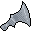

# { .sprite } Bat wing

*Ordinary animal part.*

<div class="infobox" markdown>

<p class="ib-img">{ .sprite }</p>

| | |
|---|---|
| **Item ID** | `bat_wing` |
| **Category** | Animal part |
| **Rarity** | Ordinary |
| **Base value** | 2 gold |
| **Introduced** | v0.7.0 or earlier |

</div>

## How to get it

### Dropped by

| Monster | Chance | Qty | Found in |
|---|---|---|---|
| [Three-eyed bat](../monsters/three_eyed_bat.md) | 25% | 1-2 | haunted_underground_1, haunted_underground_2, haunted_underground_3 |
| [Gray cave bat](../monsters/cavebat1.md) | 20% | 1 | Lake Laeroth |
| [Black cave bat](../monsters/cavebat2.md) | 20% | 1 | Lake Laeroth |
| [Brown cave bat](../monsters/cavebat3.md) | 20% | 1 | Lake Laeroth |
| [Cave bat](../monsters/cavebat4.md) | 20% | 1 | Lake Laeroth |
| [Aggressive cave bat](../monsters/cavebat5.md) | 20% | 1 | Lake Laeroth |


<p class="verified">Verified against v0.8.18 item, loot, map and dialogue data.</p>


## Version history

| Version | Change |
|---|---|
| [v0.7.0](../versions/0.7.0.md) | Present in v0.7.0 (earliest release tracked) |

<p class="verified">Verified against v0.8.18 and every earlier release back to v0.7.0 (game data compared release by release).</p>


## Community notes

<small>Written by players, not generated from game data. **Strategy**: how and when to use it · **Lore**: the in-world story · **Trivia**: real-world facts, references, development history · **Theory / speculation**: unconfirmed ideas; may just be unfinished content</small>

### Strategy

*Nothing here yet. Know something? [Add it](https://github.com/asdfghjkl628/Andor-s-Trail-Wikiiii/new/main/notes/items?filename=bat_wing.md&value=%23%23%20Strategy%0A%0A%3C%21--%20how%20and%20when%20to%20use%20it%20--%3E%0A%0A%23%23%20Lore%0A%0A%3C%21--%20the%20in-world%20story%20--%3E%0A%0A%23%23%20Trivia%0A%0A%3C%21--%20real-world%20facts%2C%20references%2C%20development%20history%20--%3E%0A%0A%23%23%20Theory%20/%20speculation%0A%0A%3C%21--%20unconfirmed%20ideas%3B%20may%20just%20be%20unfinished%20content%20--%3E%0A).*

### Lore

*Nothing here yet. Know something? [Add it](https://github.com/asdfghjkl628/Andor-s-Trail-Wikiiii/new/main/notes/items?filename=bat_wing.md&value=%23%23%20Strategy%0A%0A%3C%21--%20how%20and%20when%20to%20use%20it%20--%3E%0A%0A%23%23%20Lore%0A%0A%3C%21--%20the%20in-world%20story%20--%3E%0A%0A%23%23%20Trivia%0A%0A%3C%21--%20real-world%20facts%2C%20references%2C%20development%20history%20--%3E%0A%0A%23%23%20Theory%20/%20speculation%0A%0A%3C%21--%20unconfirmed%20ideas%3B%20may%20just%20be%20unfinished%20content%20--%3E%0A).*

### Trivia

*Nothing here yet. Know something? [Add it](https://github.com/asdfghjkl628/Andor-s-Trail-Wikiiii/new/main/notes/items?filename=bat_wing.md&value=%23%23%20Strategy%0A%0A%3C%21--%20how%20and%20when%20to%20use%20it%20--%3E%0A%0A%23%23%20Lore%0A%0A%3C%21--%20the%20in-world%20story%20--%3E%0A%0A%23%23%20Trivia%0A%0A%3C%21--%20real-world%20facts%2C%20references%2C%20development%20history%20--%3E%0A%0A%23%23%20Theory%20/%20speculation%0A%0A%3C%21--%20unconfirmed%20ideas%3B%20may%20just%20be%20unfinished%20content%20--%3E%0A).*

### Theory / speculation

*Nothing here yet. Know something? [Add it](https://github.com/asdfghjkl628/Andor-s-Trail-Wikiiii/new/main/notes/items?filename=bat_wing.md&value=%23%23%20Strategy%0A%0A%3C%21--%20how%20and%20when%20to%20use%20it%20--%3E%0A%0A%23%23%20Lore%0A%0A%3C%21--%20the%20in-world%20story%20--%3E%0A%0A%23%23%20Trivia%0A%0A%3C%21--%20real-world%20facts%2C%20references%2C%20development%20history%20--%3E%0A%0A%23%23%20Theory%20/%20speculation%0A%0A%3C%21--%20unconfirmed%20ideas%3B%20may%20just%20be%20unfinished%20content%20--%3E%0A).*


??? info "Technical information"

    | | |
    |---|---|
    | Item ID | `bat_wing` |
    | Category ID | `animal` |
    | Icon | `items_misc:46` |
    | Defined in | `res/raw/itemlist_v070.json` |
    | Loot tables containing it | `cavebat`, `three_eyed_bat_dl` |

    Raw data:

    ```json
    {
     "id": "bat_wing",
     "iconID": "items_misc:46",
     "name": "Bat wing",
     "hasManualPrice": 1,
     "baseMarketCost": 2,
     "category": "animal"
    }
    ```


<small>Data from v0.8.18</small>
