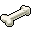

# { .sprite } Bone

*Ordinary animal part.*

<div class="infobox" markdown>

<p class="ib-img"></p>

| | |
|---|---|
| **Item ID** | `bone` |
| **Category** | Animal part |
| **Rarity** | Ordinary |
| **Base value** | 2 gold |
| **Introduced** | v0.7.0 or earlier |

</div>

## How to get it

### Dropped by

| Monster | Chance | Qty | Found in |
|---|---|---|---|
| [Keknazar](../monsters/keknazar.md) | 100% | 1-3 | Crossroads Guardhouse |
| [Thukuzun](../monsters/thukuzun.md) | 100% | 2-8 | Lostmine 11 |
| [Hira'zinn](../monsters/hirazinn.md) | 100% | 0-4 | Lodarcave 4a |
| [Zuul'khan](../monsters/zuul_khan.md#v-zuul_khan9) | 100% | 1 | Mushroom m 3 1 |
| [Prim guard skeleton](../monsters/elm_miner4.md#v-elm_miner4a) | 100% | 1-2 | Elm 5f 2 |
| [Golden jackal](../monsters/golden_jackal.md) | 100% | 1 | Sullengard west ravine, Sullengard woods 12, Sullengard woods 4 |
| [Sleepy giant ogre](../monsters/mg2_troll.md) | 100% | 1 | Galmore 18 |
| [Kotheses](../monsters/kotheses.md) | 80% | 1-2 | Laerothprison 7 |
| [Greater wight](../monsters/wight_greater.md) | 70% | 1 | Laerothprison 6, Laerothprison 7 |
| [River troll](../monsters/rivertroll.md) | 50% | 3-5 | Flagstone Prison, Crossroads Guardhouse |
| [Mazarth beast](../monsters/mazarth1.md) | 50% | 0-5 | Charwood |
| [Tough mazarth beast](../monsters/mazarth2.md) | 50% | 0-5 | Charwood |
| [Skeleton](../monsters/skeleton.md#v-guynmart_skeleton) | 50% | 1 | Guynmart Castle |
| [Skeleton](../monsters/skeleton.md#v-guynmart_skeleton2) | 50% | 1 | Guynmart Castle |
| [Skeletal warrior](../monsters/skeletal_warrior.md) | 30% | 1 | Flagstone Prison |
| [Skeletal master](../monsters/skeletal_master.md) | 30% | 1 | Flagstone Prison |
| [Skeleton](../monsters/skeleton.md) | 30% | 1 | Flagstone Prison |
| [Bone warrior](../monsters/bone_warrior.md) | 30% | 1 | Flagstone Prison |
| [Bone champion](../monsters/bone_champion.md) | 30% | 1 | Flagstone Prison, Loneford |
| [Graveyard corpse](../monsters/graveyard_corpse.md) | 30% | 1-2 | Graveyard 1 |
| [Lesser wight](../monsters/wight_lesser.md) | 30% | 1 | Laerothprison 6 |
| [Lesser wight](../monsters/wight_lesser.md#v-wight_lesser5) | 30% | 1 | Laerothprison 5 |
| [Lesser wight](../monsters/wight_lesser.md#v-wight_lesser5b) | 30% | 1 | Laerothprison 5 |
| [Luthor's skeleton guard](../monsters/tt_monster1.md) | 30% | 1 | Crackshot hideout 4 |
| [Luthor's skeleton guard](../monsters/tt_monster1.md#v-tt_monster2) | 30% | 1 | Crackshot hideout 4 |
| [Luthor's skeleton guard](../monsters/tt_monster1.md#v-tt_monster3) | 30% | 1 | Crackshot hideout 4 |
| [Harrowback](../monsters/harrowback.md) | 25% | 1-2 | Mt. Galmore |
| [Mutated harrowback](../monsters/mutated_harrowback.md) | 25% | 1-2 | Mt. Galmore |
| [Ridgehowler](../monsters/ridgehowler.md) | 25% | 1-2 | Mt. Galmore |
| [Tough redfoot beast](../monsters/redft0.md) | 20% | 1-3 | Foaming Flask Tavern, Fallhaven, Charwood |
| [Strong redfoot beast](../monsters/redft1.md) | 20% | 1-3 | Foaming Flask Tavern, Fallhaven, Charwood |
| [Bloodthirsty redfoot beast](../monsters/redft2.md) | 20% | 1-3 | Foaming Flask Tavern, Fallhaven, Charwood |
| [Resurrected miner's skeleton](../monsters/elm_miner1.md) | 16.6667% | 1-3 | Elm 5f 1, Elm 5f 2, Elm 4f 2 |
| [Foul miner's skeleton](../monsters/elm_miner2.md) | 16.6667% | 1-3 | Elm 5f 1, Elm 5f 2, Elm 4f 2 |
| [Contaminated miner's skeleton](../monsters/elm_miner3.md) | 16.6667% | 1-3 | Elm 5f 1, Elm 5f 2, Elm 4f 1 |
| [Prim guard skeleton](../monsters/elm_miner4.md) | 16.6667% | 1-3 | Elm 5f 1, Elm 5f 2, Elm 4f 1 |
| [Hatchling white wyrm](../monsters/hatchling_white_wyrm.md) | 10% | 1 | Blackwater Mountain |
| [Young white wyrm](../monsters/young_white_wyrm.md) | 10% | 1 | Blackwater Mountain |
| [White wyrm](../monsters/white_wyrm.md) | 10% | 1-2 | Blackwater Mountain |
| [Young aulaeth](../monsters/young_aulaeth.md) | 10% | 1-3 | Blackwater Mountain |

*…and 28 more.*

### Found in containers

- [Blackwater mountain 71](../maps/blackwater_mountain71.md#container-1) (container 2, 80%), Blackwater Mountain
- [Blackwater mountain 73](../maps/blackwater_mountain73.md#container-0) (container 1, 80%), Blackwater Mountain
- [Blackwater mountain 73](../maps/blackwater_mountain73.md#container-1) (container 2, 80%), Blackwater Mountain
- [Blackwater mountain 73](../maps/blackwater_mountain73.md#container-2) (container 3, 80%), Blackwater Mountain
- [Blackwater mountain 74](../maps/blackwater_mountain74.md#container-1) (container 2, 80%)
- [Blackwater mountain 74](../maps/blackwater_mountain74.md#container-2) (container 3, 80%)
- [Blackwater mountain 75](../maps/blackwater_mountain75.md#container-0) (container 1, 80%)
- [Blackwater mountain 75](../maps/blackwater_mountain75.md#container-1) (container 2, 80%)
- [Blackwater mountain 75](../maps/blackwater_mountain75.md#container-2) (container 3, 80%)
- [Blackwater mountain 76](../maps/blackwater_mountain76.md#container-0) (container 1, 80%)
- [Blackwater mountain 76](../maps/blackwater_mountain76.md#container-1) (container 2, 80%)
- [Bwmfill 6](../maps/bwmfill6.md#container-0) (container 1, 15%), Blackwater Mountain
- [Elm mine 2](../maps/elm_mine2.md#container-2) (container 3, 100%)
- [Elm mine 4](../maps/elm_mine4.md#container-0) (container 1, 80%)
- [Elm mine 5](../maps/elm_mine5.md#container-1) (container 2, 100%)
- [Gamjee well 1](../maps/gamjee_well_1.md#container-2) (container 3, 100%)
- [Guynmart wood 3 hole](../maps/guynmart_wood_3_hole.md#container-0) (container 1, 100%), Guynmart Castle
- [Home](../maps/home.md#container-1) (container 2, 100%), Crossglen


<p class="verified">Verified against v0.8.18 item, loot, map and dialogue data.</p>

## Uses

Where the game checks for this item in dialogue:

| With | Quest | What happens to it | Option |
|---|---|---|---|
| [Thoronir](../monsters/thoronir.md) ([Fallhaven church](../maps/fallhaven_church.md)) | [Disallowed substance](../quests/bonemeal.md#stage-100) | handed over (5×) | “I have those bones for you.” |
| [Thoronir](../monsters/thoronir.md) ([Fallhaven church](../maps/fallhaven_church.md)) | [Disallowed substance](../quests/bonemeal.md#stage-110) | handed over (5×) | “I have those bones for you.” |
| [Talion](../monsters/talion.md) | [I have it in me](../quests/maggots.md#stage-40) | handed over (5×) | “Here you go.” |
| [Halvor](../monsters/halvor.md) ([Blackwater mountain 4](../maps/blackwater_mountain4.md)) | – | handed over (2×) | “I do have these here. Take them.” |
| [Halvor](../monsters/halvor.md) ([Blackwater mountain 4](../maps/blackwater_mountain4.md)) | – | handed over (2×) | “Let me check ... I do have two bones here with me. Take them.” |
| [Halvor](../monsters/halvor.md) ([Blackwater mountain 4](../maps/blackwater_mountain4.md)) | – | handed over (2×) | “Yes. Look at these.” |
| [Halvor](../monsters/halvor.md) ([Blackwater mountain 4](../maps/blackwater_mountain4.md)) | – | handed over (2×) | “How about these two?” |
| [Halvor](../monsters/halvor.md) ([Blackwater mountain 4](../maps/blackwater_mountain4.md)) | [Surprise?](../quests/halvor_surprise.md#stage-165) | handed over (1×) | “How about this one?” |
| stepping on a trigger on [Ratdom maze 464](../maps/ratdom_maze_464.md) | [Yellow is it](../quests/ratdom_quest.md#stage-32) | handed over (1×) | “A bone.” |
| stepping on a trigger on [Crossglen cave](../maps/crossglen_cave.md) | [Yellow is it](../quests/ratdom_quest.md#stage-100) | handed over (1×) | “What would happen if I put a bone into the hole?” |
| walking into a blocked passage on [Ratdom maze 626](../maps/ratdom_maze_626.md) | – | must be carried (1×) | “Insert a bone into the hole.” |
| stepping on a trigger on [Home](../maps/home.md) | [Ratdom story flags (hidden flag)](../quests/ratdom_nondisplay.md#stage-1) | handed over (1×) | “(automatic)” |
| stepping on a trigger on [Home](../maps/home.md) | – | handed over (1×) | “(automatic)” |
| stepping on a trigger on [Wexlow village](../maps/wexlow_village.md) | – | handed over (1×) | “[Throw a bone into the well]” |
| walking into a blocked passage on [Debugmap](../maps/debugmap.md) | – | handed over (-5×) | “5 normal bones” |

<p class="verified">Verified against v0.8.18 dialogue data.</p>


## Version history

| Version | Change |
|---|---|
| [v0.7.0](../versions/0.7.0.md) | Present in v0.7.0 (earliest release tracked) |

<p class="verified">Verified against v0.8.18 and every earlier release back to v0.7.0 (game data compared release by release).</p>


## Community notes

<small>Written by players, not generated from game data. **Strategy**: how and when to use it · **Lore**: the in-world story · **Trivia**: real-world facts, references, development history · **Theory / speculation**: unconfirmed ideas; may just be unfinished content</small>

### Strategy

*No notes yet. Contributions are welcome: [add a note](https://github.com/asdfghjkl628/Andor-s-Trail-Wikiiii/new/main/notes/items?filename=bone.md&value=%23%23%20Strategy%0A%0A%3C%21--%20how%20and%20when%20to%20use%20it%20--%3E%0A%0A%23%23%20Lore%0A%0A%3C%21--%20the%20in-world%20story%20--%3E%0A%0A%23%23%20Trivia%0A%0A%3C%21--%20real-world%20facts%2C%20references%2C%20development%20history%20--%3E%0A%0A%23%23%20Theory%20/%20speculation%0A%0A%3C%21--%20unconfirmed%20ideas%3B%20may%20just%20be%20unfinished%20content%20--%3E%0A).*

### Lore

*No notes yet. Contributions are welcome: [add a note](https://github.com/asdfghjkl628/Andor-s-Trail-Wikiiii/new/main/notes/items?filename=bone.md&value=%23%23%20Strategy%0A%0A%3C%21--%20how%20and%20when%20to%20use%20it%20--%3E%0A%0A%23%23%20Lore%0A%0A%3C%21--%20the%20in-world%20story%20--%3E%0A%0A%23%23%20Trivia%0A%0A%3C%21--%20real-world%20facts%2C%20references%2C%20development%20history%20--%3E%0A%0A%23%23%20Theory%20/%20speculation%0A%0A%3C%21--%20unconfirmed%20ideas%3B%20may%20just%20be%20unfinished%20content%20--%3E%0A).*

### Trivia

*No notes yet. Contributions are welcome: [add a note](https://github.com/asdfghjkl628/Andor-s-Trail-Wikiiii/new/main/notes/items?filename=bone.md&value=%23%23%20Strategy%0A%0A%3C%21--%20how%20and%20when%20to%20use%20it%20--%3E%0A%0A%23%23%20Lore%0A%0A%3C%21--%20the%20in-world%20story%20--%3E%0A%0A%23%23%20Trivia%0A%0A%3C%21--%20real-world%20facts%2C%20references%2C%20development%20history%20--%3E%0A%0A%23%23%20Theory%20/%20speculation%0A%0A%3C%21--%20unconfirmed%20ideas%3B%20may%20just%20be%20unfinished%20content%20--%3E%0A).*

### Theory / speculation

*No notes yet. Contributions are welcome: [add a note](https://github.com/asdfghjkl628/Andor-s-Trail-Wikiiii/new/main/notes/items?filename=bone.md&value=%23%23%20Strategy%0A%0A%3C%21--%20how%20and%20when%20to%20use%20it%20--%3E%0A%0A%23%23%20Lore%0A%0A%3C%21--%20the%20in-world%20story%20--%3E%0A%0A%23%23%20Trivia%0A%0A%3C%21--%20real-world%20facts%2C%20references%2C%20development%20history%20--%3E%0A%0A%23%23%20Theory%20/%20speculation%0A%0A%3C%21--%20unconfirmed%20ideas%3B%20may%20just%20be%20unfinished%20content%20--%3E%0A).*


??? info "Technical information"

    | | |
    |---|---|
    | Item ID | `bone` |
    | Category ID | `animal` |
    | Icon | `items_misc:44` |
    | Defined in | `res/raw/itemlist_animal.json` |
    | Loot tables containing it | `skeleton`, `skeleton2`, `skeleton3`, `restless_dead_1`, `restless_dead_2`, `wyrm_1`, `wyrm_2`, `wyrm_3`, `wyrm_4`, `aulaeth`, `keknazar`, `rivertroll`, `mbrute`, `mbrute_b`, `hirazinn`, `thukuzun`, `redft`, `mazarth`, `graveyardcorpse`, `waterwaycavebeast`, `guynmart_drp_skeleton`, `guynmart_drp_wood3hole`, `guildbrig_2`, `zuul_khan9`, `bwm73_drop`, `elm2_passage2`, `elm_drop2`, `elm_miner1`, `elm_miner2`, `elm_miner4a`, `sullengard_gj_drop`, `big_cat_dl`, `ratdom_startitems2`, `ratdom_skeleton_bone`, `bwmfill6_container`, `wight1`, `wight2`, `kotheses`, `gamjee_well_bone_dl`, `mg2_troll`, `harrowback_dl` |

    Raw data:

    ```json
    {
     "id": "bone",
     "iconID": "items_misc:44",
     "name": "Bone",
     "hasManualPrice": 1,
     "baseMarketCost": 2,
     "category": "animal"
    }
    ```


<small>Data from v0.8.18</small>
