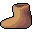

# { .sprite } Leather boots
*Ordinary* · Footwear, leather · value 23 gold

**Slot:** feet · **Size:** light

## When equipped

| Stat | Value |
|---|---|
| Block chance | +3 |

## Dropped by

| Monster | Chance | Qty |
|---|---|---|
| [Rebelled thief](../monsters/guild03_rebthief_1.md) | 20% | 1 |
| [Rabid boar](../monsters/rabid_boar.md) | 5% | 1 |
| [Vicious hound](../monsters/vicious_hound.md) | 5% | 1 |
| [Wild boar](../monsters/wild_boar.md) | 5% | 1 |
| [Trained mountain wolf](../monsters/mountain_wolf_2.md) | 3% | 1 |

## Sold by

- [Thelry](../monsters/thelry.md)
- [Tailor](../monsters/tailor.md)
- [General's henchman](../monsters/ortholion_guard1.md)

<small>Item ID: `boots1` · Data from v0.8.18</small>
