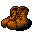

# { .sprite } Bar brawler's boots
*Ordinary* · Footwear, leather · value 0 gold

**Slot:** feet · **Size:** light

## When equipped

| Stat | Value |
|---|---|
| Max HP | +2 |
| Critical skill | +4 |
| Block chance | +7 |

## Sold by

- [Arghes](../monsters/arghes.md)

Verified against v0.8.18 item data.

## Version history

| Version | Change |
|---|---|
| [v0.7.0](../versions/0.7.0.md) | Present in v0.7.0 (earliest release tracked) |

Verified against v0.8.18 and every earlier release back to v0.7.0 (game data compared release by release).

<small>Item ID: `boots_brawler` · Data from v0.8.18</small>
