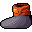

# { .sprite } Boots of flight
*Ordinary* · Footwear, cloth · value 0 gold

**Slot:** feet

## When equipped

| Stat | Value |
|---|---|
| Move cost | -2 |
| Use item cost | 0 |
| Attack cost | +1 |
| Block chance | +3 |

## Sold by

- [Quiet thief](../monsters/stoutford_thief.md)

Verified against v0.8.18 item data.

## Version history

| Version | Change |
|---|---|
| [v0.7.2](../versions/0.7.2.md) | Added |

Verified against v0.8.18 and every earlier release back to v0.7.0 (game data compared release by release).

<small>Item ID: `boots_flight` · Data from v0.8.18</small>
