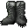

# { .sprite } Spiked metal boots

*Ordinary footwear, metal (light).*

<div class="infobox" markdown>

<p class="ib-img">{ .sprite }</p>

| | |
|---|---|
| **Item ID** | `boots_spiked` |
| **Category** | Footwear, metal (light) |
| **Slot** | feet |
| **Proficiency** | [Light armor proficiency](../skills/armorProficiencyLight.md) |
| **Rarity** | Ordinary |
| **Base value** | 0 gold |
| **Introduced** | [v0.7.11](../versions/0.7.11.md) |

</div>

> These boots look very uncomfortable. For your enemy!

## Statistics

### When equipped

| Stat | Value |
|---|---|
| Attack damage | 1 to 3 |
| Attack chance | -2 |
| Block chance | +7 |

<p class="verified">Verified against v0.8.18 item data.</p>

## How to get it

### Sold by

- [Prowling Arantxa](../monsters/sullengard_arantxa.md) (Sullengard)


<p class="verified">Verified against v0.8.18 item, loot, map and dialogue data.</p>


## Version history

| Version | Change |
|---|---|
| [v0.7.11](../versions/0.7.11.md) | Added |

<p class="verified">Verified against v0.8.18 and every earlier release back to v0.7.0 (game data compared release by release).</p>


## Community notes

<small>Written by players, not generated from game data. **Strategy**: how and when to use it · **Lore**: the in-world story · **Trivia**: real-world facts, references, development history · **Theory / speculation**: unconfirmed ideas; may just be unfinished content</small>

### Strategy

*No notes yet. Contributions are welcome: [add a note](https://github.com/asdfghjkl628/Andor-s-Trail-Wikiiii/new/main/notes/items?filename=boots_spiked.md&value=%23%23%20Strategy%0A%0A%3C%21--%20how%20and%20when%20to%20use%20it%20--%3E%0A%0A%23%23%20Lore%0A%0A%3C%21--%20the%20in-world%20story%20--%3E%0A%0A%23%23%20Trivia%0A%0A%3C%21--%20real-world%20facts%2C%20references%2C%20development%20history%20--%3E%0A%0A%23%23%20Theory%20/%20speculation%0A%0A%3C%21--%20unconfirmed%20ideas%3B%20may%20just%20be%20unfinished%20content%20--%3E%0A).*

### Lore

*No notes yet. Contributions are welcome: [add a note](https://github.com/asdfghjkl628/Andor-s-Trail-Wikiiii/new/main/notes/items?filename=boots_spiked.md&value=%23%23%20Strategy%0A%0A%3C%21--%20how%20and%20when%20to%20use%20it%20--%3E%0A%0A%23%23%20Lore%0A%0A%3C%21--%20the%20in-world%20story%20--%3E%0A%0A%23%23%20Trivia%0A%0A%3C%21--%20real-world%20facts%2C%20references%2C%20development%20history%20--%3E%0A%0A%23%23%20Theory%20/%20speculation%0A%0A%3C%21--%20unconfirmed%20ideas%3B%20may%20just%20be%20unfinished%20content%20--%3E%0A).*

### Trivia

*No notes yet. Contributions are welcome: [add a note](https://github.com/asdfghjkl628/Andor-s-Trail-Wikiiii/new/main/notes/items?filename=boots_spiked.md&value=%23%23%20Strategy%0A%0A%3C%21--%20how%20and%20when%20to%20use%20it%20--%3E%0A%0A%23%23%20Lore%0A%0A%3C%21--%20the%20in-world%20story%20--%3E%0A%0A%23%23%20Trivia%0A%0A%3C%21--%20real-world%20facts%2C%20references%2C%20development%20history%20--%3E%0A%0A%23%23%20Theory%20/%20speculation%0A%0A%3C%21--%20unconfirmed%20ideas%3B%20may%20just%20be%20unfinished%20content%20--%3E%0A).*

### Theory / speculation

*No notes yet. Contributions are welcome: [add a note](https://github.com/asdfghjkl628/Andor-s-Trail-Wikiiii/new/main/notes/items?filename=boots_spiked.md&value=%23%23%20Strategy%0A%0A%3C%21--%20how%20and%20when%20to%20use%20it%20--%3E%0A%0A%23%23%20Lore%0A%0A%3C%21--%20the%20in-world%20story%20--%3E%0A%0A%23%23%20Trivia%0A%0A%3C%21--%20real-world%20facts%2C%20references%2C%20development%20history%20--%3E%0A%0A%23%23%20Theory%20/%20speculation%0A%0A%3C%21--%20unconfirmed%20ideas%3B%20may%20just%20be%20unfinished%20content%20--%3E%0A).*


??? info "Technical information"

    | | |
    |---|---|
    | Item ID | `boots_spiked` |
    | Category ID | `feet_mtl_li` |
    | Icon | `items_rijackson_1:9` |
    | Defined in | `res/raw/itemlist_brimhaven.json` |
    | Loot tables containing it | `sullengard_arantxa_dl` |

    Raw data:

    ```json
    {
     "id": "boots_spiked",
     "iconID": "items_rijackson_1:9",
     "name": "Spiked metal boots",
     "displaytype": "ordinary",
     "category": "feet_mtl_li",
     "description": "These boots look very uncomfortable. For your enemy!",
     "equipEffect": {
      "increaseAttackDamage": {
       "min": 1,
       "max": 3
      },
      "increaseAttackChance": -2,
      "increaseBlockChance": 7
     }
    }
    ```


<small>Data from v0.8.18</small>
