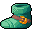

# { .sprite } Vacor's boots of attack
*Extraordinary* · Footwear, leather · value 185 gold

**Slot:** feet · **Size:** light

## When equipped

| Stat | Value |
|---|---|
| Attack chance | +9 |
| Block chance | +2 |

## Dropped by

| Monster | Chance | Qty |
|---|---|---|
| [Vacor](../monsters/vacor.md) | 100% | 1 |

Verified against v0.8.18 item data.

## Version history

| Version | Change |
|---|---|
| [v0.7.0](../versions/0.7.0.md) | Present in v0.7.0 (earliest release tracked) |

Verified against v0.8.18 and every earlier release back to v0.7.0 (game data compared release by release).

<small>Item ID: `boots_vacor` · Data from v0.8.18</small>
