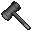

# { .sprite } Bridgebreaker
*Legendary* · Warhammer · value 0 gold

> Forged with ancient heartstone, this hammer is said to shatter the strongest of stones and the will of those who guarded the way.

**Slot:** weapon · **Size:** std

## When equipped

| Stat | Value |
|---|---|
| Attack damage | 4 to 25 |
| Max HP | -20 |
| Use item cost | 0 |
| Attack cost | +7 |
| Attack chance | +23 |
| Critical skill | +6 |
| Block chance | -7 |
| Critical multiplier | 3.0 |
| setNonWeaponDamageModifier | +152 |

## On hit

| Stat | Value |
|---|---|
| On target | Unstable footing (magnitude 1, 5 rounds, 5% chance) |

## Dropped by

| Monster | Chance | Qty |
|---|---|---|
| [Bridge bogling](../monsters/bridge_bogling.md) | 0.01% | 1 |

Verified against v0.8.18 item data.

## Version history

| Version | Change |
|---|---|
| [v0.8.14](../versions/0.8.14.md) | Added |

Verified against v0.8.18 and every earlier release back to v0.7.0 (game data compared release by release).

<small>Item ID: `bridgebreaker` · Data from v0.8.18</small>
