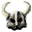

# { .sprite } Trollbone helmet
*Extraordinary* · Headwear, metal (heavy) · value 2670 gold

> A troll's skull fashioned into a helmet.

**Slot:** head · **Size:** large

## When equipped

| Stat | Value |
|---|---|
| Attack chance | -3 |
| Critical skill | -3 |
| Block chance | +16 |
| Damage resistance | +1 |

## When hit

| Stat | Value |
|---|---|
| On self | Troll regeneration (magnitude 1, 1 rounds, 20% chance) |

## Dropped by

| Monster | Chance | Qty |
|---|---|---|
| [Charwood troll](../monsters/brightport_troll.md) | 100% | 1 |

Verified against v0.8.18 item data.

## Version history

| Version | Change |
|---|---|
| [v0.8.16.1](../versions/0.8.16.1.md) | Added |

Verified against v0.8.18 and every earlier release back to v0.7.0 (game data compared release by release).

<small>Item ID: `brightport_trollhelmet` · Data from v0.8.18</small>
