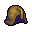

# { .sprite } Bronze helmet
*Ordinary* · Headwear, metal (light) · value 0 gold

**Slot:** head · **Size:** std

## When equipped

| Stat | Value |
|---|---|
| Block chance | +13 |
| Damage resistance | +1 |

## Sold by

- [Zaccheria](../monsters/sullengard_zaccheria.md)

Verified against v0.8.18 item data.

## Version history

| Version | Change |
|---|---|
| [v0.8.2](../versions/0.8.2.md) | Added |

Verified against v0.8.18 and every earlier release back to v0.7.0 (game data compared release by release).

<small>Item ID: `bronze_helmet` · Data from v0.8.18</small>
