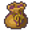

# { .sprite } Coin bag (with the name "Alkapoan" on it)

*Quest other.*

<div class="infobox" markdown>

<p class="ib-img">{ .sprite }</p>

| | |
|---|---|
| **Item ID** | `brv_richmans_coin_bag` |
| **Category** | Other |
| **Rarity** | Quest |
| **Base value** | 0 gold |
| **Quest item** | Yes |
| **Introduced** | [v0.7.11](../versions/0.7.11.md) |

</div>

## How to get it

### Dropped by

| Monster | Chance | Qty | Found in |
|---|---|---|---|
| [Alvies](../monsters/brv_alvies.md) | 100% | 1 | Brimhaven |
| [Attohead](../monsters/brv_attohead.md) | 100% | 1 | Brimhaven |


<p class="verified">Verified against v0.8.18 item, loot, map and dialogue data.</p>

## Uses

Where the game checks for this item in dialogue:

| With | Quest | What happens to it | Option |
|---|---|---|---|
| [Alkapoan](../monsters/brv_richman.md) ([brimhaven_house1](../maps/brimhaven_house1.md)) | [Much water](../quests/brv_flood.md#stage-150) | must be carried (1×) | “I found your coin bags, and you paid the brothers to destroy the dam. [Show the ” |
| [Alkapoan](../monsters/brv_richman.md) ([brimhaven_house1](../maps/brimhaven_house1.md)) | [Much water](../quests/brv_flood.md#stage-130) | must be carried (1×) | “Are you sure?” |
| [Alkapoan](../monsters/brv_richman.md) ([brimhaven_house1](../maps/brimhaven_house1.md)) | [Much water](../quests/brv_flood.md#stage-150) | handed over (1×) | “I found your coin bags, and you paid the brothers for destroying the dam. [Hand ” |
| stepping on a trigger on [brimhaven_brother1_to_2](../maps/brimhaven_brother1_to_2.md) | [Much water](../quests/brv_flood.md#stage-75) | must be carried (1×) | “(automatic)” |

<p class="verified">Verified against v0.8.18 dialogue data.</p>


## Version history

| Version | Change |
|---|---|
| [v0.7.11](../versions/0.7.11.md) | Added |

<p class="verified">Verified against v0.8.18 and every earlier release back to v0.7.0 (game data compared release by release).</p>


## Community notes

<small>Written by players, not generated from game data. **Strategy**: how and when to use it · **Lore**: the in-world story · **Trivia**: real-world facts, references, development history · **Theory / speculation**: unconfirmed ideas; may just be unfinished content</small>

### Strategy

*Nothing here yet. Know something? [Add it](https://github.com/asdfghjkl628/Andor-s-Trail-Wikiiii/new/main/notes/items?filename=brv_richmans_coin_bag.md&value=%23%23%20Strategy%0A%0A%3C%21--%20how%20and%20when%20to%20use%20it%20--%3E%0A%0A%23%23%20Lore%0A%0A%3C%21--%20the%20in-world%20story%20--%3E%0A%0A%23%23%20Trivia%0A%0A%3C%21--%20real-world%20facts%2C%20references%2C%20development%20history%20--%3E%0A%0A%23%23%20Theory%20/%20speculation%0A%0A%3C%21--%20unconfirmed%20ideas%3B%20may%20just%20be%20unfinished%20content%20--%3E%0A).*

### Lore

*Nothing here yet. Know something? [Add it](https://github.com/asdfghjkl628/Andor-s-Trail-Wikiiii/new/main/notes/items?filename=brv_richmans_coin_bag.md&value=%23%23%20Strategy%0A%0A%3C%21--%20how%20and%20when%20to%20use%20it%20--%3E%0A%0A%23%23%20Lore%0A%0A%3C%21--%20the%20in-world%20story%20--%3E%0A%0A%23%23%20Trivia%0A%0A%3C%21--%20real-world%20facts%2C%20references%2C%20development%20history%20--%3E%0A%0A%23%23%20Theory%20/%20speculation%0A%0A%3C%21--%20unconfirmed%20ideas%3B%20may%20just%20be%20unfinished%20content%20--%3E%0A).*

### Trivia

*Nothing here yet. Know something? [Add it](https://github.com/asdfghjkl628/Andor-s-Trail-Wikiiii/new/main/notes/items?filename=brv_richmans_coin_bag.md&value=%23%23%20Strategy%0A%0A%3C%21--%20how%20and%20when%20to%20use%20it%20--%3E%0A%0A%23%23%20Lore%0A%0A%3C%21--%20the%20in-world%20story%20--%3E%0A%0A%23%23%20Trivia%0A%0A%3C%21--%20real-world%20facts%2C%20references%2C%20development%20history%20--%3E%0A%0A%23%23%20Theory%20/%20speculation%0A%0A%3C%21--%20unconfirmed%20ideas%3B%20may%20just%20be%20unfinished%20content%20--%3E%0A).*

### Theory / speculation

*Nothing here yet. Know something? [Add it](https://github.com/asdfghjkl628/Andor-s-Trail-Wikiiii/new/main/notes/items?filename=brv_richmans_coin_bag.md&value=%23%23%20Strategy%0A%0A%3C%21--%20how%20and%20when%20to%20use%20it%20--%3E%0A%0A%23%23%20Lore%0A%0A%3C%21--%20the%20in-world%20story%20--%3E%0A%0A%23%23%20Trivia%0A%0A%3C%21--%20real-world%20facts%2C%20references%2C%20development%20history%20--%3E%0A%0A%23%23%20Theory%20/%20speculation%0A%0A%3C%21--%20unconfirmed%20ideas%3B%20may%20just%20be%20unfinished%20content%20--%3E%0A).*


??? info "Technical information"

    | | |
    |---|---|
    | Item ID | `brv_richmans_coin_bag` |
    | Category ID | `other` |
    | Icon | `items_japozero:440` |
    | Defined in | `res/raw/itemlist_brimhaven.json` |
    | Loot tables containing it | `brv_brothers` |

    Raw data:

    ```json
    {
     "id": "brv_richmans_coin_bag",
     "iconID": "items_japozero:440",
     "name": "Coin bag (with the name \"Alkapoan\" on it)",
     "displaytype": "quest",
     "category": "other",
     "description": ""
    }
    ```


<small>Data from v0.8.18</small>
