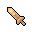

# { .sprite } Wooden sword
*Ordinary* · Shortsword · value 78 gold

**Slot:** weapon · **Size:** light

## When equipped

| Stat | Value |
|---|---|
| Attack damage | 0 to 1 |
| Attack cost | +5 |
| Attack chance | 0 |
| setNonWeaponDamageModifier | +95 |

Verified against v0.8.18 item data.

## Version history

| Version | Change |
|---|---|
| [v0.7.11](../versions/0.7.11.md) | Added |

Verified against v0.8.18 and every earlier release back to v0.7.0 (game data compared release by release).

<small>Item ID: `brv_school_sword` · Data from v0.8.18</small>
