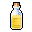

# { .sprite } Blackwater brew
*Ordinary* · Potion · value 57 gold

## When used

| Stat | Value |
|---|---|
| Heal HP | 15 |
| On self | Intoxicated (magnitude 1, 10 rounds, 100% chance) |

## Dropped by

| Monster | Chance | Qty |
|---|---|---|
| [Feygard scout](../monsters/ortholion_guard2.md) | 10% | 1-20 |
| [Strong gornaud](../monsters/strong_gornaud.md) | 5% | 10 |

## Sold by

- [Feygard scout](../monsters/ortholion_guard6.md)
- [Mazeg](../monsters/mazeg.md)

<small>Item ID: `bwm_brew` · Data from v0.8.18</small>
