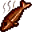

# { .sprite } Toasted inkyfish

*Ordinary food.*

<div class="infobox" markdown>

<p class="ib-img"></p>

| | |
|---|---|
| **Item ID** | `bwm_fish3` |
| **Category** | Food |
| **Rarity** | Ordinary |
| **Base value** | 108 gold |
| **Introduced** | [v0.7.14](../versions/0.7.14.md) |

</div>

> There are those who prefere it like this.

## Statistics

### When used

| Stat | Value |
|---|---|
| Heal HP | 5 to 10 |
| On self | [Sustenance](../conditions/food.md) (magnitude 4, 7 rounds); [Strength](../conditions/str.md) (magnitude 3, 5 rounds, 10% chance); [Nausea](../conditions/nausea.md) (magnitude 2, 7 rounds, 5% chance) |

<p class="verified">Verified against v0.8.18 item data.</p>

## How to get it

### Found in containers

- [Elm 2f 2](../maps/elm_2f_2.md#container-1) (container 2, 10%)
- [Elm mine 5](../maps/elm_mine5.md#container-0) (container 1, 14.2857%)


<p class="verified">Verified against v0.8.18 item, loot, map and dialogue data.</p>


## Version history

| Version | Change |
|---|---|
| [v0.7.14](../versions/0.7.14.md) | Added |

<p class="verified">Verified against v0.8.18 and every earlier release back to v0.7.0 (game data compared release by release).</p>


## Community notes

<small>Written by players, not generated from game data. **Strategy**: how and when to use it · **Lore**: the in-world story · **Trivia**: real-world facts, references, development history · **Theory / speculation**: unconfirmed ideas; may just be unfinished content</small>

### Strategy

*No notes yet. Contributions are welcome: [add a note](https://github.com/asdfghjkl628/Andor-s-Trail-Wikiiii/new/main/notes/items?filename=bwm_fish3.md&value=%23%23%20Strategy%0A%0A%3C%21--%20how%20and%20when%20to%20use%20it%20--%3E%0A%0A%23%23%20Lore%0A%0A%3C%21--%20the%20in-world%20story%20--%3E%0A%0A%23%23%20Trivia%0A%0A%3C%21--%20real-world%20facts%2C%20references%2C%20development%20history%20--%3E%0A%0A%23%23%20Theory%20/%20speculation%0A%0A%3C%21--%20unconfirmed%20ideas%3B%20may%20just%20be%20unfinished%20content%20--%3E%0A).*

### Lore

*No notes yet. Contributions are welcome: [add a note](https://github.com/asdfghjkl628/Andor-s-Trail-Wikiiii/new/main/notes/items?filename=bwm_fish3.md&value=%23%23%20Strategy%0A%0A%3C%21--%20how%20and%20when%20to%20use%20it%20--%3E%0A%0A%23%23%20Lore%0A%0A%3C%21--%20the%20in-world%20story%20--%3E%0A%0A%23%23%20Trivia%0A%0A%3C%21--%20real-world%20facts%2C%20references%2C%20development%20history%20--%3E%0A%0A%23%23%20Theory%20/%20speculation%0A%0A%3C%21--%20unconfirmed%20ideas%3B%20may%20just%20be%20unfinished%20content%20--%3E%0A).*

### Trivia

*No notes yet. Contributions are welcome: [add a note](https://github.com/asdfghjkl628/Andor-s-Trail-Wikiiii/new/main/notes/items?filename=bwm_fish3.md&value=%23%23%20Strategy%0A%0A%3C%21--%20how%20and%20when%20to%20use%20it%20--%3E%0A%0A%23%23%20Lore%0A%0A%3C%21--%20the%20in-world%20story%20--%3E%0A%0A%23%23%20Trivia%0A%0A%3C%21--%20real-world%20facts%2C%20references%2C%20development%20history%20--%3E%0A%0A%23%23%20Theory%20/%20speculation%0A%0A%3C%21--%20unconfirmed%20ideas%3B%20may%20just%20be%20unfinished%20content%20--%3E%0A).*

### Theory / speculation

*No notes yet. Contributions are welcome: [add a note](https://github.com/asdfghjkl628/Andor-s-Trail-Wikiiii/new/main/notes/items?filename=bwm_fish3.md&value=%23%23%20Strategy%0A%0A%3C%21--%20how%20and%20when%20to%20use%20it%20--%3E%0A%0A%23%23%20Lore%0A%0A%3C%21--%20the%20in-world%20story%20--%3E%0A%0A%23%23%20Trivia%0A%0A%3C%21--%20real-world%20facts%2C%20references%2C%20development%20history%20--%3E%0A%0A%23%23%20Theory%20/%20speculation%0A%0A%3C%21--%20unconfirmed%20ideas%3B%20may%20just%20be%20unfinished%20content%20--%3E%0A).*


??? info "Technical information"

    | | |
    |---|---|
    | Item ID | `bwm_fish3` |
    | Category ID | `food` |
    | Icon | `items_omi2:23` |
    | Defined in | `res/raw/itemlist_omi2.json` |
    | Loot tables containing it | `elm_drop1`, `elm2f2_chest` |

    Raw data:

    ```json
    {
     "id": "bwm_fish3",
     "iconID": "items_omi2:23",
     "name": "Toasted inkyfish",
     "displaytype": "ordinary",
     "hasManualPrice": 1,
     "baseMarketCost": 108,
     "category": "food",
     "description": "There are those who prefere it like this.",
     "useEffect": {
      "increaseCurrentHP": {
       "min": 5,
       "max": 10
      },
      "conditionsSource": [
       {
        "condition": "food",
        "magnitude": 4,
        "duration": 7,
        "chance": "100"
       },
       {
        "condition": "str",
        "magnitude": 3,
        "duration": 5,
        "chance": "10"
       },
       {
        "condition": "nausea",
        "magnitude": 2,
        "duration": 7,
        "chance": "5"
       }
      ]
     }
    }
    ```


<small>Data from v0.8.18</small>
