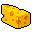

# { .sprite } Charwood cheddar

*Ordinary food.*

<div class="infobox" markdown>

<p class="ib-img">{ .sprite }</p>

| | |
|---|---|
| **Item ID** | `charwood_cheddar` |
| **Category** | Food |
| **Rarity** | Ordinary |
| **Base value** | 63 gold |
| **Introduced** | [v0.7.2](../versions/0.7.2.md) |

</div>

## Statistics

### When used

| Stat | Value |
|---|---|
| On self | Sustenance (magnitude 2, 6 rounds, 100% chance) |

<p class="verified">Verified against v0.8.18 item data.</p>

## How to get it

### Dropped by

| Monster | Chance | Qty | Found in |
|---|---|---|---|
| [Khorailla](../monsters/khorailla_cheddar.md) | 100% | 5 | Prim |

### Sold by

- [Horfael](../monsters/ratdom_rat_pub_owner.md) (Pub)

### Quest & dialogue rewards

- From [Wart](../monsters/ratdom_rat_warden.md) ([ratdom_maze_624](../maps/ratdom_maze_624.md)) (1×)


<p class="verified">Verified against v0.8.18 item, loot, map and dialogue data.</p>

## Uses

Where the game checks for this item in dialogue:

| With | Quest | What happens to it | Option |
|---|---|---|---|
| [Old man](../monsters/guynmart_wise.md) ([guynmart_wood_10](../maps/guynmart_wood_10.md)) | [Rare delicacies](../quests/guynmart_wise.md#stage-90) | handed over (1×) | “Yes, finally I got it. I hope the cheddar is still fresh after the long journey.” |
| walking into a blocked passage on [ratdom_maze_624](../maps/ratdom_maze_624.md) | – | handed over (1×) | “(automatic)” |
| [Fraedro](../monsters/ratdom_fraedro.md) ([ratdom_maze_626](../maps/ratdom_maze_626.md)) | – | handed over (1×) | “Starving? I have some good cheddar from Charwood for you here.” |

<p class="verified">Verified against v0.8.18 dialogue data.</p>


## Version history

| Version | Change |
|---|---|
| [v0.7.2](../versions/0.7.2.md) | Added |

<p class="verified">Verified against v0.8.18 and every earlier release back to v0.7.0 (game data compared release by release).</p>


## Community notes

<small>Written by players, not generated from game data. **Strategy**: how and when to use it · **Lore**: the in-world story · **Trivia**: real-world facts, references, development history · **Theory / speculation**: unconfirmed ideas; may just be unfinished content</small>

### Strategy

*Nothing here yet. Know something? [Add it](https://github.com/asdfghjkl628/Andor-s-Trail-Wikiiii/new/main/notes/items?filename=charwood_cheddar.md&value=%23%23%20Strategy%0A%0A%3C%21--%20how%20and%20when%20to%20use%20it%20--%3E%0A%0A%23%23%20Lore%0A%0A%3C%21--%20the%20in-world%20story%20--%3E%0A%0A%23%23%20Trivia%0A%0A%3C%21--%20real-world%20facts%2C%20references%2C%20development%20history%20--%3E%0A%0A%23%23%20Theory%20/%20speculation%0A%0A%3C%21--%20unconfirmed%20ideas%3B%20may%20just%20be%20unfinished%20content%20--%3E%0A).*

### Lore

*Nothing here yet. Know something? [Add it](https://github.com/asdfghjkl628/Andor-s-Trail-Wikiiii/new/main/notes/items?filename=charwood_cheddar.md&value=%23%23%20Strategy%0A%0A%3C%21--%20how%20and%20when%20to%20use%20it%20--%3E%0A%0A%23%23%20Lore%0A%0A%3C%21--%20the%20in-world%20story%20--%3E%0A%0A%23%23%20Trivia%0A%0A%3C%21--%20real-world%20facts%2C%20references%2C%20development%20history%20--%3E%0A%0A%23%23%20Theory%20/%20speculation%0A%0A%3C%21--%20unconfirmed%20ideas%3B%20may%20just%20be%20unfinished%20content%20--%3E%0A).*

### Trivia

*Nothing here yet. Know something? [Add it](https://github.com/asdfghjkl628/Andor-s-Trail-Wikiiii/new/main/notes/items?filename=charwood_cheddar.md&value=%23%23%20Strategy%0A%0A%3C%21--%20how%20and%20when%20to%20use%20it%20--%3E%0A%0A%23%23%20Lore%0A%0A%3C%21--%20the%20in-world%20story%20--%3E%0A%0A%23%23%20Trivia%0A%0A%3C%21--%20real-world%20facts%2C%20references%2C%20development%20history%20--%3E%0A%0A%23%23%20Theory%20/%20speculation%0A%0A%3C%21--%20unconfirmed%20ideas%3B%20may%20just%20be%20unfinished%20content%20--%3E%0A).*

### Theory / speculation

*Nothing here yet. Know something? [Add it](https://github.com/asdfghjkl628/Andor-s-Trail-Wikiiii/new/main/notes/items?filename=charwood_cheddar.md&value=%23%23%20Strategy%0A%0A%3C%21--%20how%20and%20when%20to%20use%20it%20--%3E%0A%0A%23%23%20Lore%0A%0A%3C%21--%20the%20in-world%20story%20--%3E%0A%0A%23%23%20Trivia%0A%0A%3C%21--%20real-world%20facts%2C%20references%2C%20development%20history%20--%3E%0A%0A%23%23%20Theory%20/%20speculation%0A%0A%3C%21--%20unconfirmed%20ideas%3B%20may%20just%20be%20unfinished%20content%20--%3E%0A).*


??? info "Technical information"

    | | |
    |---|---|
    | Item ID | `charwood_cheddar` |
    | Category ID | `food` |
    | Icon | `items_consumables:23` |
    | Defined in | `res/raw/itemlist_v070.json` |
    | Loot tables containing it | `shop_khorailla_cheddar`, `ratdom_rat_pub_owner` |

    Raw data:

    ```json
    {
     "id": "charwood_cheddar",
     "iconID": "items_consumables:23",
     "name": "Charwood cheddar",
     "hasManualPrice": 1,
     "baseMarketCost": 63,
     "category": "food",
     "useEffect": {
      "conditionsSource": [
       {
        "condition": "food",
        "magnitude": 2,
        "duration": 6,
        "chance": "100"
       }
      ]
     }
    }
    ```


<small>Data from v0.8.18</small>
