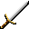

# { .sprite } Steel claymore
*Ordinary* · Two-handed sword · value 0 gold

**Slot:** weapon · **Size:** large

## When equipped

| Stat | Value |
|---|---|
| Attack damage | 1 to 14 |
| Attack cost | +7 |
| Attack chance | +17 |
| Critical skill | +1 |
| Block chance | -5 |
| Critical multiplier | 1.5 |
| setNonWeaponDamageModifier | +175 |

## Sold by

- [Truric](../monsters/truric.md)

<small>Item ID: `claymore_steel` · Data from v0.8.18</small>
