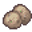

# { .sprite } Sparkling egg
*Extraordinary* · Other · value 1000 gold

> Now, this is strange.

Verified against v0.8.18 item data.

## Version history

| Version | Change |
|---|---|
| [v0.8.12.1](../versions/0.8.12.1.md) | Added |

Verified against v0.8.18 and every earlier release back to v0.7.0 (game data compared release by release).

<small>Item ID: `clear_egg` · Data from v0.8.18</small>
