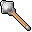

# { .sprite } Iron club

*Ordinary mace.*

<div class="infobox" markdown>

<p class="ib-img"></p>

| | |
|---|---|
| **Item ID** | `club3` |
| **Category** | Mace |
| **Slot** | weapon |
| **Hands** | One-handed |
| **Proficiency** | [Blunt weapon proficiency](../skills/weaponProficiencyBlunt.md) |
| **Rarity** | Ordinary |
| **Base value** | 253 gold |
| **Introduced** | v0.7.0 or earlier |

</div>

## Statistics

### When equipped

| Stat | Value |
|---|---|
| Attack damage | 2 to 7 |
| Attack cost | +6 |
| setNonWeaponDamageModifier | +170 |
| Attack chance | +5 |

<p class="verified">Verified against v0.8.18 item data.</p>

## How to get it

### Dropped by

| Monster | Chance | Qty | Found in |
|---|---|---|---|
| [Ulirfendor](../monsters/ulirfendor.md) | 100% | 1 | Waytobrimhavencave 4 |
| [Giant ogre](../monsters/ratdom_troll_9.md) | 100% | 1 | Ratdom maze 517a |
| [Ogre](../monsters/ratdom_uglybrute.md) | 75% | 1 | Gold hunter |
| [Cave troll](../monsters/cave_troll_1.md) | 5% | 1 | Lakecave 0 |
| [Strong cave troll](../monsters/cave_troll_2.md) | 5% | 1 | Lakecave 0, Lakecave 2 |
| [Tough cave troll](../monsters/cave_troll_3.md) | 5% | 1 | Lakecave 0, Lakecave 2 |
| [Cave troll shaman](../monsters/cave_troll_4.md) | 5% | 1 | Lakecave 0, Lakecave 2 |
| [Cave troll](../monsters/cave_troll_1.md#v-cave_troll_7) | 5% | 1 | Lakecave 0 |
| [Cave gnome](../monsters/ratdom_m6a.md) | 5% | 1 | Labyrinth |
| [Plump cave gnome](../monsters/ratdom_m6b.md) | 5% | 1 | Labyrinth |
| [Young ogre](../monsters/ratdom_troll_1.md) | 5% | 1 | Ratdom maze 517a |
| [Weak ogre](../monsters/ratdom_troll_2.md) | 5% | 1 | Ratdom maze 517a |
| [Angry ogre](../monsters/ratdom_troll_3.md) | 5% | 1 | Ratdom maze 517a |
| [Mad ogre](../monsters/ratdom_troll_4.md) | 5% | 1 | Ratdom maze 517a |
| [Dangerous ogre](../monsters/ratdom_troll_5.md) | 5% | 1 | Ratdom maze 517a |
| [Ancient ogre](../monsters/ratdom_troll_6.md) | 5% | 1 | Ratdom maze 517a |

### Sold by

- [Audir](../monsters/audir.md)

### Found in containers

- [Ratdom maze 427](../maps/ratdom_maze_427.md#container-0) (container 1, 5%), Entry
- [Ratdom maze 432](../maps/ratdom_maze_432.md#container-0) (container 1, 5%), Pub
- [Ratdom maze 444](../maps/ratdom_maze_444.md#container-0) (container 1, 5%), Gold hunter
- [Ratdom maze 444](../maps/ratdom_maze_444.md#container-1) (container 2, 5%), Gold hunter
- [Ratdom maze 444](../maps/ratdom_maze_444.md#container-2) (container 3, 5%), Gold hunter
- [Ratdom maze 444](../maps/ratdom_maze_444.md#container-3) (container 4, 5%), Gold hunter
- [Ratdom maze 444](../maps/ratdom_maze_444.md#container-4) (container 5, 5%), Gold hunter
- [Ratdom maze 444](../maps/ratdom_maze_444.md#container-5) (container 6, 5%), Gold hunter
- [Ratdom maze 444](../maps/ratdom_maze_444.md#container-6) (container 7, 5%), Gold hunter
- [Ratdom maze 444](../maps/ratdom_maze_444.md#container-7) (container 8, 5%), Gold hunter
- [Ratdom maze 457](../maps/ratdom_maze_457.md#container-0) (container 1, 5%), Entry
- [Ratdom maze 536](../maps/ratdom_maze_536.md#container-0) (container 1, 5%), Bloskelt + Roskelt
- [Ratdom maze 546](../maps/ratdom_maze_546.md#container-0) (container 1, 5%), Bloskelt + Roskelt
- [Ratdom maze 547](../maps/ratdom_maze_547.md#container-0) (container 1, 5%), Labyrinth
- [Ratdom maze 562](../maps/ratdom_maze_562.md#container-0) (container 1, 5%)
- [Ratdom maze 633](../maps/ratdom_maze_633.md#container-0) (container 1, 5%)
- [Ratdom maze 636](../maps/ratdom_maze_636.md#container-0) (container 1, 5%), Bloskelt + Roskelt


<p class="verified">Verified against v0.8.18 item, loot, map and dialogue data.</p>


## Version history

| Version | Change |
|---|---|
| [v0.7.0](../versions/0.7.0.md) | Present in v0.7.0 (earliest release tracked) |
| [v0.7.10](../versions/0.7.10.md) | When equipped, non-weapon damage modifier (%): added (170) |

<p class="verified">Verified against v0.8.18 and every earlier release back to v0.7.0 (game data compared release by release).</p>


## Community notes

<small>Written by players, not generated from game data. **Strategy**: how and when to use it · **Lore**: the in-world story · **Trivia**: real-world facts, references, development history · **Theory / speculation**: unconfirmed ideas; may just be unfinished content</small>

### Strategy

*No notes yet. Contributions are welcome: [add a note](https://github.com/asdfghjkl628/Andor-s-Trail-Wikiiii/new/main/notes/items?filename=club3.md&value=%23%23%20Strategy%0A%0A%3C%21--%20how%20and%20when%20to%20use%20it%20--%3E%0A%0A%23%23%20Lore%0A%0A%3C%21--%20the%20in-world%20story%20--%3E%0A%0A%23%23%20Trivia%0A%0A%3C%21--%20real-world%20facts%2C%20references%2C%20development%20history%20--%3E%0A%0A%23%23%20Theory%20/%20speculation%0A%0A%3C%21--%20unconfirmed%20ideas%3B%20may%20just%20be%20unfinished%20content%20--%3E%0A).*

### Lore

*No notes yet. Contributions are welcome: [add a note](https://github.com/asdfghjkl628/Andor-s-Trail-Wikiiii/new/main/notes/items?filename=club3.md&value=%23%23%20Strategy%0A%0A%3C%21--%20how%20and%20when%20to%20use%20it%20--%3E%0A%0A%23%23%20Lore%0A%0A%3C%21--%20the%20in-world%20story%20--%3E%0A%0A%23%23%20Trivia%0A%0A%3C%21--%20real-world%20facts%2C%20references%2C%20development%20history%20--%3E%0A%0A%23%23%20Theory%20/%20speculation%0A%0A%3C%21--%20unconfirmed%20ideas%3B%20may%20just%20be%20unfinished%20content%20--%3E%0A).*

### Trivia

*No notes yet. Contributions are welcome: [add a note](https://github.com/asdfghjkl628/Andor-s-Trail-Wikiiii/new/main/notes/items?filename=club3.md&value=%23%23%20Strategy%0A%0A%3C%21--%20how%20and%20when%20to%20use%20it%20--%3E%0A%0A%23%23%20Lore%0A%0A%3C%21--%20the%20in-world%20story%20--%3E%0A%0A%23%23%20Trivia%0A%0A%3C%21--%20real-world%20facts%2C%20references%2C%20development%20history%20--%3E%0A%0A%23%23%20Theory%20/%20speculation%0A%0A%3C%21--%20unconfirmed%20ideas%3B%20may%20just%20be%20unfinished%20content%20--%3E%0A).*

### Theory / speculation

*No notes yet. Contributions are welcome: [add a note](https://github.com/asdfghjkl628/Andor-s-Trail-Wikiiii/new/main/notes/items?filename=club3.md&value=%23%23%20Strategy%0A%0A%3C%21--%20how%20and%20when%20to%20use%20it%20--%3E%0A%0A%23%23%20Lore%0A%0A%3C%21--%20the%20in-world%20story%20--%3E%0A%0A%23%23%20Trivia%0A%0A%3C%21--%20real-world%20facts%2C%20references%2C%20development%20history%20--%3E%0A%0A%23%23%20Theory%20/%20speculation%0A%0A%3C%21--%20unconfirmed%20ideas%3B%20may%20just%20be%20unfinished%20content%20--%3E%0A).*


??? info "Technical information"

    | | |
    |---|---|
    | Item ID | `club3` |
    | Category ID | `mace` |
    | Icon | `items_weapons:44` |
    | Defined in | `res/raw/itemlist_weapons.json` |
    | Loot tables containing it | `shop_audir`, `ulirfendor`, `cave_troll_1`, `cave_troll_2`, `container_gold_3_10`, `container_gold_30_200`, `container_rock_1`, `ratdom_troll`, `ratdom_troll_9`, `ratdom_uglybrute` |

    Raw data:

    ```json
    {
     "id": "club3",
     "iconID": "items_weapons:44",
     "name": "Iron club",
     "baseMarketCost": 253,
     "category": "mace",
     "equipEffect": {
      "increaseAttackDamage": {
       "min": 2,
       "max": 7
      },
      "increaseAttackCost": 6,
      "setNonWeaponDamageModifier": 170,
      "increaseAttackChance": 5
     }
    }
    ```


<small>Data from v0.8.18</small>
