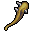

# { .sprite } Spiked club of bleeding
*Ordinary* · Club · value 107 gold

**Slot:** weapon · **Size:** std

## When equipped

| Stat | Value |
|---|---|
| Attack damage | 3 to 5 |
| Attack cost | +5 |
| Attack chance | +5 |
| Block chance | -2 |
| setNonWeaponDamageModifier | +115 |

## On hit

| Stat | Value |
|---|---|
| On target | Bleeding wound (magnitude 1, 2 rounds, 15% chance) |

## Sold by

- [Agthor](../monsters/agthor.md)

Verified against v0.8.18 item data.

## Version history

| Version | Change |
|---|---|
| [v0.7.0](../versions/0.7.0.md) | Present in v0.7.0 (earliest release tracked) |
| [v0.7.2](../versions/0.7.2.md) | hitEffect: {"conditionsTarget": [{"chance": 15, "c… → {"conditionsTarget": [{"chance": "15", … |
| [v0.7.10](../versions/0.7.10.md) | equipEffect: {"increaseAttackChance": 5, "increaseAt… → {"increaseAttackChance": 5, "increaseAt… |

Verified against v0.8.18 and every earlier release back to v0.7.0 (game data compared release by release).

<small>Item ID: `club_bld` · Data from v0.8.18</small>
