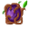

# { .sprite } Corrupted swamp core
*Extraordinary* · Edible animal part · value 0 gold

> A pulsating organ that seems to radiate dark energy, tainted by the swamp's corruption.

## When used

| Stat | Value |
|---|---|
| On self | Kazaul possession (magnitude 10, 10 rounds, 100% chance); Bad taste (magnitude 5, 3 rounds, 100% chance); Venom (magnitude 3, 5 rounds, 100% chance); Lightning attack (magnitude 1, 7 rounds, 100% chance); Concentration (magnitude 2, 8 rounds, 100% chance) |

## Dropped by

| Monster | Chance | Qty |
|---|---|---|
| [Venomous swamp creature](../monsters/venomous_swamp_creature.md) | 100% | 1 |

<small>Item ID: `corrupted_swamp_core` · Data from v0.8.18</small>
