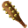

# { .sprite } Cragbreaker

*Extraordinary club.*

<div class="infobox" markdown>

<p class="ib-img">{ .sprite }</p>

| | |
|---|---|
| **Item ID** | `cragbreaker` |
| **Category** | Club |
| **Slot** | weapon |
| **Hands** | One-handed |
| **Proficiency** | [Blunt weapon proficiency](../skills/weaponProficiencyBlunt.md) |
| **Rarity** | Extraordinary |
| **Base value** | 0 gold |
| **Introduced** | [v0.8.12.1](../versions/0.8.12.1.md) |

</div>

> A massive, rugged club, capable of shattering stone and crushing enemies with ease.

## Statistics

### When equipped

| Stat | Value |
|---|---|
| Attack damage | 6 to 11 |
| Attack cost | +7 |
| Attack chance | +10 |
| Critical skill | +7 |
| Block chance | -7 |
| Critical multiplier | 2.0 |
| setNonWeaponDamageModifier | +155 |

### On hit

| Stat | Value |
|---|---|
| On target | [Fracture](../conditions/crit2.md) (magnitude 1, 3 rounds, 3% chance) |

<p class="verified">Verified against v0.8.18 item data.</p>

## How to get it

### Dropped by

| Monster | Chance | Qty | Found in |
|---|---|---|---|
| [Gamjee](../monsters/gamjee.md) | 100% | 1 | Gamjee well 4 1 |
| [Gamjee](../monsters/gamjee.md#v-gamjee_oc) | 100% | 1 | Gamjee well 4 1 |


<p class="verified">Verified against v0.8.18 item, loot, map and dialogue data.</p>


## Version history

| Version | Change |
|---|---|
| [v0.8.12.1](../versions/0.8.12.1.md) | Added |

<p class="verified">Verified against v0.8.18 and every earlier release back to v0.7.0 (game data compared release by release).</p>


## Community notes

<small>Written by players, not generated from game data. **Strategy**: how and when to use it · **Lore**: the in-world story · **Trivia**: real-world facts, references, development history · **Theory / speculation**: unconfirmed ideas; may just be unfinished content</small>

### Strategy

*No notes yet. Contributions are welcome: [add a note](https://github.com/asdfghjkl628/Andor-s-Trail-Wikiiii/new/main/notes/items?filename=cragbreaker.md&value=%23%23%20Strategy%0A%0A%3C%21--%20how%20and%20when%20to%20use%20it%20--%3E%0A%0A%23%23%20Lore%0A%0A%3C%21--%20the%20in-world%20story%20--%3E%0A%0A%23%23%20Trivia%0A%0A%3C%21--%20real-world%20facts%2C%20references%2C%20development%20history%20--%3E%0A%0A%23%23%20Theory%20/%20speculation%0A%0A%3C%21--%20unconfirmed%20ideas%3B%20may%20just%20be%20unfinished%20content%20--%3E%0A).*

### Lore

*No notes yet. Contributions are welcome: [add a note](https://github.com/asdfghjkl628/Andor-s-Trail-Wikiiii/new/main/notes/items?filename=cragbreaker.md&value=%23%23%20Strategy%0A%0A%3C%21--%20how%20and%20when%20to%20use%20it%20--%3E%0A%0A%23%23%20Lore%0A%0A%3C%21--%20the%20in-world%20story%20--%3E%0A%0A%23%23%20Trivia%0A%0A%3C%21--%20real-world%20facts%2C%20references%2C%20development%20history%20--%3E%0A%0A%23%23%20Theory%20/%20speculation%0A%0A%3C%21--%20unconfirmed%20ideas%3B%20may%20just%20be%20unfinished%20content%20--%3E%0A).*

### Trivia

*No notes yet. Contributions are welcome: [add a note](https://github.com/asdfghjkl628/Andor-s-Trail-Wikiiii/new/main/notes/items?filename=cragbreaker.md&value=%23%23%20Strategy%0A%0A%3C%21--%20how%20and%20when%20to%20use%20it%20--%3E%0A%0A%23%23%20Lore%0A%0A%3C%21--%20the%20in-world%20story%20--%3E%0A%0A%23%23%20Trivia%0A%0A%3C%21--%20real-world%20facts%2C%20references%2C%20development%20history%20--%3E%0A%0A%23%23%20Theory%20/%20speculation%0A%0A%3C%21--%20unconfirmed%20ideas%3B%20may%20just%20be%20unfinished%20content%20--%3E%0A).*

### Theory / speculation

*No notes yet. Contributions are welcome: [add a note](https://github.com/asdfghjkl628/Andor-s-Trail-Wikiiii/new/main/notes/items?filename=cragbreaker.md&value=%23%23%20Strategy%0A%0A%3C%21--%20how%20and%20when%20to%20use%20it%20--%3E%0A%0A%23%23%20Lore%0A%0A%3C%21--%20the%20in-world%20story%20--%3E%0A%0A%23%23%20Trivia%0A%0A%3C%21--%20real-world%20facts%2C%20references%2C%20development%20history%20--%3E%0A%0A%23%23%20Theory%20/%20speculation%0A%0A%3C%21--%20unconfirmed%20ideas%3B%20may%20just%20be%20unfinished%20content%20--%3E%0A).*


??? info "Technical information"

    | | |
    |---|---|
    | Item ID | `cragbreaker` |
    | Category ID | `club` |
    | Icon | `items_newb:450` |
    | Defined in | `res/raw/itemlist_feygard_1.json` |
    | Loot tables containing it | `gamjee_dl`, `gamjee_oc_dl` |

    Raw data:

    ```json
    {
     "id": "cragbreaker",
     "iconID": "items_newb:450",
     "name": "Cragbreaker",
     "displaytype": "extraordinary",
     "category": "club",
     "description": "A massive, rugged club, capable of shattering stone and crushing enemies with ease.",
     "equipEffect": {
      "increaseAttackDamage": {
       "min": 6,
       "max": 11
      },
      "increaseAttackCost": 7,
      "increaseAttackChance": 10,
      "increaseCriticalSkill": 7,
      "increaseBlockChance": -7,
      "setCriticalMultiplier": 2.0,
      "setNonWeaponDamageModifier": 155
     },
     "hitEffect": {
      "conditionsTarget": [
       {
        "condition": "crit2",
        "magnitude": 1,
        "duration": 3,
        "chance": "3"
       }
      ]
     }
    }
    ```


<small>Data from v0.8.18</small>
