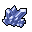

# { .sprite } Blue Crystals

*Ordinary gem.*

<div class="infobox" markdown>

<p class="ib-img"></p>

| | |
|---|---|
| **Item ID** | `crystal_blue` |
| **Category** | Gem |
| **Rarity** | Ordinary |
| **Base value** | 5 gold |
| **Introduced** | [v0.7.8](../versions/0.7.8.md) |

</div>

> Some blue shimmering crystals.

## How to get it

### Dropped by

| Monster | Chance | Qty | Found in |
|---|---|---|---|
| [Azurite Gornaud](../monsters/gornaud_4.md) | 5% | 1 | Arulircave 1, Arulircave 2, Arulircave 6 |
| [Garnet Gornaud](../monsters/gornaud_5.md) | 5% | 1 | Arulircave 1, Arulircave 2, Arulircave 6 |
| [Nephrite Gornaud](../monsters/gornaud_6.md) | 5% | 1 | Arulircave 1, Arulircave 2, Arulircave 6 |
| [Arulir Pack Leader](../monsters/arulir_leader.md) | 5% | 1 | Arulircave 6 |
| [Demonic Arulir](../monsters/arulir_8.md) | 3% | 1 | Arulircave 6 |

### Found in containers

- [Galmore 53](../maps/galmore_53.md#container-0) (container 1, 100%), Mt. Galmore

### Quest & dialogue rewards

- From stepping on a trigger on [Korhald cave hidden](../maps/korhald_cave_hidden.md) during [General story flags (hidden flag)](../quests/nondisplay.md#stage-49) (100%)


<p class="verified">Verified against v0.8.18 item, loot, map and dialogue data.</p>


## Version history

| Version | Change |
|---|---|
| [v0.7.8](../versions/0.7.8.md) | Added |

<p class="verified">Verified against v0.8.18 and every earlier release back to v0.7.0 (game data compared release by release).</p>


## Community notes

<small>Written by players, not generated from game data. **Strategy**: how and when to use it · **Lore**: the in-world story · **Trivia**: real-world facts, references, development history · **Theory / speculation**: unconfirmed ideas; may just be unfinished content</small>

### Strategy

*No notes yet. Contributions are welcome: [add a note](https://github.com/asdfghjkl628/Andor-s-Trail-Wikiiii/new/main/notes/items?filename=crystal_blue.md&value=%23%23%20Strategy%0A%0A%3C%21--%20how%20and%20when%20to%20use%20it%20--%3E%0A%0A%23%23%20Lore%0A%0A%3C%21--%20the%20in-world%20story%20--%3E%0A%0A%23%23%20Trivia%0A%0A%3C%21--%20real-world%20facts%2C%20references%2C%20development%20history%20--%3E%0A%0A%23%23%20Theory%20/%20speculation%0A%0A%3C%21--%20unconfirmed%20ideas%3B%20may%20just%20be%20unfinished%20content%20--%3E%0A).*

### Lore

*No notes yet. Contributions are welcome: [add a note](https://github.com/asdfghjkl628/Andor-s-Trail-Wikiiii/new/main/notes/items?filename=crystal_blue.md&value=%23%23%20Strategy%0A%0A%3C%21--%20how%20and%20when%20to%20use%20it%20--%3E%0A%0A%23%23%20Lore%0A%0A%3C%21--%20the%20in-world%20story%20--%3E%0A%0A%23%23%20Trivia%0A%0A%3C%21--%20real-world%20facts%2C%20references%2C%20development%20history%20--%3E%0A%0A%23%23%20Theory%20/%20speculation%0A%0A%3C%21--%20unconfirmed%20ideas%3B%20may%20just%20be%20unfinished%20content%20--%3E%0A).*

### Trivia

*No notes yet. Contributions are welcome: [add a note](https://github.com/asdfghjkl628/Andor-s-Trail-Wikiiii/new/main/notes/items?filename=crystal_blue.md&value=%23%23%20Strategy%0A%0A%3C%21--%20how%20and%20when%20to%20use%20it%20--%3E%0A%0A%23%23%20Lore%0A%0A%3C%21--%20the%20in-world%20story%20--%3E%0A%0A%23%23%20Trivia%0A%0A%3C%21--%20real-world%20facts%2C%20references%2C%20development%20history%20--%3E%0A%0A%23%23%20Theory%20/%20speculation%0A%0A%3C%21--%20unconfirmed%20ideas%3B%20may%20just%20be%20unfinished%20content%20--%3E%0A).*

### Theory / speculation

*No notes yet. Contributions are welcome: [add a note](https://github.com/asdfghjkl628/Andor-s-Trail-Wikiiii/new/main/notes/items?filename=crystal_blue.md&value=%23%23%20Strategy%0A%0A%3C%21--%20how%20and%20when%20to%20use%20it%20--%3E%0A%0A%23%23%20Lore%0A%0A%3C%21--%20the%20in-world%20story%20--%3E%0A%0A%23%23%20Trivia%0A%0A%3C%21--%20real-world%20facts%2C%20references%2C%20development%20history%20--%3E%0A%0A%23%23%20Theory%20/%20speculation%0A%0A%3C%21--%20unconfirmed%20ideas%3B%20may%20just%20be%20unfinished%20content%20--%3E%0A).*


??? info "Technical information"

    | | |
    |---|---|
    | Item ID | `crystal_blue` |
    | Category ID | `gem` |
    | Icon | `items_misc:31` |
    | Defined in | `res/raw/itemlist_arulir_mountain.json` |
    | Loot tables containing it | `arulir_gornaud`, `arulir_demonic`, `arulir_leader`, `korhald_locked_chest_dl`, `galmore53_dl` |

    Raw data:

    ```json
    {
     "id": "crystal_blue",
     "iconID": "items_misc:31",
     "name": "Blue Crystals",
     "hasManualPrice": 1,
     "baseMarketCost": 5,
     "category": "gem",
     "description": "Some blue shimmering crystals."
    }
    ```


<small>Data from v0.8.18</small>
