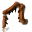

# { .sprite } Cyclopea root
*Rare* · Edible animal part · value 0 gold

> A root from the Cyclopea creeper which when consumed, has been known to provide a modest boost in strength

## When used

| Stat | Value |
|---|---|
| On self | Strength (magnitude 4, 5 rounds, 100% chance) |

## Dropped by

| Monster | Chance | Qty |
|---|---|---|
| [Cyclopea creeper](../monsters/cyclopea_creeper.md) | 5% | 1 |
| [Crimoculus Cyclopea creeper](../monsters/agg_cyclopea_creeper.md) | 5% | 1 |
| [Spiked cyclopea creeper](../monsters/spiked_cyclopea_creeper.md) | 3% | 1 |
| [Verdant cyclopea creeper](../monsters/verdant_cyclopea_creeper.md) | 2% | 1 |

Verified against v0.8.18 item data.

## Version history

| Version | Change |
|---|---|
| [v0.8.8](../versions/0.8.8.md) | Added |

Verified against v0.8.18 and every earlier release back to v0.7.0 (game data compared release by release).

<small>Item ID: `cyclopea_root` · Data from v0.8.18</small>
