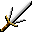

# { .sprite } Trident dagger
*Ordinary* · Parrying weapon · value 0 gold

**Slot:** shield · **Size:** light

## When equipped

| Stat | Value |
|---|---|
| Attack damage | 1 to 2 |
| Move cost | 0 |
| Attack cost | 0 |
| Attack chance | +4 |
| Block chance | +9 |
| setNonWeaponDamageModifier | +98 |

## Sold by

- [Truric](../monsters/truric.md)

Verified against v0.8.18 item data.

## Version history

| Version | Change |
|---|---|
| [v0.7.11](../versions/0.7.11.md) | Added |

Verified against v0.8.18 and every earlier release back to v0.7.0 (game data compared release by release).

<small>Item ID: `dagger_trident` · Data from v0.8.18</small>
