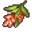

# { .sprite } Damerilias

*Quest other.*

<div class="infobox" markdown>

<p class="ib-img"></p>

| | |
|---|---|
| **Item ID** | `damerilias` |
| **Category** | Other |
| **Rarity** | Quest |
| **Base value** | 0 gold |
| **Quest item** | Yes |
| **Introduced** | [v0.7.2](../versions/0.7.2.md) |

</div>

> Flowers that grow only in Remgard

## How to get it

### Quest & dialogue rewards

- From [Caeda](../monsters/caeda.md) ([Lakecave 2](../maps/lakecave2.md)) during [The roots of love](../quests/roots_love.md#stage-20) (3×)
- From stepping on a trigger on [Lakecave 1](../maps/lakecave1.md) during [General story flags (hidden flag)](../quests/nondisplay.md#stage-30) (1×)
- From stepping on a trigger on [Lakecave 1](../maps/lakecave1.md) during [General story flags (hidden flag)](../quests/nondisplay.md#stage-32) (1×)
- From stepping on a trigger on [Lakecave 1](../maps/lakecave1.md) during [General story flags (hidden flag)](../quests/nondisplay.md#stage-34) (1×)
- From stepping on a trigger on [Lakecave 1](../maps/lakecave1.md) during [General story flags (hidden flag)](../quests/nondisplay.md#stage-36) (1×)
- From stepping on a trigger on [Lakecave 1](../maps/lakecave1.md) during [General story flags (hidden flag)](../quests/nondisplay.md#stage-38) (1×)


<p class="verified">Verified against v0.8.18 item, loot, map and dialogue data.</p>

## Uses

Where the game checks for this item in dialogue:

| With | Quest | What happens to it | Option |
|---|---|---|---|
| [Aryfora](../monsters/stoutford_widow.md) ([Stoutford gate](../maps/stoutford_gate.md)) | [The roots of love](../quests/roots_love.md#stage-30) | handed over (3×) | “Yes. Here they are, three of the most beautiful damerilias.” |
| [Aryfora](../monsters/stoutford_widow.md) ([Stoutford gate](../maps/stoutford_gate.md)) | – | must be carried (2×) | “Yes. Here they are, two of the most beautiful damerilias.” |
| [Aryfora](../monsters/stoutford_widow.md) ([Stoutford gate](../maps/stoutford_gate.md)) | – | must be carried (1×) | “Yes. Here it is, the most beautiful one.” |
| [Aryfora](../monsters/stoutford_widow.md#v-stoutford_widow2) ([Stoutford potion](../maps/stoutford_potion.md)) | – | handed over (3×) | “OK, I have some damerilias with me.” |
| [Aryfora](../monsters/stoutford_widow.md#v-stoutford_widow2) ([Stoutford potion](../maps/stoutford_potion.md)) | – | handed over (3×) | “And another one, please.” |

<p class="verified">Verified against v0.8.18 dialogue data.</p>


## Version history

| Version | Change |
|---|---|
| [v0.7.2](../versions/0.7.2.md) | Added |

<p class="verified">Verified against v0.8.18 and every earlier release back to v0.7.0 (game data compared release by release).</p>


## Community notes

<small>Written by players, not generated from game data. **Strategy**: how and when to use it · **Lore**: the in-world story · **Trivia**: real-world facts, references, development history · **Theory / speculation**: unconfirmed ideas; may just be unfinished content</small>

### Strategy

*No notes yet. Contributions are welcome: [add a note](https://github.com/asdfghjkl628/Andor-s-Trail-Wikiiii/new/main/notes/items?filename=damerilias.md&value=%23%23%20Strategy%0A%0A%3C%21--%20how%20and%20when%20to%20use%20it%20--%3E%0A%0A%23%23%20Lore%0A%0A%3C%21--%20the%20in-world%20story%20--%3E%0A%0A%23%23%20Trivia%0A%0A%3C%21--%20real-world%20facts%2C%20references%2C%20development%20history%20--%3E%0A%0A%23%23%20Theory%20/%20speculation%0A%0A%3C%21--%20unconfirmed%20ideas%3B%20may%20just%20be%20unfinished%20content%20--%3E%0A).*

### Lore

*No notes yet. Contributions are welcome: [add a note](https://github.com/asdfghjkl628/Andor-s-Trail-Wikiiii/new/main/notes/items?filename=damerilias.md&value=%23%23%20Strategy%0A%0A%3C%21--%20how%20and%20when%20to%20use%20it%20--%3E%0A%0A%23%23%20Lore%0A%0A%3C%21--%20the%20in-world%20story%20--%3E%0A%0A%23%23%20Trivia%0A%0A%3C%21--%20real-world%20facts%2C%20references%2C%20development%20history%20--%3E%0A%0A%23%23%20Theory%20/%20speculation%0A%0A%3C%21--%20unconfirmed%20ideas%3B%20may%20just%20be%20unfinished%20content%20--%3E%0A).*

### Trivia

*No notes yet. Contributions are welcome: [add a note](https://github.com/asdfghjkl628/Andor-s-Trail-Wikiiii/new/main/notes/items?filename=damerilias.md&value=%23%23%20Strategy%0A%0A%3C%21--%20how%20and%20when%20to%20use%20it%20--%3E%0A%0A%23%23%20Lore%0A%0A%3C%21--%20the%20in-world%20story%20--%3E%0A%0A%23%23%20Trivia%0A%0A%3C%21--%20real-world%20facts%2C%20references%2C%20development%20history%20--%3E%0A%0A%23%23%20Theory%20/%20speculation%0A%0A%3C%21--%20unconfirmed%20ideas%3B%20may%20just%20be%20unfinished%20content%20--%3E%0A).*

### Theory / speculation

*No notes yet. Contributions are welcome: [add a note](https://github.com/asdfghjkl628/Andor-s-Trail-Wikiiii/new/main/notes/items?filename=damerilias.md&value=%23%23%20Strategy%0A%0A%3C%21--%20how%20and%20when%20to%20use%20it%20--%3E%0A%0A%23%23%20Lore%0A%0A%3C%21--%20the%20in-world%20story%20--%3E%0A%0A%23%23%20Trivia%0A%0A%3C%21--%20real-world%20facts%2C%20references%2C%20development%20history%20--%3E%0A%0A%23%23%20Theory%20/%20speculation%0A%0A%3C%21--%20unconfirmed%20ideas%3B%20may%20just%20be%20unfinished%20content%20--%3E%0A).*


??? info "Technical information"

    | | |
    |---|---|
    | Item ID | `damerilias` |
    | Category ID | `other` |
    | Icon | `items_rijackson_1:12` |
    | Defined in | `res/raw/itemlist_stoutford_combined.json` |
    | Loot tables containing it | – |

    Raw data:

    ```json
    {
     "id": "damerilias",
     "iconID": "items_rijackson_1:12",
     "name": "Damerilias",
     "displaytype": "quest",
     "category": "other",
     "description": "Flowers that grow only in Remgard"
    }
    ```


<small>Data from v0.8.18</small>
