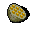

# { .sprite } Durian fruit
*Ordinary* · Food · value 110 gold

> Wow! The smell is almost overpowering. It's a mixture of old socks and sewage! It does taste good though!

## When used

| Stat | Value |
|---|---|
| On self | Sustenance (magnitude 5, 6 rounds, 100% chance) |

## Sold by

- [Rosmara](../monsters/rosmara.md)

Verified against v0.8.18 item data.

## Version history

| Version | Change |
|---|---|
| [v0.8.11](../versions/0.8.11.md) | Added |

Verified against v0.8.18 and every earlier release back to v0.7.0 (game data compared release by release).

<small>Item ID: `durian` · Data from v0.8.18</small>
