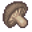

# { .sprite } Boletus spelunca
*Rare* · Food · value 191 gold

> Rare mushroom only found in caves with high humidity and  temperature.

## When used

| Stat | Value |
|---|---|
| Heal HP | 18 to 20 |
| On self | Nausea (magnitude -99, 75 rounds, 100% chance); Sustenance (magnitude 1, 30 rounds, 100% chance); Confusion (magnitude -99, 10 rounds, 50% chance) |

Verified against v0.8.18 item data.

## Version history

| Version | Change |
|---|---|
| [v0.7.14](../versions/0.7.14.md) | Added |

Verified against v0.8.18 and every earlier release back to v0.7.0 (game data compared release by release).

<small>Item ID: `elm_mushroom1` · Data from v0.8.18</small>
