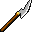

# { .sprite } Steel fauchard
*Ordinary* · Pole weapon · value 0 gold

**Slot:** weapon · **Size:** large

## When equipped

| Stat | Value |
|---|---|
| Attack damage | 5 to 7 |
| Attack cost | +7 |
| Attack chance | +10 |
| Block chance | +8 |
| setNonWeaponDamageModifier | +160 |

## Dropped by

| Monster | Chance | Qty |
|---|---|---|
| [Drakthorn](../monsters/drakthorn.md) | 4% | 1 |

## Sold by

- [Truric](../monsters/truric.md)

Verified against v0.8.18 item data.

## Version history

| Version | Change |
|---|---|
| [v0.7.12](../versions/0.7.12.md) | Added |
| [v0.7.13](../versions/0.7.13.md) | equipEffect: {"increaseAttackCost": 7, "increaseAtta… → {"increaseAttackChance": 10, "increaseA… |

Verified against v0.8.18 and every earlier release back to v0.7.0 (game data compared release by release).

<small>Item ID: `fauchard_steel` · Data from v0.8.18</small>
