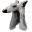

# { .sprite } Feline hat

*Rare headwear, cloth.*

<div class="infobox" markdown>

<p class="ib-img">{ .sprite }</p>

| | |
|---|---|
| **Item ID** | `feline_hat` |
| **Category** | Headwear, cloth |
| **Slot** | head |
| **Rarity** | Rare |
| **Base value** | 3,451 gold |
| **Introduced** | [v0.8.11](../versions/0.8.11.md) |

</div>

## Statistics

### When equipped

| Stat | Value |
|---|---|
| Max HP | +1 |
| Attack chance | +7 |
| Block chance | +6 |
| Damage resistance | -1 |
| Grants | [Clumsiness](../conditions/clumsiness.md) (magnitude 1) |

### On hit

| Stat | Value |
|---|---|
| On self | [Heightened senses](../conditions/sense_1.md) (magnitude 1, 3 rounds, 5% chance) |

### When hit

| Stat | Value |
|---|---|
| On self | [Fear](../conditions/fear.md) (magnitude 1, 2 rounds, 5% chance) |

<p class="verified">Verified against v0.8.18 item data.</p>

## How to get it

### Dropped by

| Monster | Chance | Qty | Found in |
|---|---|---|---|
| [Gylew's henchman](../monsters/gylew_henchman.md#v-gylew_henchman_aggresive) | 100% | 1 | Waterway 5 |


<p class="verified">Verified against v0.8.18 item, loot, map and dialogue data.</p>


## Version history

| Version | Change |
|---|---|
| [v0.8.11](../versions/0.8.11.md) | Added |
| [v0.8.12.1](../versions/0.8.12.1.md) | When equipped, critical skill: removed (was +1)<br>When equipped, critical multiplier: removed (was 1.5) |

<p class="verified">Verified against v0.8.18 and every earlier release back to v0.7.0 (game data compared release by release).</p>


## Community notes

<small>Written by players, not generated from game data. **Strategy**: how and when to use it · **Lore**: the in-world story · **Trivia**: real-world facts, references, development history · **Theory / speculation**: unconfirmed ideas; may just be unfinished content</small>

### Strategy

*No notes yet. Contributions are welcome: [add a note](https://github.com/asdfghjkl628/Andor-s-Trail-Wikiiii/new/main/notes/items?filename=feline_hat.md&value=%23%23%20Strategy%0A%0A%3C%21--%20how%20and%20when%20to%20use%20it%20--%3E%0A%0A%23%23%20Lore%0A%0A%3C%21--%20the%20in-world%20story%20--%3E%0A%0A%23%23%20Trivia%0A%0A%3C%21--%20real-world%20facts%2C%20references%2C%20development%20history%20--%3E%0A%0A%23%23%20Theory%20/%20speculation%0A%0A%3C%21--%20unconfirmed%20ideas%3B%20may%20just%20be%20unfinished%20content%20--%3E%0A).*

### Lore

*No notes yet. Contributions are welcome: [add a note](https://github.com/asdfghjkl628/Andor-s-Trail-Wikiiii/new/main/notes/items?filename=feline_hat.md&value=%23%23%20Strategy%0A%0A%3C%21--%20how%20and%20when%20to%20use%20it%20--%3E%0A%0A%23%23%20Lore%0A%0A%3C%21--%20the%20in-world%20story%20--%3E%0A%0A%23%23%20Trivia%0A%0A%3C%21--%20real-world%20facts%2C%20references%2C%20development%20history%20--%3E%0A%0A%23%23%20Theory%20/%20speculation%0A%0A%3C%21--%20unconfirmed%20ideas%3B%20may%20just%20be%20unfinished%20content%20--%3E%0A).*

### Trivia

*No notes yet. Contributions are welcome: [add a note](https://github.com/asdfghjkl628/Andor-s-Trail-Wikiiii/new/main/notes/items?filename=feline_hat.md&value=%23%23%20Strategy%0A%0A%3C%21--%20how%20and%20when%20to%20use%20it%20--%3E%0A%0A%23%23%20Lore%0A%0A%3C%21--%20the%20in-world%20story%20--%3E%0A%0A%23%23%20Trivia%0A%0A%3C%21--%20real-world%20facts%2C%20references%2C%20development%20history%20--%3E%0A%0A%23%23%20Theory%20/%20speculation%0A%0A%3C%21--%20unconfirmed%20ideas%3B%20may%20just%20be%20unfinished%20content%20--%3E%0A).*

### Theory / speculation

*No notes yet. Contributions are welcome: [add a note](https://github.com/asdfghjkl628/Andor-s-Trail-Wikiiii/new/main/notes/items?filename=feline_hat.md&value=%23%23%20Strategy%0A%0A%3C%21--%20how%20and%20when%20to%20use%20it%20--%3E%0A%0A%23%23%20Lore%0A%0A%3C%21--%20the%20in-world%20story%20--%3E%0A%0A%23%23%20Trivia%0A%0A%3C%21--%20real-world%20facts%2C%20references%2C%20development%20history%20--%3E%0A%0A%23%23%20Theory%20/%20speculation%0A%0A%3C%21--%20unconfirmed%20ideas%3B%20may%20just%20be%20unfinished%20content%20--%3E%0A).*


??? info "Technical information"

    | | |
    |---|---|
    | Item ID | `feline_hat` |
    | Category ID | `hd_cloth` |
    | Icon | `items_newb:108` |
    | Defined in | `res/raw/itemlist_laeroth.json` |
    | Loot tables containing it | `gylew_henchman_dl` |

    Raw data:

    ```json
    {
     "id": "feline_hat",
     "iconID": "items_newb:108",
     "name": "Feline hat",
     "displaytype": "rare",
     "hasManualPrice": 1,
     "baseMarketCost": 3451,
     "category": "hd_cloth",
     "equipEffect": {
      "increaseMaxHP": 1,
      "increaseAttackChance": 7,
      "increaseBlockChance": 6,
      "increaseDamageResistance": -1,
      "addedConditions": [
       {
        "condition": "clumsiness",
        "magnitude": 1
       }
      ]
     },
     "hitEffect": {
      "conditionsSource": [
       {
        "condition": "sense_1",
        "magnitude": 1,
        "duration": 3,
        "chance": "5"
       }
      ]
     },
     "hitReceivedEffect": {
      "conditionsSource": [
       {
        "condition": "fear",
        "magnitude": 1,
        "duration": 2,
        "chance": "5"
       }
      ]
     }
    }
    ```


<small>Data from v0.8.18</small>
