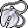

# { .sprite } Broken Feygard medallion
*Ordinary* · Necklace · value 0 gold

**Slot:** neck

## When equipped

| Stat | Value |
|---|---|
| Attack damage | -3 to 4 |
| Max HP | +3 |
| Attack chance | +5 |
| Block chance | +2 |
| setNonWeaponDamageModifier | +100 |

## Dropped by

| Monster | Chance | Qty |
|---|---|---|
| [Subdued Feygard mountain scout](../monsters/ortholion_subdued.md) | 20% | 1 |

Verified against v0.8.18 item data.

## Version history

| Version | Change |
|---|---|
| [v0.7.14](../versions/0.7.14.md) | Added |

Verified against v0.8.18 and every earlier release back to v0.7.0 (game data compared release by release).

<small>Item ID: `feygard_necklace1` · Data from v0.8.18</small>
