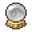

# { .sprite } Red globe of the elements

*Quest other.*

<div class="infobox" markdown>

<p class="ib-img">{ .sprite }</p>

| | |
|---|---|
| **Item ID** | `final_cave_r` |
| **Category** | Other |
| **Rarity** | Quest |
| **Base value** | 0 gold |
| **Quest item** | Yes |
| **Introduced** | [v0.8.11](../versions/0.8.11.md) |

</div>

## How to get it

### Found in containers

- [Island 3](../maps/island3.md#container-1) (container 2, 100%)
- [Island 3](../maps/island3.md#container-4) (container 5, 100%)
- [Island 3](../maps/island3.md#container-11) (container 12, 100%)
- [Island 3](../maps/island3.md#container-14) (container 15, 100%)

### Quest & dialogue rewards

- From walking into a blocked passage on [Final cave 1](../maps/final_cave1.md) (1×)


<p class="verified">Verified against v0.8.18 item, loot, map and dialogue data.</p>

## Uses

Where the game checks for this item in dialogue:

| With | Quest | What happens to it | Option |
|---|---|---|---|
| walking into a blocked passage on [Final cave 1](../maps/final_cave1.md) | [Final cave (hidden flag)](../quests/final_cave.md#stage-2) | handed over (1×) | “The red globe” |
| walking into a blocked passage on [Final cave 1](../maps/final_cave1.md) | [Final cave (hidden flag)](../quests/final_cave.md#stage-4) | handed over (1×) | “The red globe” |
| walking into a blocked passage on [Final cave 1](../maps/final_cave1.md) | [Final cave (hidden flag)](../quests/final_cave.md#stage-6) | handed over (1×) | “The red globe” |

<p class="verified">Verified against v0.8.18 dialogue data.</p>


## Version history

| Version | Change |
|---|---|
| [v0.8.11](../versions/0.8.11.md) | Added |

<p class="verified">Verified against v0.8.18 and every earlier release back to v0.7.0 (game data compared release by release).</p>


## Community notes

<small>Written by players, not generated from game data. **Strategy**: how and when to use it · **Lore**: the in-world story · **Trivia**: real-world facts, references, development history · **Theory / speculation**: unconfirmed ideas; may just be unfinished content</small>

### Strategy

*No notes yet. Contributions are welcome: [add a note](https://github.com/asdfghjkl628/Andor-s-Trail-Wikiiii/new/main/notes/items?filename=final_cave_r.md&value=%23%23%20Strategy%0A%0A%3C%21--%20how%20and%20when%20to%20use%20it%20--%3E%0A%0A%23%23%20Lore%0A%0A%3C%21--%20the%20in-world%20story%20--%3E%0A%0A%23%23%20Trivia%0A%0A%3C%21--%20real-world%20facts%2C%20references%2C%20development%20history%20--%3E%0A%0A%23%23%20Theory%20/%20speculation%0A%0A%3C%21--%20unconfirmed%20ideas%3B%20may%20just%20be%20unfinished%20content%20--%3E%0A).*

### Lore

*No notes yet. Contributions are welcome: [add a note](https://github.com/asdfghjkl628/Andor-s-Trail-Wikiiii/new/main/notes/items?filename=final_cave_r.md&value=%23%23%20Strategy%0A%0A%3C%21--%20how%20and%20when%20to%20use%20it%20--%3E%0A%0A%23%23%20Lore%0A%0A%3C%21--%20the%20in-world%20story%20--%3E%0A%0A%23%23%20Trivia%0A%0A%3C%21--%20real-world%20facts%2C%20references%2C%20development%20history%20--%3E%0A%0A%23%23%20Theory%20/%20speculation%0A%0A%3C%21--%20unconfirmed%20ideas%3B%20may%20just%20be%20unfinished%20content%20--%3E%0A).*

### Trivia

*No notes yet. Contributions are welcome: [add a note](https://github.com/asdfghjkl628/Andor-s-Trail-Wikiiii/new/main/notes/items?filename=final_cave_r.md&value=%23%23%20Strategy%0A%0A%3C%21--%20how%20and%20when%20to%20use%20it%20--%3E%0A%0A%23%23%20Lore%0A%0A%3C%21--%20the%20in-world%20story%20--%3E%0A%0A%23%23%20Trivia%0A%0A%3C%21--%20real-world%20facts%2C%20references%2C%20development%20history%20--%3E%0A%0A%23%23%20Theory%20/%20speculation%0A%0A%3C%21--%20unconfirmed%20ideas%3B%20may%20just%20be%20unfinished%20content%20--%3E%0A).*

### Theory / speculation

*No notes yet. Contributions are welcome: [add a note](https://github.com/asdfghjkl628/Andor-s-Trail-Wikiiii/new/main/notes/items?filename=final_cave_r.md&value=%23%23%20Strategy%0A%0A%3C%21--%20how%20and%20when%20to%20use%20it%20--%3E%0A%0A%23%23%20Lore%0A%0A%3C%21--%20the%20in-world%20story%20--%3E%0A%0A%23%23%20Trivia%0A%0A%3C%21--%20real-world%20facts%2C%20references%2C%20development%20history%20--%3E%0A%0A%23%23%20Theory%20/%20speculation%0A%0A%3C%21--%20unconfirmed%20ideas%3B%20may%20just%20be%20unfinished%20content%20--%3E%0A).*


??? info "Technical information"

    | | |
    |---|---|
    | Item ID | `final_cave_r` |
    | Category ID | `other` |
    | Icon | `items_japozero:359` |
    | Defined in | `res/raw/itemlist_laeroth.json` |
    | Loot tables containing it | `lae_fc1_3g1`, `lae_fc1_3g2`, `lae_fc1_3g3`, `lae_fc1_3g4` |

    Raw data:

    ```json
    {
     "id": "final_cave_r",
     "iconID": "items_japozero:359",
     "name": "Red globe of the elements",
     "displaytype": "quest",
     "category": "other"
    }
    ```


<small>Data from v0.8.18</small>
