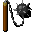

# { .sprite } Giant's flail
*Extraordinary* · Two-handed mace · value 0 gold

> This is a very heavy weapon!

**Slot:** weapon · **Size:** large

## When equipped

| Stat | Value |
|---|---|
| Attack damage | 11 to 40 |
| Attack cost | +14 |
| Attack chance | +20 |
| Critical skill | +5 |
| Critical multiplier | 3.0 |
| setNonWeaponDamageModifier | +320 |

## On hit

| Stat | Value |
|---|---|
| On target | Dazed (magnitude 1, 3 rounds, 20% chance) |

## Dropped by

| Monster | Chance | Qty |
|---|---|---|
| [Arulir Pack Leader](../monsters/arulir_leader.md) | 100% | 1 |

<small>Item ID: `flail_giant` · Data from v0.8.18</small>
