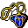

# { .sprite } Sapphire Necklace

*Quest necklace.*

<div class="infobox" markdown>

<p class="ib-img">{ .sprite }</p>

| | |
|---|---|
| **Item ID** | `g02_ambelie` |
| **Category** | Necklace |
| **Slot** | neck |
| **Rarity** | Quest |
| **Base value** | 5,000 gold |
| **Quest item** | Yes |
| **Introduced** | [v0.7.8](../versions/0.7.8.md) |

</div>

> The jewelry that Ambelie gave me in exchange for her life.

## Statistics

### When equipped

| Stat | Value |
|---|---|
| Max HP | +5 |

<p class="verified">Verified against v0.8.18 item data.</p>

## How to get it

### Quest & dialogue rewards

- From [Ambelie](../monsters/ambelie.md) ([foaming_flask](../maps/foaming_flask.md)) during [Immaculate kidnapping](../quests/Thieves02.md#stage-24) (1×)


<p class="verified">Verified against v0.8.18 item, loot, map and dialogue data.</p>

## Uses

Where the game checks for this item in dialogue:

| With | Quest | What happens to it | Option |
|---|---|---|---|
| [Umar](../monsters/umar.md) ([fallhaven_derelict2](../maps/fallhaven_derelict2.md)) | – | handed over (1×) | “I brought a valuable necklace from the noblewoman.” |

<p class="verified">Verified against v0.8.18 dialogue data.</p>


## Version history

| Version | Change |
|---|---|
| [v0.7.8](../versions/0.7.8.md) | Added |

<p class="verified">Verified against v0.8.18 and every earlier release back to v0.7.0 (game data compared release by release).</p>


## Community notes

<small>Written by players, not generated from game data. **Strategy**: how and when to use it · **Lore**: the in-world story · **Trivia**: real-world facts, references, development history · **Theory / speculation**: unconfirmed ideas; may just be unfinished content</small>

### Strategy

*Nothing here yet. Know something? [Add it](https://github.com/asdfghjkl628/Andor-s-Trail-Wikiiii/new/main/notes/items?filename=g02_ambelie.md&value=%23%23%20Strategy%0A%0A%3C%21--%20how%20and%20when%20to%20use%20it%20--%3E%0A%0A%23%23%20Lore%0A%0A%3C%21--%20the%20in-world%20story%20--%3E%0A%0A%23%23%20Trivia%0A%0A%3C%21--%20real-world%20facts%2C%20references%2C%20development%20history%20--%3E%0A%0A%23%23%20Theory%20/%20speculation%0A%0A%3C%21--%20unconfirmed%20ideas%3B%20may%20just%20be%20unfinished%20content%20--%3E%0A).*

### Lore

*Nothing here yet. Know something? [Add it](https://github.com/asdfghjkl628/Andor-s-Trail-Wikiiii/new/main/notes/items?filename=g02_ambelie.md&value=%23%23%20Strategy%0A%0A%3C%21--%20how%20and%20when%20to%20use%20it%20--%3E%0A%0A%23%23%20Lore%0A%0A%3C%21--%20the%20in-world%20story%20--%3E%0A%0A%23%23%20Trivia%0A%0A%3C%21--%20real-world%20facts%2C%20references%2C%20development%20history%20--%3E%0A%0A%23%23%20Theory%20/%20speculation%0A%0A%3C%21--%20unconfirmed%20ideas%3B%20may%20just%20be%20unfinished%20content%20--%3E%0A).*

### Trivia

*Nothing here yet. Know something? [Add it](https://github.com/asdfghjkl628/Andor-s-Trail-Wikiiii/new/main/notes/items?filename=g02_ambelie.md&value=%23%23%20Strategy%0A%0A%3C%21--%20how%20and%20when%20to%20use%20it%20--%3E%0A%0A%23%23%20Lore%0A%0A%3C%21--%20the%20in-world%20story%20--%3E%0A%0A%23%23%20Trivia%0A%0A%3C%21--%20real-world%20facts%2C%20references%2C%20development%20history%20--%3E%0A%0A%23%23%20Theory%20/%20speculation%0A%0A%3C%21--%20unconfirmed%20ideas%3B%20may%20just%20be%20unfinished%20content%20--%3E%0A).*

### Theory / speculation

*Nothing here yet. Know something? [Add it](https://github.com/asdfghjkl628/Andor-s-Trail-Wikiiii/new/main/notes/items?filename=g02_ambelie.md&value=%23%23%20Strategy%0A%0A%3C%21--%20how%20and%20when%20to%20use%20it%20--%3E%0A%0A%23%23%20Lore%0A%0A%3C%21--%20the%20in-world%20story%20--%3E%0A%0A%23%23%20Trivia%0A%0A%3C%21--%20real-world%20facts%2C%20references%2C%20development%20history%20--%3E%0A%0A%23%23%20Theory%20/%20speculation%0A%0A%3C%21--%20unconfirmed%20ideas%3B%20may%20just%20be%20unfinished%20content%20--%3E%0A).*


??? info "Technical information"

    | | |
    |---|---|
    | Item ID | `g02_ambelie` |
    | Category ID | `neck` |
    | Icon | `items_necklaces_1:0` |
    | Defined in | `res/raw/itemlist_omicronrg9.json` |
    | Loot tables containing it | – |

    Raw data:

    ```json
    {
     "id": "g02_ambelie",
     "iconID": "items_necklaces_1:0",
     "name": "Sapphire Necklace",
     "displaytype": "quest",
     "hasManualPrice": 1,
     "baseMarketCost": 5000,
     "category": "neck",
     "description": "The jewelry that Ambelie gave me in exchange for her life.",
     "equipEffect": {
      "increaseMaxHP": 5
     }
    }
    ```


<small>Data from v0.8.18</small>
