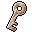

# { .sprite } Key of Luthor

*Quest other.*

<div class="infobox" markdown>

<p class="ib-img">{ .sprite }</p>

| | |
|---|---|
| **Item ID** | `g03_luthor` |
| **Category** | Other |
| **Rarity** | Quest |
| **Base value** | 0 gold |
| **Quest item** | Yes |
| **Introduced** | [v0.7.8](../versions/0.7.8.md) |

</div>

> The ancient key has a bluish glow.

## How to get it

### Dropped by

| Monster | Chance | Qty | Found in |
|---|---|---|---|
| [Crackshot](../monsters/g03_crackshot.md) | 100% | 1 | crackshot_hideout3 |


<p class="verified">Verified against v0.8.18 item, loot, map and dialogue data.</p>

## Uses

Where the game checks for this item in dialogue:

| With | Quest | What happens to it | Option |
|---|---|---|---|
| walking into a blocked passage on [crackshot_hideout3](../maps/crackshot_hideout3.md) | – | must be carried (1×) | “Insert the key of Luthor into the lock.” |
| [Umar](../monsters/umar.md) ([fallhaven_derelict2](../maps/fallhaven_derelict2.md)) | [The ruthless Crackshot](../quests/Thieves03.md#stage-45) | handed over (1×) | “Yes ... [give key]. Why is this key so important to us?” |
| [Umar](../monsters/umar.md) ([fallhaven_derelict2](../maps/fallhaven_derelict2.md)) | [The ruthless Crackshot](../quests/Thieves03.md#stage-45) | handed over (1×) | “Sure, here, take it. And maybe it's time to give me some more information.” |
| [Umar](../monsters/umar.md) ([fallhaven_derelict2](../maps/fallhaven_derelict2.md)) | [The ruthless Crackshot](../quests/Thieves03.md#stage-45) | handed over (1×) | “Oh. Yes, I remember now that I found the key. Here, take it.” |

<p class="verified">Verified against v0.8.18 dialogue data.</p>


## Version history

| Version | Change |
|---|---|
| [v0.7.8](../versions/0.7.8.md) | Added |

<p class="verified">Verified against v0.8.18 and every earlier release back to v0.7.0 (game data compared release by release).</p>


## Community notes

<small>Written by players, not generated from game data. **Strategy**: how and when to use it · **Lore**: the in-world story · **Trivia**: real-world facts, references, development history · **Theory / speculation**: unconfirmed ideas; may just be unfinished content</small>

### Strategy

*Nothing here yet. Know something? [Add it](https://github.com/asdfghjkl628/Andor-s-Trail-Wikiiii/new/main/notes/items?filename=g03_luthor.md&value=%23%23%20Strategy%0A%0A%3C%21--%20how%20and%20when%20to%20use%20it%20--%3E%0A%0A%23%23%20Lore%0A%0A%3C%21--%20the%20in-world%20story%20--%3E%0A%0A%23%23%20Trivia%0A%0A%3C%21--%20real-world%20facts%2C%20references%2C%20development%20history%20--%3E%0A%0A%23%23%20Theory%20/%20speculation%0A%0A%3C%21--%20unconfirmed%20ideas%3B%20may%20just%20be%20unfinished%20content%20--%3E%0A).*

### Lore

*Nothing here yet. Know something? [Add it](https://github.com/asdfghjkl628/Andor-s-Trail-Wikiiii/new/main/notes/items?filename=g03_luthor.md&value=%23%23%20Strategy%0A%0A%3C%21--%20how%20and%20when%20to%20use%20it%20--%3E%0A%0A%23%23%20Lore%0A%0A%3C%21--%20the%20in-world%20story%20--%3E%0A%0A%23%23%20Trivia%0A%0A%3C%21--%20real-world%20facts%2C%20references%2C%20development%20history%20--%3E%0A%0A%23%23%20Theory%20/%20speculation%0A%0A%3C%21--%20unconfirmed%20ideas%3B%20may%20just%20be%20unfinished%20content%20--%3E%0A).*

### Trivia

*Nothing here yet. Know something? [Add it](https://github.com/asdfghjkl628/Andor-s-Trail-Wikiiii/new/main/notes/items?filename=g03_luthor.md&value=%23%23%20Strategy%0A%0A%3C%21--%20how%20and%20when%20to%20use%20it%20--%3E%0A%0A%23%23%20Lore%0A%0A%3C%21--%20the%20in-world%20story%20--%3E%0A%0A%23%23%20Trivia%0A%0A%3C%21--%20real-world%20facts%2C%20references%2C%20development%20history%20--%3E%0A%0A%23%23%20Theory%20/%20speculation%0A%0A%3C%21--%20unconfirmed%20ideas%3B%20may%20just%20be%20unfinished%20content%20--%3E%0A).*

### Theory / speculation

*Nothing here yet. Know something? [Add it](https://github.com/asdfghjkl628/Andor-s-Trail-Wikiiii/new/main/notes/items?filename=g03_luthor.md&value=%23%23%20Strategy%0A%0A%3C%21--%20how%20and%20when%20to%20use%20it%20--%3E%0A%0A%23%23%20Lore%0A%0A%3C%21--%20the%20in-world%20story%20--%3E%0A%0A%23%23%20Trivia%0A%0A%3C%21--%20real-world%20facts%2C%20references%2C%20development%20history%20--%3E%0A%0A%23%23%20Theory%20/%20speculation%0A%0A%3C%21--%20unconfirmed%20ideas%3B%20may%20just%20be%20unfinished%20content%20--%3E%0A).*


??? info "Technical information"

    | | |
    |---|---|
    | Item ID | `g03_luthor` |
    | Category ID | `other` |
    | Icon | `items_misc:21` |
    | Defined in | `res/raw/itemlist_omicronrg9.json` |
    | Loot tables containing it | `drop_g03_crackshot` |

    Raw data:

    ```json
    {
     "id": "g03_luthor",
     "iconID": "items_misc:21",
     "name": "Key of Luthor",
     "displaytype": "quest",
     "category": "other",
     "description": "The ancient key has a bluish glow."
    }
    ```


<small>Data from v0.8.18</small>
