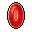

# { .sprite } Ruby gem

*Ordinary gem.*

<div class="infobox" markdown>

<p class="ib-img">{ .sprite }</p>

| | |
|---|---|
| **Item ID** | `gem2` |
| **Category** | Gem |
| **Rarity** | Ordinary |
| **Base value** | 6 gold |
| **Introduced** | v0.7.0 or earlier |

</div>

## How to get it

### Dropped by

| Monster | Chance | Qty | Found in |
|---|---|---|---|
| [Graverobber](../monsters/graverobber.md) | 100% | 1 | blackwater_mountain35 |
| [Strong larval burrower](../monsters/larval_boss.md) | 100% | 1 | Crossroads Guardhouse |
| [Cave troll leader](../monsters/cave_troll_5.md) | 100% | 1 | lakecave2 |
| [Kazarite golem](../monsters/elm_golem1.md) | 100% | 1-5 | elm5f_1, elm5f_2, elm_3f |
| [Dried kazarite golem](../monsters/elm_golem2.md) | 100% | 1-5 | elm5f_1, elm5f_2, elm_3f |
| [Rebelled thief](../monsters/guild03_rebthief_1.md) | 50% | 1-2 | crackshot_hideout2, crackshot_hideout3 |
| [Shadowfang](../monsters/shadowfang1.md) | 50% | 1-5 | blackwater_mountain76, elm_2f_1, elm_2f_3 |
| [Hardened erumen lizard](../monsters/erumen_7.md) | 30% | 1 | waterway11, waterway11_east, waterway9 |
| [Snake servant](../monsters/snake_servant.md) | 25% | 1 | snakecave3 |
| [Young minotaur](../monsters/young_minotaur.md) | 25% | 1 | jan_pitcave2 |
| [Strong minotaur](../monsters/strong_minotaur.md) | 25% | 1 | jan_pitcave2 |
| [Skeletal warrior](../monsters/skeletal_warrior.md) | 25% | 1 | Flagstone Prison |
| [Skeletal master](../monsters/skeletal_master.md) | 25% | 1 | Flagstone Prison |
| [Skeleton](../monsters/skeleton.md) | 25% | 1 | Flagstone Prison |
| [Guardian of the catacombs](../monsters/guardian_of_the_catacombs.md) | 25% | 1 | Fallhaven |
| [Ghostly visage](../monsters/ghostly_visage.md) | 25% | 1 | Fallhaven |
| [Spectre](../monsters/spectre.md) | 25% | 1 | Fallhaven |
| [Apparition](../monsters/apparition.md) | 25% | 1 | Fallhaven |
| [Shade](../monsters/shade.md) | 25% | 1 | Fallhaven |
| [Young gargoyle](../monsters/young_gargoyle.md) | 25% | 1 | Fallhaven |
| [Bone warrior](../monsters/bone_warrior.md) | 25% | 1 | Flagstone Prison |
| [Bone champion](../monsters/bone_champion.md) | 25% | 1 | Flagstone Prison, Loneford |
| [Rotting corpse](../monsters/rotting_corpse.md) | 25% | 1 | Flagstone Prison |
| [Walking corpse](../monsters/walking_corpse.md) | 25% | 1 | Flagstone Prison |
| [Gargoyle](../monsters/gargoyle.md) | 25% | 1 | Flagstone Prison |
| [Fledgling gargoyle](../monsters/fledgling_gargoyle.md) | 25% | 1 | Flagstone Prison |
| [Young shadow gargoyle](../monsters/young_shadow_gargoyle.md) | 25% | 1 | Foaming Flask Tavern |
| [Fledgling shadow gargoyle](../monsters/fledgling_shadow_gargoyle.md) | 25% | 1 | Foaming Flask Tavern |
| [Shadow gargoyle](../monsters/shadow_gargoyle.md) | 25% | 1 | gargoylecave1, gargoylecave2 |
| [Tough shadow gargoyle](../monsters/tough_shadow_gargoyle.md) | 25% | 1 | gargoylecave1, gargoylecave2 |
| [Shadow gargoyle trainer](../monsters/shadow_gargoyle_trainer.md) | 25% | 1 | gargoylecave2, gargoylecave3, gargoylecave4 |
| [Shadow gargoyle master](../monsters/shadow_gargoyle_master.md) | 25% | 1 | gargoylecave2, gargoylecave3, gargoylecave4 |
| [Rancid zombie](../monsters/zombie1.md) | 25% | 1 | Foaming Flask Tavern |
| [Rotting zombie](../monsters/zombie2.md) | 25% | 1 | Foaming Flask Tavern |
| [Blighted zombie](../monsters/zombie3.md) | 25% | 1 | Foaming Flask Tavern |
| [Corrupted zombie](../monsters/zombie5.md) | 25% | 1 | Foaming Flask Tavern |
| [Bloodthirsty zombie](../monsters/zombie6.md) | 25% | 1 | Foaming Flask Tavern |
| [Tainted zombie](../monsters/zombie7.md) | 25% | 1 | Foaming Flask Tavern |
| [Luthor's skeleton guard](../monsters/tt_monster1.md) | 25% | 1 | crackshot_hideout4 |
| [Luthor's skeleton guard](../monsters/tt_monster2.md) | 25% | 1 | crackshot_hideout4 |

*…and 27 more.*

### Sold by

- [Gruil](../monsters/gruil.md)
- [Alynndir](../monsters/alynndir.md) (road5_house)

### Found in containers

- [elm_4f_2](../maps/elm_4f_2.md#container-0) (container 1, 100%)
- [elm_mine2](../maps/elm_mine2.md#container-0) (container 1, 33.3333%)
- [gamjee_well_1](../maps/gamjee_well_1.md#container-1) (container 2, 100%)
- [guynmart_wood_18](../maps/guynmart_wood_18.md#container-0) (container 1, 100%)
- [guynmart_wood_18](../maps/guynmart_wood_18.md#container-1) (container 2, 100%)
- [haunted_house](../maps/haunted_house.md#container-0) (container 1, 100%)
- [island1](../maps/island1.md#container-2) (container 3, 33%)
- [island1](../maps/island1.md#container-3) (container 4, 33%)
- [island1](../maps/island1.md#container-5) (container 6, 100%)
- [island1](../maps/island1.md#container-7) (container 8, 33%)
- [island1](../maps/island1.md#container-10) (container 11, 33%)
- [island1](../maps/island1.md#container-13) (container 14, 33%)
- [island2](../maps/island2.md#container-2) (container 3, 33%)
- [island2](../maps/island2.md#container-5) (container 6, 100%)
- [island3](../maps/island3.md#container-2) (container 3, 33%)
- [island3](../maps/island3.md#container-3) (container 4, 100%)
- [island3](../maps/island3.md#container-5) (container 6, 100%)
- [island3](../maps/island3.md#container-7) (container 8, 100%)
- [island3](../maps/island3.md#container-10) (container 11, 100%)
- [island3](../maps/island3.md#container-13) (container 14, 100%)
- [island4](../maps/island4.md#container-2) (container 3, 33%)
- [island4](../maps/island4.md#container-3) (container 4, 100%)
- [island4](../maps/island4.md#container-5) (container 6, 100%)
- [island_underground5](../maps/island_underground5.md#container-0) (container 1, 100%)
- [korhald_cave_hidden](../maps/korhald_cave_hidden.md#container-0) (container 1, 100%)
- [laerothcave2](../maps/laerothcave2.md#container-0) (container 1, 100%)
- [lake_shore_road_4](../maps/lake_shore_road_4.md#container-0) (container 1, 100%)
- [mountainlake8_cave](../maps/mountainlake8_cave.md#container-2) (container 3, 100%)
- [mushroom_m2_4b](../maps/mushroom_m2_4b.md#container-1) (container 2, 100%)
- [mushroom_m3_2](../maps/mushroom_m3_2.md#container-0) (container 1, 50%)

### Quest & dialogue rewards

- From [Burhczyd](../monsters/burhczyd1.md) ([crossglen_hall](../maps/crossglen_hall.md)), [Knight of Elythom](../monsters/burhczyd1e.md) ([crossglen_hall](../maps/crossglen_hall.md)) (1×)


<p class="verified">Verified against v0.8.18 item, loot, map and dialogue data.</p>

## Uses

Where the game checks for this item in dialogue:

| With | Quest | What happens to it | Option |
|---|---|---|---|
| [Lodar](../monsters/lodar.md) ([lodarhouse1](../maps/lodarhouse1.md)) | [Lodar's potions](../quests/lodar_pots.md#stage-41) | handed over (1×) | “I have those things on me, here.” |
| [Lodar](../monsters/lodar.md) ([lodarhouse1](../maps/lodarhouse1.md)) | [Lodar's potions](../quests/lodar_pots.md#stage-41) | handed over (5×) | “I have enough of those things on me for five potions, here.” |
| [Lodar](../monsters/lodar.md) ([lodarhouse1](../maps/lodarhouse1.md)) | [Lodar's potions](../quests/lodar_pots.md#stage-41) | handed over (10×) | “I have enough of those things on me for ten potions, here.” |
| [Burhczyd](../monsters/burhczyd1.md) ([crossglen_hall](../maps/crossglen_hall.md)), [Knight of Elythom](../monsters/burhczyd1e.md) ([crossglen_hall](../maps/crossglen_hall.md)) | [Young merchant Non-displayed (hidden flag)](../quests/quest_burhczyd_nd.md#stage-84) | handed over (1×) | “(automatic)” |
| [Godoe](../monsters/godoe1.md) ([guynmart_wood_18](../maps/guynmart_wood_18.md)), [Godoe](../monsters/godoe2.md) ([guynmart_wood_18](../maps/guynmart_wood_18.md)) | [feygard_nondisplayed (hidden flag)](../quests/feygard_nondisplayed.md#stage-80) | handed over (5×) | “Sure, I have plenty of them.” |
| stepping on a trigger on [wexlow_village](../maps/wexlow_village.md) | – | handed over (1×) | “[Throw an Ruby gem]” |

<p class="verified">Verified against v0.8.18 dialogue data.</p>


## Version history

| Version | Change |
|---|---|
| [v0.7.0](../versions/0.7.0.md) | Present in v0.7.0 (earliest release tracked) |

<p class="verified">Verified against v0.8.18 and every earlier release back to v0.7.0 (game data compared release by release).</p>


## Community notes

<small>Written by players, not generated from game data. **Strategy**: how and when to use it · **Lore**: the in-world story · **Trivia**: real-world facts, references, development history · **Theory / speculation**: unconfirmed ideas; may just be unfinished content</small>

### Strategy

*Nothing here yet. Know something? [Add it](https://github.com/asdfghjkl628/Andor-s-Trail-Wikiiii/new/main/notes/items?filename=gem2.md&value=%23%23%20Strategy%0A%0A%3C%21--%20how%20and%20when%20to%20use%20it%20--%3E%0A%0A%23%23%20Lore%0A%0A%3C%21--%20the%20in-world%20story%20--%3E%0A%0A%23%23%20Trivia%0A%0A%3C%21--%20real-world%20facts%2C%20references%2C%20development%20history%20--%3E%0A%0A%23%23%20Theory%20/%20speculation%0A%0A%3C%21--%20unconfirmed%20ideas%3B%20may%20just%20be%20unfinished%20content%20--%3E%0A).*

### Lore

*Nothing here yet. Know something? [Add it](https://github.com/asdfghjkl628/Andor-s-Trail-Wikiiii/new/main/notes/items?filename=gem2.md&value=%23%23%20Strategy%0A%0A%3C%21--%20how%20and%20when%20to%20use%20it%20--%3E%0A%0A%23%23%20Lore%0A%0A%3C%21--%20the%20in-world%20story%20--%3E%0A%0A%23%23%20Trivia%0A%0A%3C%21--%20real-world%20facts%2C%20references%2C%20development%20history%20--%3E%0A%0A%23%23%20Theory%20/%20speculation%0A%0A%3C%21--%20unconfirmed%20ideas%3B%20may%20just%20be%20unfinished%20content%20--%3E%0A).*

### Trivia

*Nothing here yet. Know something? [Add it](https://github.com/asdfghjkl628/Andor-s-Trail-Wikiiii/new/main/notes/items?filename=gem2.md&value=%23%23%20Strategy%0A%0A%3C%21--%20how%20and%20when%20to%20use%20it%20--%3E%0A%0A%23%23%20Lore%0A%0A%3C%21--%20the%20in-world%20story%20--%3E%0A%0A%23%23%20Trivia%0A%0A%3C%21--%20real-world%20facts%2C%20references%2C%20development%20history%20--%3E%0A%0A%23%23%20Theory%20/%20speculation%0A%0A%3C%21--%20unconfirmed%20ideas%3B%20may%20just%20be%20unfinished%20content%20--%3E%0A).*

### Theory / speculation

*Nothing here yet. Know something? [Add it](https://github.com/asdfghjkl628/Andor-s-Trail-Wikiiii/new/main/notes/items?filename=gem2.md&value=%23%23%20Strategy%0A%0A%3C%21--%20how%20and%20when%20to%20use%20it%20--%3E%0A%0A%23%23%20Lore%0A%0A%3C%21--%20the%20in-world%20story%20--%3E%0A%0A%23%23%20Trivia%0A%0A%3C%21--%20real-world%20facts%2C%20references%2C%20development%20history%20--%3E%0A%0A%23%23%20Theory%20/%20speculation%0A%0A%3C%21--%20unconfirmed%20ideas%3B%20may%20just%20be%20unfinished%20content%20--%3E%0A).*


??? info "Technical information"

    | | |
    |---|---|
    | Item ID | `gem2` |
    | Category ID | `gem` |
    | Icon | `items_misc:1` |
    | Defined in | `res/raw/itemlist_junk.json` |
    | Loot tables containing it | `cavemonster`, `lich1`, `skeleton`, `catacombguard`, `skeleton2`, `pack1`, `skeleton3`, `undead1`, `shadowgarg1`, `shadowgarg2`, `shadowgarg3`, `bjorgur_bandit`, `shop_alynndir`, `shop_gruil`, `larva_boss`, `mwolf`, `erumen_b`, `anklebiter`, `cave_troll_4`, `drop_g03_rebthief_1`, `boss_fungi_chest`, `bogsten_tomb_loot1`, `mushroom_m3_2_loot`, `gison_thief`, `bwm_venomfang2`, `ortholion_subdued`, `shadowfang1`, `elm2_chest`, `elm_fiend`, `elm_golem`, `kamelio`, `haunted_house_dl`, `ratdom_531_loot2`, `ratdom_567_loot2`, `ratdom_bone_collector_container2`, `ratdom_troll_loot_1`, `gal_isle_loot`, `korhald_gems`, `laerothcave2`, `lae_underground5_loot`, `lae_fc1_1x1`, `lae_fc1_1x2`, `lae_fc1_2x1`, `lae_fc1_2x2`, `lae_fc1_3x1`, `lae_fc1_3x2`, `lae_fc1_4x1`, `lae_fc1_4x2`, `lae_fc1_1y1`, `lae_fc1_1y2`, `lae_fc1_1y3`, `lae_fc1_1y4`, `lae_fc1_3y1`, `lae_fc1_3y2`, `lae_fc1_3y3`, `lae_fc1_3y4`, `lae_fc1_4y1`, `brute_creator_l3`, `guynmart18_c1`, `guynmart18_c2`, `gamjee_well_gems_dl` |

    Raw data:

    ```json
    {
     "id": "gem2",
     "iconID": "items_misc:1",
     "name": "Ruby gem",
     "hasManualPrice": 1,
     "baseMarketCost": 6,
     "category": "gem"
    }
    ```


<small>Data from v0.8.18</small>
