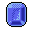

# { .sprite } Polished gem
*Ordinary* · Gem · value 8 gold

## Dropped by

| Monster | Chance | Qty |
|---|---|---|
| [Snake master](../monsters/snake_master.md) | 100% | 1 |
| [Feygard scout](../monsters/feygard_scout.md) | 100% | 1-3 |
| [Maelveon](../monsters/maelveon.md) | 100% | 1 |
| [Kazaul guardian](../monsters/kazaul_guardian.md) | 100% | 1 |
| [Thief](../monsters/gison_thief1.md) | 20% | 1 |
| [Thief](../monsters/gison_thief2.md) | 20% | 1 |
| [Thief](../monsters/gison_thief3.md) | 20% | 1 |
| [Glowing mudfiend](../monsters/elm_fiend1.md) | 10% | 0-4 |
| [Ravenous glowing mudfiend](../monsters/elm_fiend2.md) | 10% | 0-4 |
| [Restless dead](../monsters/bwm_dead.md) | 10% | 1 |
| [Grave spawn](../monsters/bwm_grave_spawn.md) | 10% | 1 |
| [Shadow gargoyle trainer](../monsters/shadow_gargoyle_trainer.md) | 10% | 1 |
| [Shadow gargoyle master](../monsters/shadow_gargoyle_master.md) | 10% | 1 |
| [Restless dead](../monsters/restless_dead.md) | 10% | 1 |
| [Grave spawn](../monsters/grave_spawn.md) | 10% | 1 |
| [Cave troll shaman](../monsters/cave_troll_4.md) | 5% | 1 |
| [Rabid wolf](../monsters/rabid_wolf.md) | 5% | 1 |
| [Fledgling wolf](../monsters/fledgling_wolf.md) | 5% | 1 |

## Sold by

- [Alain](../monsters/brightportitem.md)
- [Gruil](../monsters/gruil.md)
- [Ganos](../monsters/ganos.md)
- [Troublemaker](../monsters/troublemaker.md)
- [Dunla](../monsters/dunla.md)

<small>Item ID: `gem3` · Data from v0.8.18</small>
