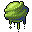

# { .sprite } Poison gland

*Ordinary animal part.*

<div class="infobox" markdown>

<p class="ib-img">{ .sprite }</p>

| | |
|---|---|
| **Item ID** | `gland` |
| **Category** | Animal part |
| **Rarity** | Ordinary |
| **Base value** | 15 gold |
| **Introduced** | v0.7.0 or earlier |

</div>

## How to get it

### Dropped by

| Monster | Chance | Qty | Found in |
|---|---|---|---|
| [Venomous swamp creature](../monsters/venomous_swamp_creature.md) | 100% | 3-10 | Galmore 28 |
| [Grasslands snake](../monsters/grass_snake.md) | 30% | 1 | Loneford, Crossroads Guardhouse, Guynmart Castle |
| [Tough grasslands snake](../monsters/grass_snake2.md) | 30% | 1 | Loneford, Crossroads Guardhouse, Guynmart Castle |
| [Grasslands lizard](../monsters/grass_lizard.md) | 30% | 1 | Crossroads Guardhouse |
| [Black grasslands lizard](../monsters/grass_lizard2.md) | 30% | 1 | Crossroads Guardhouse, Flagstone Prison |
| [Poisonous river frog](../monsters/frog_3.md) | 30% | 1 | Guynmart Castle |
| [Sullengard forest snake](../monsters/sullengard_venom_snake.md) | 30% | 1 | Sullengard |
| [Queen Sullengard forest snake](../monsters/sullengard_venom_snake_queen.md) | 30% | 1 | Way to sullengard east 9 |
| [Sullengard red forest snake](../monsters/sull_red_forest_snake.md) | 30% | 1 | Sullengard west ravine, Sullengard woods 1, Sullengard woods 13 |
| [Yellow tooth slitherer](../monsters/yellow_tooth.md) | 30% | 1 | Deebo's Orchard |
| [King yellow tooth slitherer](../monsters/yellow_tooth_king.md) | 30% | 1 | Way to sullengard east 1 |
| [Breeder of venomscale](../monsters/vscaleb1.md) | 20% | 1-3 | Lodar 16, Lodar 19 |
| [Venomscale master](../monsters/vscaleb2.md) | 20% | 1-3 | Lodar 17, Lodar 19 |
| [Plague groundberry](../monsters/plague_groundberry.md) | 20% | 1 | Sullengard woods 11, Sullengard woods 12, Sullengard woods 3 |
| [ViridToxin dartmaw](../monsters/virid_toxin.md) | 8% | 1 | Flagstone Prison |
| [Forest snake](../monsters/forest_snake.md) | 5% | 1 | Blackwater Mountain, Fallhaven |
| [Young cave snake](../monsters/young_cave_snake.md) | 5% | 1 | Blackwater Mountain |
| [Cave snake](../monsters/cave_snake.md) | 5% | 1 | Blackwater Mountain |
| [Venomous cave snake](../monsters/venomous_cave_snake.md) | 5% | 1 | Brimhaven, Bloskelt + Roskelt, Entry |
| [Tough cave snake](../monsters/tough_cave_snake.md) | 5% | 1 | Brimhaven, Bloskelt + Roskelt, Entry |
| [Forest serpent](../monsters/forest_serpent.md) | 5% | 1 | Flagstone Prison, Fallhaven, Crossroads Guardhouse |
| [Vicious forest serpent](../monsters/vicious_forest_serpent.md) | 5% | 1 | Guynmart Castle, Foaming Flask Tavern, Fallhaven |
| [Slithering venomfang](../monsters/slithering_venomfang.md) | 5% | 1 | Stoutford, Blackwater Mountain, Prim |
| [Scaled venomfang](../monsters/scaled_venomfang.md) | 5% | 1 | Blackwater Mountain |
| [Tough venomfang](../monsters/tough_venomfang.md) | 5% | 1 | Blackwater Mountain, Flagstone Prison |
| [Puny venomscale](../monsters/vscale1.md) | 5% | 1 | Lodar 16, Lodar 20, Lodar 21 |
| [Young venomscale](../monsters/vscale2.md) | 5% | 1 | Lodar 16, Lodar 20, Lodar 21 |
| [Gray venomscale](../monsters/vscale3.md) | 5% | 1 | Lodar 16, Lodar 20, Lodar 21 |
| [Aggressive venomscale](../monsters/vscale4.md) | 5% | 1 | Lodar 16, Lodar 17, Lodar 18 |
| [Quick venomscale](../monsters/vscale5.md) | 5% | 1 | Lodar 16, Lodar 17, Lodar 18 |
| [Vicious venomscale](../monsters/vscale6.md) | 5% | 1 | Lodar 18, Lodar 19, Lodar 21 |
| [Strong venomscale](../monsters/vscale7.md) | 5% | 1 | Lodar 18, Lodar 19, Lodar 21 |
| [Tough venomscale](../monsters/vscale8.md) | 5% | 1 | Lodar 19 |
| [Young cave serpent](../monsters/young_cave_serpent.md) | 5% | 1 | Basiliskcave 1 1 1, Basiliskcave 1 1 2, Basiliskcave 1 1 3 |
| [Cave serpent](../monsters/cave_serpent.md) | 5% | 1 | Basiliskcave 1 1 1, Basiliskcave 1 1 2, Basiliskcave 1 1 3 |
| [Venomous cave serpent](../monsters/venomous_cave_serpent.md) | 5% | 1 | Basiliskcave 1 1 3, Basiliskcave 1 1 4, Basiliskcave 1 1 5 |
| [Tough cave serpent](../monsters/tough_cave_serpent.md) | 5% | 1 | Basiliskcave 1 1 3, Basiliskcave 1 1 4, Basiliskcave 1 1 5 |
| [Slippery Venomfang](../monsters/slippery_venomfang.md) | 5% | 0-2 | Blackwater Mountain |
| [Noxious venomfang](../monsters/noxious_venomfang.md) | 5% | 0-2 | Blackwater Mountain |
| [Big cave snake](../monsters/cavesnake4.md) | 5% | 1 | 4 wells, Roundlings |

*…and 40 more.*


<p class="verified">Verified against v0.8.18 item, loot, map and dialogue data.</p>

## Uses

Where the game checks for this item in dialogue:

| With | Quest | What happens to it | Option |
|---|---|---|---|
| [Gruil](../monsters/gruil.md) | [Search for Andor](../quests/andor.md#stage-30) | handed over (1×) | “Here, I have a poison gland for you.” |
| [Potion merchant](../monsters/potion_merchant.md) ([Fallhaven potions](../maps/fallhaven_potions.md)) | [Taste is everything](../quests/antifoodp.md#stage-30) | handed over (1×) | “I have those ingredients for you.” |
| [Potion merchant](../monsters/potion_merchant.md) ([Fallhaven potions](../maps/fallhaven_potions.md)) | [Taste is everything](../quests/antifoodp.md#stage-35) | handed over (1×) | “I have those ingredients for you.” |
| [Potion merchant](../monsters/potion_merchant.md) ([Fallhaven potions](../maps/fallhaven_potions.md)) | [Taste is everything](../quests/antifoodp.md#stage-20) | handed over (5×) | “Here, I have enough of those ingredients for five potions.” |
| [Potion merchant](../monsters/potion_merchant.md) ([Fallhaven potions](../maps/fallhaven_potions.md)) | [Taste is everything](../quests/antifoodp.md#stage-20) | handed over (10×) | “Here, I have enough of those ingredients for ten potions.” |

<p class="verified">Verified against v0.8.18 dialogue data.</p>


## Version history

| Version | Change |
|---|---|
| [v0.7.0](../versions/0.7.0.md) | Present in v0.7.0 (earliest release tracked) |

<p class="verified">Verified against v0.8.18 and every earlier release back to v0.7.0 (game data compared release by release).</p>


## Community notes

<small>Written by players, not generated from game data. **Strategy**: how and when to use it · **Lore**: the in-world story · **Trivia**: real-world facts, references, development history · **Theory / speculation**: unconfirmed ideas; may just be unfinished content</small>

### Strategy

*No notes yet. Contributions are welcome: [add a note](https://github.com/asdfghjkl628/Andor-s-Trail-Wikiiii/new/main/notes/items?filename=gland.md&value=%23%23%20Strategy%0A%0A%3C%21--%20how%20and%20when%20to%20use%20it%20--%3E%0A%0A%23%23%20Lore%0A%0A%3C%21--%20the%20in-world%20story%20--%3E%0A%0A%23%23%20Trivia%0A%0A%3C%21--%20real-world%20facts%2C%20references%2C%20development%20history%20--%3E%0A%0A%23%23%20Theory%20/%20speculation%0A%0A%3C%21--%20unconfirmed%20ideas%3B%20may%20just%20be%20unfinished%20content%20--%3E%0A).*

### Lore

*No notes yet. Contributions are welcome: [add a note](https://github.com/asdfghjkl628/Andor-s-Trail-Wikiiii/new/main/notes/items?filename=gland.md&value=%23%23%20Strategy%0A%0A%3C%21--%20how%20and%20when%20to%20use%20it%20--%3E%0A%0A%23%23%20Lore%0A%0A%3C%21--%20the%20in-world%20story%20--%3E%0A%0A%23%23%20Trivia%0A%0A%3C%21--%20real-world%20facts%2C%20references%2C%20development%20history%20--%3E%0A%0A%23%23%20Theory%20/%20speculation%0A%0A%3C%21--%20unconfirmed%20ideas%3B%20may%20just%20be%20unfinished%20content%20--%3E%0A).*

### Trivia

*No notes yet. Contributions are welcome: [add a note](https://github.com/asdfghjkl628/Andor-s-Trail-Wikiiii/new/main/notes/items?filename=gland.md&value=%23%23%20Strategy%0A%0A%3C%21--%20how%20and%20when%20to%20use%20it%20--%3E%0A%0A%23%23%20Lore%0A%0A%3C%21--%20the%20in-world%20story%20--%3E%0A%0A%23%23%20Trivia%0A%0A%3C%21--%20real-world%20facts%2C%20references%2C%20development%20history%20--%3E%0A%0A%23%23%20Theory%20/%20speculation%0A%0A%3C%21--%20unconfirmed%20ideas%3B%20may%20just%20be%20unfinished%20content%20--%3E%0A).*

### Theory / speculation

*No notes yet. Contributions are welcome: [add a note](https://github.com/asdfghjkl628/Andor-s-Trail-Wikiiii/new/main/notes/items?filename=gland.md&value=%23%23%20Strategy%0A%0A%3C%21--%20how%20and%20when%20to%20use%20it%20--%3E%0A%0A%23%23%20Lore%0A%0A%3C%21--%20the%20in-world%20story%20--%3E%0A%0A%23%23%20Trivia%0A%0A%3C%21--%20real-world%20facts%2C%20references%2C%20development%20history%20--%3E%0A%0A%23%23%20Theory%20/%20speculation%0A%0A%3C%21--%20unconfirmed%20ideas%3B%20may%20just%20be%20unfinished%20content%20--%3E%0A).*


??? info "Technical information"

    | | |
    |---|---|
    | Item ID | `gland` |
    | Category ID | `animal` |
    | Icon | `actorconditions_1:60` |
    | Defined in | `res/raw/itemlist_animal.json` |
    | Loot tables containing it | `snake`, `snake2`, `cave_serpent`, `fieldcritter_2`, `fieldcritter_3`, `frog_3`, `irdegh_spawn`, `irdegh`, `irdegh_b`, `plaguespider`, `vscale`, `vscaleb`, `bwm_venomfang2`, `forest_snake_dl`, `yellow_tooth_dl`, `plague_groundberry_dl`, `young_virid_toxin_dl`, `virid_toxin_dl`, `burrowing_glow_worm_dl`, `venomous_swamp_creature_dl` |

    Raw data:

    ```json
    {
     "id": "gland",
     "iconID": "actorconditions_1:60",
     "name": "Poison gland",
     "hasManualPrice": 1,
     "baseMarketCost": 15,
     "category": "animal"
    }
    ```


<small>Data from v0.8.18</small>
