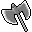

# { .sprite } Executioner's greataxe
*Ordinary* · Greataxe · value 2290 gold

**Slot:** weapon · **Size:** large

## When equipped

| Stat | Value |
|---|---|
| Attack damage | 4 to 5 |
| Attack cost | +8 |
| Attack chance | +24 |
| Block chance | +9 |
| setNonWeaponDamageModifier | +209 |

## Sold by

- [Lleglaris](../monsters/lleglaris.md)

Verified against v0.8.18 item data.

## Version history

| Version | Change |
|---|---|
| [v0.7.0](../versions/0.7.0.md) | Present in v0.7.0 (earliest release tracked) |
| [v0.7.10](../versions/0.7.10.md) | equipEffect: {"increaseAttackChance": 24, "increaseA… → {"increaseAttackChance": 24, "increaseA… |

Verified against v0.8.18 and every earlier release back to v0.7.0 (game data compared release by release).

<small>Item ID: `graxe_exec` · Data from v0.8.18</small>
